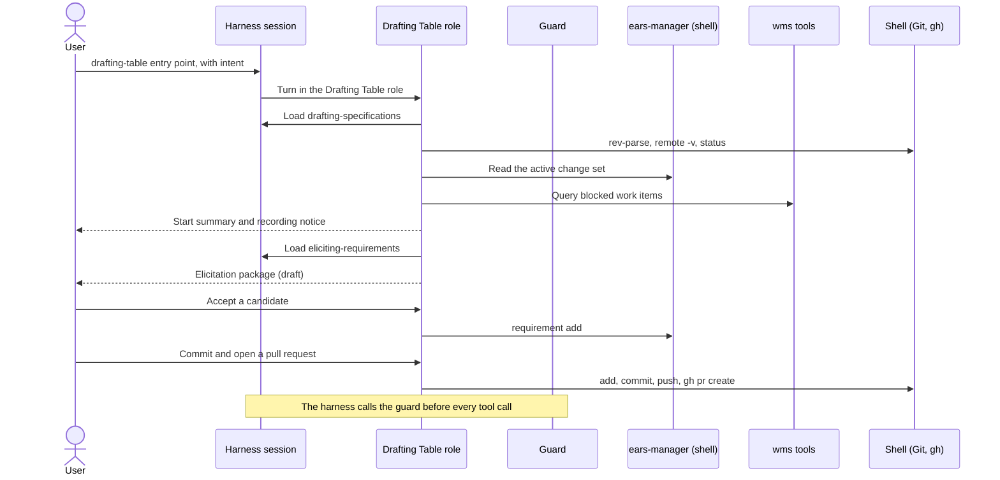

# ProtoBot: Agent Harness Adapter Contract

> Design document — September 2026
>
> Defines how the Specification Toolkit becomes the TUI Drafting Table
> inside any coding-agent harness, what is written once for every
> harness, and what each harness binding adds.

**Contents:**

- [Purpose and scope](#purpose-and-scope)
- [The three layers](#the-three-layers)
- [Adapter core](#adapter-core)
- [Session entry and resume](#session-entry-and-resume)
- [What the harness layer stops](#what-the-harness-layer-stops)
- [Repository and credential capabilities](#repository-and-credential-capabilities)
- [Deployment modes](#deployment-modes)
- [Artifacts and traces](#artifacts-and-traces)
- [Resumable state](#resumable-state)
- [Exit conditions](#exit-conditions)
- [Harness obligations](#harness-obligations)
- [Adding a harness](#adding-a-harness)
- [Toolkit skill rules](#toolkit-skill-rules)
- [Fixture session](#fixture-session)
- [Out-of-scope decisions](#out-of-scope-decisions)
- [Related Documents](#related-documents)

---

## Purpose and scope

This document answers the question posed by issue #33: _What is the
smallest useful Drafting Table adapter when the user invokes ProtoBot
inside an existing OpenCode session?_

OpenCode is the first harness, not the only one. The Toolkit must work
in any compatible agent harness
([Specification Toolkit](../../architecture.md#specification-toolkit)),
and ProtoBot is expected to run in Claude Code, Codex, OpenCode, and
harnesses that do not exist yet. The answer is one contract and one
binding per harness:

- **This document is the harness-neutral adapter contract.** It defines
  what is written once and shared by every harness, and what every
  harness binding must provide.
- **[OpenCode Harness Binding](opencode.md) is the first binding.** It
  defines the OpenCode files that meet this contract, designed against
  OpenCode 1.18.30 and partly observed with a stub model. Its fixture
  runs in #77.
- **[Claude Code Harness Binding](claude-code.md) is the second.** It
  defines the Claude Code files, designed against the Claude Code
  2.1.273 documentation and CLI help. Its fixture has not run yet.
- **[Codex Harness Binding](codex.md) is the third.** It defines the
  Codex files, designed against Codex CLI 0.154.0 and partly observed
  with a stub model. Its fixture has not run yet.

A binding for another harness is one more document beside those three
and one more row in [Binding status](#binding-status). It changes no
Toolkit file and no rule in this document.

There is no `protobot` program. In every harness the user invokes
ProtoBot through an entry point named `drafting-table`, which loads the
Toolkit skills. The adapter core adds one executable, the
[guard](#the-guard).

The first Toolkit consumer is the `eliciting-requirements` skill in
`.agents/skills/` (#56). The contract is defined for the
**single-player TUI Drafting Table** first
([Overview — Single-player mode](../overview.md#single-player-mode)).
The Web Drafting Table and a standalone session manager are out of
scope: the Web Drafting Table replaces the local harness with a hosted
runtime
([Drafting Table Boundary](../../architecture.md#drafting-table-boundary)),
and every harness already owns its sessions.

### Relationship to sibling contracts

- **#28** ([Drafting Table UX][ux]) defines what the user sees and
  decides. It defers skill packaging, adapter hooks, the
  session-recording notice, and chat persistence to #33.
- **#30** (`ears-manager` CLI integration) defines the commands and
  their request and result shapes. This document decides that the role
  runs that CLI through the harness's shell tool, and depends on #30
  for the command grammar and its JSON results.
- **#31** (Drafting Table WMS integration) defines the WMS operations.
  This document registers them as tools and does not name them.
- **#32** (Validation Rules) defines lifecycle validation. Its
  caller-side preflight runs inside the `wms` server, so no harness
  loads a rule library, and the WMS write boundary stays authoritative.
- **#34** ([Git and Project-Repository Integration](../git-integration.md))
  defines the Git rules. It leaves the harness permission layer and the
  Git host client binding to #33; both are decided in
  [Shell operations](#shell-operations).
- **#77** implements the OpenCode Drafting Table MVP: the adapter
  core, the OpenCode binding, the `drafting-specifications` skill, and
  the [fixture session](#fixture-session) as its test plan.

---

## The three layers

| Layer | Contains | Written | Changes when |
| --- | --- | --- | --- |
| Specification Toolkit | Skills: the session protocol, elicitation, Sketching and Dimensioning guidance, the `ears-manager` CLI guidance, and the [host mapping](#host-mapping). MCP tool definitions for the WMS Adapter. Reference material. | Once, for every harness | The specification method changes |
| Adapter core | The [manifest](#the-adapter-manifest), the [Drafting Table role](#the-drafting-table-role), the [shell operations](#shell-operations), the [guard](#the-guard) and its test vectors, and the [fixture](#fixture-session) | Once, for every harness | This contract changes |
| Harness binding | The harness's own files: MCP registration, skill discovery, the role's native rules, the entry point, the hook that calls the guard, and access to the session record | Once per harness | That harness changes |
| Governed systems | `ears-manager`, the WMS Adapter, Git and the Git host | Their own contracts (#30, #31, #34) | Their contracts change |

Three rules keep the layers apart:

1. **No Toolkit file names a harness.** A Toolkit skill names
   operations — `ears-manager requirement add`, a WMS operation from
   issue #31, a Git operation from issue #34 — and never a harness
   tool, a permission key, or a harness config file.
2. **The adapter core names a harness in one place only:** the guard's
   [tool vocabulary](#tool-vocabulary), which has one row per harness.
3. **A binding holds no domain logic and no policy of its own.** It
   connects the harness to the Toolkit and to the guard. Its native
   rules may copy the core's rules as an early layer, but they never
   allow what the core refuses.

### The session protocol is a skill

The start, resume, checkpoint, and approval protocol of the UX contract
is domain logic. If it lived in a harness's agent prompt, every harness would
have to copy it, and the copies would drift. It therefore lives in a
Toolkit skill, `drafting-specifications`, which issue #77 writes from
the [Drafting Table UX][ux] contract. The skill also holds the protocol
rules that do not depend on a harness:

- a refused tool call is a result, reported and not retried in another
  form;
- the resume steps run again after a continued or compacted
  conversation, before the next governed write; and
- the start summary tells the user once that the harness records the
  session on this machine.

A binding's prompt only loads that skill and states how operation names
map to the harness's tool names.

`eliciting-requirements` stays a general-purpose capability, as its
`SKILL.md` states, and knows nothing about ProtoBot or any harness.
`drafting-specifications` is its host.

### The swap test

The layers hold when one harness binding can replace another while
every Toolkit file and every adapter-core file stays byte-identical.
[Adding a harness](#adding-a-harness) turns that test into a procedure.

---

## Adapter core

### Installed layout

```text
<project root>/
├── .agents/
│   ├── drafting-table.yaml        adapter manifest
│   └── skills/                    Toolkit skills
│       ├── drafting-specifications/
│       └── eliciting-requirements/
└── <binding files>                one set per harness, in its own directories

On PATH: ears-manager, drafting-table-guard, the WMS Adapter MCP server,
         register-approved-change-set (single-player, from the Job Site)
```

`.agents/` is the directory that several harnesses already read for
skills, so the shared layer lives there. Each binding keeps its files in
its harness's own directories, so bindings for several harnesses sit in
one project without touching each other.

These are ordinary project files. They are not registered specification
artifacts, the Drafting Table never stages them, and the deny-by-default
projection manifest keeps them out of Worker projections
([Worker repository projections][projections]). A change to them
arrives as a normal pull request and is reviewed as code, because a
binding runs its hook on the machine of everyone who opens the project.

A project that does not carry the adapter can install the same shared
files under `~/.agents/` and each binding under its harness's user
config directory. The guard does nothing in a directory that is not a
ProtoBot project, so a user-scope install leaves other work unchanged.

### The adapter manifest

`.agents/drafting-table.yaml` is the single list that every binding and
the guard read:

```yaml
adapter_layout: 1
entry_point: drafting-table
session_skill: drafting-specifications
toolkit_skills:
  - drafting-specifications
  - eliciting-requirements
governed_commands:
  - ears-manager
governed_mcp_servers:
  - wms
```

- A binding takes its entry-point name, its skill allowlist, its
  governed command, and its MCP server list from the manifest. Where a
  harness needs the values written into its own config, the binding
  copies them, and the fixture checks that the copy matches.
- A new Toolkit skill is one manifest line, plus the same line in each
  binding's native copy.
- The manifest holds no credential and no path rule.

### The Drafting Table role

Each binding gives exactly one agent, profile, or session mode the
Drafting Table role. Only that role performs governed mutations.

| Capability | Drafting Table role | Through |
| --- | --- | --- |
| Read project files | Yes, except `.protobot/`, `.git/`, and credential files | The harness's read and search tools, or the read forms of its [tool vocabulary](#tool-vocabulary) row when it has none |
| Read files outside the project | No, except a user-scope Toolkit skill root | — |
| Read and write registered specifications | Yes, validated | The `ears-manager` CLI, through the harness's shell tool |
| Write a file directly | No | — |
| Read requests and work items, create and refine requests, submit reviewed resolutions | Yes | `wms` tools |
| Transition a work item | No | — |
| Git and pull-request operations | Only the [shell operations](#shell-operations), on the current change-set branch, its pull request, and the canonical repository | The harness's shell tool |
| Merge a pull request, delete a branch, or discard an edit | No; the user does these ([Stricter than #34](#stricter-than-34)) | — |
| Register an approved change set | Yes, single-player, after the user merged | `register-approved-change-set` |
| See and load skills | Toolkit skills only, in the model's skill list and in a load | The harness's skill mechanism |
| Subagents, web fetch, web search, other MCP servers | No | — |
| Credentials | None held. Credential files are not readable, and a remote URL that carries one is not printed ([Credentials](#credentials)). A local harness does not isolate the user's own credentials from the user's own machine. | — |

In an existing session, the conversation so far is context, not state:
the resume steps read authoritative state whatever it says
([resuming a session][ux-resume]). A turn outside the role has no
governed tools, so choosing the wrong agent cannot mutate governed
state.

The three read denies have different reasons. Credential files hold
credentials: `.env` files; `.netrc`, `.npmrc`, `.pypirc`, and
`.git-credentials`; the directories `.ssh/`, `.gnupg/`, `.aws/`,
`.kube/`, and `.docker/`; private keys and keystores, that is `*.pem`,
`*.key`, `*.p12`, `*.pfx`, `*.jks`, and `id_*` files; and any file
whose name contains `credential` or `secret`. Guard rule 5 refuses a
read of any of them. That list is the guard's floor, not a promise
that a project holds no token elsewhere; a binding's native copy may
deny fewer, and the guard carries the rest. `.git/` is denied because
the role reads Git state through the shell operations, never from
files, and `.git/config` can hold a remote URL with a credential.
`.protobot/` is denied because callers never parse the store
([`ears-manager` CLI](../../architecture.md#ears-manager-cli)); a Git
read command can still print its content, so that deny is a contract
rule, not a secrecy boundary.

### Governed operations

The role reaches governed state through two routes, both named by the
manifest:

- **`ears-manager` is a CLI**
  ([`ears-manager` CLI](../../architecture.md#ears-manager-cli)), and
  the role runs it through the harness's shell tool, as it runs Git.
  Every call carries `--output json`, so the result is one JSON
  document that the shell tool returns unchanged, and a non-zero exit
  carries the CLI's own diagnostic. Long text, such as a requirement
  text or a Vision document, travels on standard input in a quoted
  here-document, the same way a commit message does, so no text becomes
  shell syntax. The Toolkit skill `drafting-specifications` teaches the
  grammar and points at `--help`. No wrapper, tool schema, or
  harness-specific code exists for it.
- **`wms` is an MCP server**, because the WMS Adapter is a network
  service, and in single-player mode a local process over MCP stdio
  ([WMS Adapter API](../../architecture.md#wms-adapter-api)). Its tools
  carry the operations and result shapes of #31, one tool per
  operation. Each harness adds its own prefix, for example
  `wms_<operation>` in OpenCode and `mcp__wms__<operation>` in Claude
  Code, and the binding's prompt states that mapping. MCP tool schemas
  are the specification approach the Architecture names for the Toolkit
  ([Interface Specification Approach][interface-approach]), and
  OpenCode, Claude Code, and Codex all load MCP servers. The `wms`
  server also runs the caller-side preflight of #32, so an early
  diagnostic reaches the agent as a tool result and no harness loads a
  rule library; the WMS write boundary stays authoritative. The
  Drafting Table never transitions a work item itself
  ([Registration](../git-integration.md#registration)).

This contract depends on #30 for three things:

- **Long text on standard input.** A write command accepts its text on
  standard input, so the role needs no file-writing tool and no text is
  quoted into a command line.
- **One JSON document per call.** With `--output json`, success and
  failure alike print one document and nothing else on standard
  output, so a result can be replayed byte for byte.
- **A read of the project fields.** The role does not read files under
  `.protobot/`. The registered artifact paths are readable through
  `artifact list`. The resume steps and the guard still need the
  Git-facing fields of `project.yaml`, such as
  `repository.canonical_remote`, `repository.default_branch`, and
  `repository.branch_prefix`
  ([Repository fields](../git-integration.md#repository-fields)), and
  its `stores` block, which names the requirement, interface, and
  change-set store paths
  ([ADR-0003](../../decisions/0003-ears-manager-storage-layout.md)).
  No subcommand in the Architecture's table reads them.

#### The first consumer: `eliciting-requirements`

| Need of the skill | Met by |
| --- | --- |
| Loaded by name | The manifest's `toolkit_skills` |
| Reads `references/ears-and-review.md` and `references/quality-guidance.md` on demand | The role's read access to the skill directory |
| Host metadata to preserve: IDs, tags, trace links | The session skill passes records it read through `ears-manager` |
| No file output in normal use | Nothing; the package stays in the conversation |
| Usable without ProtoBot | No adapter file is needed to load the skill in any harness |

#### Host mapping

The skill leaves approval, persistence, identifiers, and lifecycle to
its host. In ProtoBot the host is `drafting-specifications`, and the
full mapping is Toolkit content of that skill, written by #77. The rows
below are the ones the fixture asserts:

| Elicitation package content | ProtoBot decision | Governed write |
| --- | --- | --- |
| A candidate with status `ready for review` that the user accepts | A proposed requirement in the change set: `Template:` is the record `type` ([ADR-0002][adr2-pattern]), `Requirement:` is the `text`, `Affected interfaces` is `applies_to.interfaces` | `ears-manager requirement add`, or `requirement update` for a revision |
| A candidate with status `needs clarification` or `candidate`, or `Template: unresolved` | Never written. Its open question stays a gap ([gap surfacing][ux-gaps]). | None |
| `Observable at the named boundary alone: yes` or `no` with a rationale | `verification.mode: isolated-interface`, or `implementation-aware` with that rationale ([ADR-0002][adr2-verification]) | Same call |
| A suggested supporting requirement that the user accepts | `provenance: agent-suggested`; its label, such as Required companion, is not a `relationships` entry ([ADR-0002][adr2-relationships]) | Same call |

### Shell operations

`ears-manager` and Git run through the harness's own shell tool, as
the strawman states ([OpenCode-plus-skill strawman][strawman]). The
Drafting Table role may run only the operations below, and only in the
forms shown. They are the `ears-manager` commands of #30 and the part
of the
[Permitted Git operations](../git-integration.md#permitted-git-operations)
of #34 that a Drafting Table step needs, written as commands.

The guard fills every placeholder from the working tree and the project
fields, never from the command, the prompt, or the conversation:

| Placeholder | Value |
| --- | --- |
| `<remote>` | The remote whose URL equals `repository.canonical_remote` |
| `<repo>` | The `<owner>/<name>` of `repository.canonical_remote` on the Git host |
| `<default>` | `repository.default_branch` |
| `<prefix>` | `repository.branch_prefix` |
| `<branch>` | The current branch, read with `git rev-parse --abbrev-ref HEAD`. It must have the form `<prefix><nnnnn>-<slug>`. |
| `<nnnnn>`, `<slug>` | Bound from a change set that `ears-manager change-set list --output json` returns: `<nnnnn>` is its five-digit number, and `<slug>` is derived from its `intent` by #34's rule, lowercase letters, digits, and single hyphens, at most 40 characters ([One branch per change set](../git-integration.md#one-branch-per-change-set)). For `git switch -c`, that change set is the open one, whose manifest holds `base_commit`. |
| `<rev>` | `HEAD`, `<remote>/<default>`, `<branch>`, or a full 40-character commit hash |
| `<path>` | A registered artifact path, a path below a store named in the `stores` block of `project.yaml` ([ADR-0003](../../decisions/0003-ears-manager-storage-layout.md)), `.protobot/project.yaml`, or `.protobot/projection.yaml` |

| Operation | Command forms | Constraint |
| --- | --- | --- |
| Read specifications | `ears-manager <read> --output json`, where `<read>` is `<group> list`, `<group> show`, `artifact get`, `change-set compare`, `check`, or `impact` with #30's arguments; and `ears-manager <any> --help` | Read-only |
| Write specifications | `ears-manager <write> --output json` with the long text on standard input in a quoted here-document, where `<write>` is `project init`, `artifact put`, `interface add` or `update`, `requirement add`, `update`, or `retire`, or `change-set create` or `update` with #30's arguments | #30's grammar |
| Read repository state | `git rev-parse --show-toplevel`, `git rev-parse --abbrev-ref HEAD`, `git rev-parse --verify <rev>`, `git status --porcelain`, `git merge-base <rev> <rev>`, `git merge-base --is-ancestor <rev> <rev>`, `git remote -v` | Read-only. `git remote -v` is refused when any remote URL carries userinfo, such as `user:token@`, and the refusal names the remote; #34 keeps credentials in the credential helper, never in a URL ([Repository fields](../git-integration.md#repository-fields)). |
| Fetch | `git fetch <remote>` | Nothing after the remote |
| Create or switch a change-set branch | `git switch -c <prefix><nnnnn>-<slug> <default>`, `git switch <prefix><nnnnn>-<slug>` | #34's branch name, bound from the change set. The create form is allowed only when `<default>` resolves to the open change set's `base_commit`, so the branch is cut from the fetched default branch as #34 requires. The switch form only to the branch of a change set in the store. |
| Stage | `git add -- <path> ...` | On `<branch>`; every path is a `<path>`, and never `.` |
| Commit | `git commit -F -` with the message in a quoted here-document | On `<branch>` |
| Merge the default branch in | `git merge --no-ff --no-edit <remote>/<default>`, `git merge --abort` | On `<branch>` |
| Push the change-set branch | `git push <remote> <branch>` | The current branch only |
| Open a pull request | `gh pr create --repo <repo> --base <default> --head <branch> --title '<title>' --body-file -` with the body in a quoted here-document | The canonical repository and the current branch only |
| Update a pull request | `gh pr edit <branch> --repo <repo> --body-file -`, with `--title '<title>'` before `--body-file -` when the intent changed | The pull request of the current branch only |
| Read a pull request | `gh pr view <branch> --repo <repo> --json <fields>` | `<fields>` is a comma-separated subset of `number`, `state`, `url`, `baseRefName`, `headRefName`, and `mergeCommit` |
| Register an approved change set | `register-approved-change-set` with the change-set ID of `<branch>` and the full merge commit | Single-player, after the user merged the pull request |

The guard parses the command as shell words into an argument list and
a standard-input text, and matches the list against the forms; it
never matches the command string. Every command is one simple command
in one of these forms, with the options in the order shown and nothing
more. For `ears-manager`, the form is the subcommand, #30's arguments
for it, and `--output json`, except `<any> --help`, which takes no
other option; the guard takes the argument list of each subcommand
from #30. The guard refuses:

- an option or argument that the form does not show, such as `--force`,
  `--amend`, `--no-verify`, `--delete`, or `--squash`, and with them
  every option that writes a file or runs a program, such as
  `--output` on a Git command, `--upload-pack`, `--receive-pack`, or
  `--exec`;
- a global Git option before the subcommand, such as `-c` or `-C`, and
  an environment assignment before the command;
- output redirection, command substitution, and variable expansion
  outside a quoted here-document body;
- a command that does not parse to exactly one simple command, so a
  quoted here-document whose body holds its own delimiter line ends
  early, and the second command that follows is refused; and
- any other command, so a push to the default branch is refused before
  it runs, as the
  [repository fixture](../git-integration.md#repository-fixture)
  requires.

Three properties follow from the forms:

- **Targets come from state, not from the caller.** `<branch>`,
  `<remote>`, `<repo>`, `<path>`, and `<nnnnn>-<slug>` are bound to
  the working tree, the project fields, and the change sets in the
  store, in the same way that #34 takes the project
  identity from the working tree
  ([The project root](../git-integration.md#the-project-root)) and the
  Gate binds allowed refs in hosted modes
  ([Authentication and Credential Isolation][credential-isolation]).
  The role therefore cannot push another change set's branch, cut a
  branch for a change set that does not exist, edit another pull
  request, open a pull request in another repository, or stage a file
  that no governed component owns.
- **Messages, bodies, and specification text are data.** A commit
  message, a pull-request body, or a requirement text travels in a
  quoted here-document, so its text cannot become shell syntax. A
  pull-request title travels in single quotes, and a title that
  contains a single quote is refused; reword it. A harness whose
  native patterns match here-document text may refuse a text that
  contains a forbidden option; reword it too.
- **The Git host client is `gh`.** The first project is hosted on
  GitHub, so the same client serves every harness; another host's
  client gets the same shell-operation shape. `gh pr merge`, `gh api`,
  `gh auth`, and every other `gh` command are refused. A non-zero exit
  of `gh` is reported with its status and message, and matches the row
  "Pull-request creation failed" of #34's
  [failure table](../git-integration.md#failure-behavior).

A binding may copy these operations into its harness's native command
rules as an early layer. Native patterns usually cannot read project
fields or the current branch, so a native copy uses the defaults
`origin`, `cs/`, and `main`, and a wildcard where the form has
`<repo>`, `<branch>`, `<rev>`, or `<path>`. A project with other
defaults edits that copy. The guard always binds the real values.

A harness sandbox may refuse a shell operation before the guard's
answer matters, for example a Git write when the sandbox keeps `.git/`
read-only. The role then reports the refusal and names the command,
and the user runs it, as for a discard and a merge
([Stricter than #34](#stricter-than-34)). The binding document says
which operations that covers; in the
[Codex binding](codex.md#what-the-user-runs-in-codex) it is every Git
write, every `gh` command, and registration.

#### Stricter than #34

The [Permitted Git operations](../git-integration.md#permitted-git-operations)
of #34 are the most that the Drafting Table may do. Two rows of that
list exist for this contract: `remote`, for listing only, among the
reads, and switching to an existing change-set branch on resume. The
shell operations leave out five of them, because no Drafting Table
step needs them and each one reaches past the current change set:

| #34 allows | Shell operations | Why |
| --- | --- | --- |
| Reading state with `log`, `diff`, `show`, and `ls-files` | Not a shell operation | No step needs them. `ears-manager change-set compare` shows the change, and `show` and `diff` print files under `.protobot/`, which the role does not read. |
| Amending an unpushed commit on explicit request | Refused | A command alone does not show whether a commit was pushed. |
| Merging one's own pull request, in single-player mode | Refused. The user merges on the Git host, then asks the role to register. | The merge is the approval event ([Registration](../git-integration.md#registration)), so a person makes it, never an agent tool call ([Compliance](../components.md#compliance-ess--aia)). |
| Deleting a merged change-set branch | Refused. The host deletes merged head branches, or the user does. | Drafting needs no deleted ref, and a wrong delete can remove a colleague's branch. |
| Discarding a direct edit | Refused. The diagnostic names `git checkout -- <path>`, and the user runs it. | A discard destroys text that the user wrote. |

### The guard

`drafting-table-guard` is the only adapter code shared by every harness.
It is one executable with no runtime dependency, like `ears-manager`.
Every binding calls it before each tool call, and it answers allow or
refuse.

#### Guard input and output

- **Input.** JSON on standard input, in the `PreToolUse` hook shape that
  Claude Code and Codex already send: `hook_event_name`, `session_id`,
  `cwd`, `tool_name`, and `tool_input`. The binding adds two arguments:
  `--harness <name>` and `--role drafting-table` or `--role other`. A
  harness without that hook shape, such as OpenCode, gets a binding
  shim that builds the same JSON.
- **Allow.** Exit status 0 with no output. The harness's own rules then
  decide.
- **Refuse.** Exit status 2 and one line on standard error that names
  the rule and the governed route, for example
  `ears-manager artifact put`. Claude Code and Codex both block a tool
  call on status 2 and show the line to the model, so their bindings
  need only a shim that adds the two arguments.
- **Fail closed.** The guard exits with status 2 on any internal error,
  and always writes its line, because some harnesses treat other
  non-zero statuses, or a refusal without a reason, as a pass.

#### Tool vocabulary

The guard carries one vocabulary row per harness. A row lists which
tool names write files and where their target paths are, which tool runs
shell commands and where the command is, which tools read files, which
tool loads a skill, and how MCP tool names are formed. It is data, not
logic. Adding a harness adds a row and its test vectors. Under the
Drafting Table role, a tool name that the row does not list is refused.

A harness whose model reads files only through its shell, such as
Codex, has no read tool to list. Its row lists read forms instead: a
few read-only shell command forms, such as `cat <path>`, that count as
reads, and the path form that counts as a skill load. The binding
document names them, and guard rules 5 and 6 treat them as reads.

#### Guard rules

1. **Find the project.** The guard looks for `.protobot/project.yaml`
   at the root of the Git working tree that contains `cwd`, by the rule
   in [The project root](../git-integration.md#the-project-root). Without
   a `.protobot/` directory there, it allows everything: the directory
   is not a ProtoBot project. With that directory but no readable
   `project.yaml`, the project counts as found and the read in rule 2
   as failed, so a malformed project fails closed.
2. **Ask `ears-manager`.** For each decision it reads the registered
   artifact paths through `artifact list`, and the `stores` paths and
   the Git-facing fields of `project.yaml` through the project read
   operation of #30. It never parses `project.yaml` itself
   ([`ears-manager` CLI](../../architecture.md#ears-manager-cli)). If that
   read fails, it refuses every file write and every shell command in
   the Drafting Table role, refuses a write under `.protobot/` in every
   role, and names the failure. Other writes outside the role are
   allowed, because the harness layer is optional and the later layers
   still hold ([What the harness layer stops][layer-stops]).
3. **Guarded paths, every role.** A file write under `.protobot/`, to
   a registered artifact path, or below a store is refused. Paths are
   compared after symlink resolution, a registered directory or a store
   guards everything below it, and a write whose target path cannot be
   read is refused.
4. **Governed operations.** A write command of a program in
   `governed_commands`, such as `ears-manager requirement add`, and a
   tool of a server in `governed_mcp_servers` are refused outside the
   Drafting Table role. A read command, such as
   `ears-manager requirement list`, is allowed in every role. Any other
   MCP tool is refused inside the role.
5. **The role's tool set.** Under the Drafting Table role, the guard
   refuses every file write, subagent launch, web fetch, and web search,
   every read under `.protobot/` or `.git/`, or of a credential file,
   and every skill load not listed in `toolkit_skills`.
6. **The role's shell commands.** Under the Drafting Table role, a
   command that is not one of the [shell operations](#shell-operations)
   in its exact form, or a read form of the harness's
   [vocabulary row](#tool-vocabulary), is refused. The guard reads the
   current branch with `git rev-parse --abbrev-ref HEAD`, the project
   fields and the change sets through `ears-manager`, and refuses a
   command whose `<branch>`, `<remote>`, `<repo>`, `<path>`, or
   `<prefix><nnnnn>-<slug>` does not match them, and a `git switch -c`
   whose start point does not resolve to the open change set's
   `base_commit`.
7. **Other roles' shell commands.** A command whose output redirection
   targets a guarded path written from the project root, such as
   `> docs/vision.md`, is refused. A path in any other position is not
   a write, so `echo "see docs/vision.md" > notes.txt` is allowed.

The guard runs no Git command that writes, opens no network connection,
writes no file, and does nothing when a session is idle or ends.

#### Guard test vectors

The adapter core ships test vectors: a JSON input, a harness, a role,
the expected exit status, and a fragment of the expected reason. The
vectors run against the guard directly, and again through each
binding's hook, in [the fixture](#guard-vectors).

---

## Session entry and resume

Every binding provides the same session behavior:

- **One entry point named `drafting-table`.** Depending on the harness
  it is a command, an agent, a profile, or a launcher. It gives the turn the
  Drafting Table role and loads the `drafting-specifications` skill.
  Its name differs from every Toolkit skill name, because harnesses can
  also invoke a skill by name as a command.
- **Resume on every start.** The resume steps of the session skill run
  on every entry, on a continued session, and after compaction. They
  read the project, the change-set branch, and blocked work through
  governed tools and shell operations only
  ([resuming a session][ux-resume]).
- **One recording notice.** The start summary tells the user once that
  the harness records the session on this machine. The UX contract left
  that decision to #33 ([draft conversation state][ux-draft]).
- **No action on idle or exit.** No binding commits, pushes, registers,
  or cleans up when a session is idle or ends.
- **No session upload.** A binding turns off any harness feature that
  uploads or shares a session, because a session carries unapproved
  specification text and pasted IdeaBot material.
- **No permission prompt inside the governed path.** A binding's rules
  allow or refuse. A headless run then behaves like an interactive one,
  and the fixture can replay it.



---

## What the harness layer stops

The harness layer is the optional early layer of the
[Governed tool integrations](../../architecture.md#governed-tool-integrations).
The mandatory layers stay where #34 puts them
([Ungoverned-edit detection](../git-integration.md#ungoverned-edit-detection)),
so a harness whose binding is weaker changes how early a violation is
caught, never whether it is caught.

| Write route to a guarded path | Drafting Table role | Every other role | Caught later by |
| --- | --- | --- | --- |
| File-writing tool | Refused by the guard; hidden by native rules where the harness can hide tools | Refused by the guard | Pre-stage digest comparison, `ears-manager check`, CI path ownership |
| Shell writer, such as `sed -i`, `cp`, or `tee` | Refused by the guard | Not stopped | Same |
| Output redirection in a shell command | Refused by the guard | Refused by the guard when the redirection target is written from the project root | Same |
| Tool of a non-governed MCP server | Refused by the guard | The user's own configuration | Same |
| Subagent | Refused by the guard | Not applicable | Same |

A route marked "not stopped" is real. An agent outside the role can
still change a registered file through its shell, for example after
`cd docs`. The pre-stage digest comparison refuses to stage the change,
`ears-manager check` fails in CI, and the Drafting Table offers the two
routes forward from [The pre-stage digest comparison][pre-stage].

A user can also switch the harness layer off, by editing a binding or
starting the harness without hooks. The later layers do not depend on
any harness.

---

## Repository and credential capabilities

### Credentials

- **No binding file holds a credential.** Binding config names servers
  and commands, not tokens, in the same way that `project.yaml` never
  holds one ([Repository fields](../git-integration.md#repository-fields)).
- **A local harness uses the user's own credentials, in every mode.**
  Git uses the user's credential helper and `gh` its own store, whether
  the project's `review_mode` is single-player or multi-player. The
  Drafting Table role cannot print a credential: environment and
  file-printing commands are not shell operations, credential-file
  reads, reads under `.git/`, and reads outside the project are
  refused, variable expansion is refused, and `git remote -v` is
  refused when a remote URL carries userinfo.
- **The limit of a local harness.** The agent runs as the user, on the
  user's machine. The adapter narrows what the Drafting Table role can
  reach; it does not isolate a token from the user's own shell or from
  another agent. Credential isolation by the Bridge/Gate pattern is a
  property of hosted runtimes
  ([Environmental Constraints][env-constraints]), and the hosted
  credential row of #34's
  [ceremony table](../git-integration.md#ceremony-in-each-mode) describes
  that case, not a laptop in a multi-player project.
- **The `wms` server.** In single-player mode it is a local process
  that obtains the user's own Git host token itself, as the
  [WMS Adapter API](../../architecture.md#wms-adapter-api) topology states.
  In multi-player mode it is remote: the harness's MCP client
  authenticates the user with OAuth 2.1, Red Hat SSO as the issuer, and
  the hosted WMS Adapter terminates the token and uses its own
  credentials downstream
  ([Authentication and Credential Isolation][credential-isolation]).
  The harness keeps that token in its own store outside the project,
  where the role's reads cannot reach it (H13).
- **The harness's own model credentials** belong to the harness and its
  user. The adapter neither reads nor configures them.

### Untrusted input

IdeaBot material, repository files, and project instructions such as
`AGENTS.md`, which harnesses load for every agent, all enter the
agent's context. They can change what the agent says. They cannot
change what the agent can do, because the guard and the native rules
bound every effect ([Enforce constraints structurally][structural]).
The guard and the resume steps take the project identity from the
working tree only, never from a caller
([The project root](../git-integration.md#the-project-root)).

IdeaBot material enters as pasted text or as a file attached to the
user's prompt. The role does not read IdeaBot files outside the
paroject, and nothing in the adapter depends on IdeaBot input
([IdeaBot material](../git-integration.md#ideabot-material)).

---

## Deployment modes

| Mode | Harness bindings | `wms` server | Git host credential | Who merges |
| --- | --- | --- | --- | --- |
| Single-player | Used, in any bound harness | Local, MCP over stdio | The user's own token, held by Git and `gh` | The author, on the Git host; the role then registers |
| Multi-player | Used by each contributor, each in the harness they choose | Remote, OAuth 2.1 (H13) | The user's own token, held by Git and `gh`, as for every local harness | A reviewer, on the Git host |
| Web | Not used. A hosted runtime loads the same Toolkit | Hosted | Bridge/Gate | As #34 states |

Contributors to one project may use different harnesses at the same
time. The Toolkit, the manifest, the guard, and the Git rules are the
same for all of them, so the specification history they produce is the
same.

A binding runs on the user's machine and needs no cluster
([Vision — Intended users](../../vision.md#intended-users)). The
deployment-level registry of hosted modes decides which projects a user
may open and never supplies the project identity
([Persistent State](../../architecture.md#persistent-state)).

---

## Artifacts and traces

### Artifacts

| Artifact | Produced by | Where | Status |
| --- | --- | --- | --- |
| Registered specification artifacts and the change-set manifest | `ears-manager`, through the shell operations | Working tree on the change-set branch | Proposed; approved on merge |
| Commits, the pushed branch, the pull request | Git and `gh`, through the shell operations | Project repository and Git host | #34 |
| Registration call | `register-approved-change-set` | Job Site intake | #34 |
| Resolutions of blocked work | `wms` tools | WMS backend | WMS Adapter |
| Elicitation packages | `eliciting-requirements` | The conversation only | Draft; never a file |
| Session record | The harness | The harness's own store on the user's machine | Non-authoritative trace source |
| Exported session | The binding's export route | Where the user writes it | Evaluation input |

The adapter produces no demonstration artifact and writes nothing under
`.protobot/attestations/`; those belong to the Job Site
([Job Site Handoff Boundary](../../architecture.md#job-site-handoff-boundary)).

### Traces

The Architecture requires replayable inputs, outputs, and decision
records for every agentic operation, and leaves the trace format open
([Evaluability](../components.md#evaluability)). In every harness the trace
source is the harness's own session record. The adapter adds no trace
store.

A usable session record holds the role, the model and provider, the
harness and its version, every message, and every tool call with its
arguments, status, and result or error text, including guard refusals.
The adapter places three more facts in it:

| Fact | How it enters the record |
| --- | --- |
| Adapter layout and binding | The entry point's prompt states `adapter_layout` and the binding name |
| Toolkit skill content | The skill-load result holds the loaded `SKILL.md`; read results hold its references |
| Project, branch, and base commit | The results of the resume reads |

- Each binding names its record and its export route, and states what
  the record lacks. The fixture captures anything missing, such as the
  resolved native rules, next to the export.
- The adapter cannot redact a harness's record, so it keeps
  credentials out of it: every credential-file read, every read under
  `.git/`, and `git remote -v` on a URL with userinfo are refused, and
  the fixture plants a token-shaped string in those places and asserts
  that no export holds it ([harness checks](#guard-vectors)). A full
  export still holds unapproved specification text, pasted material,
  and whatever the role read, and is handled as confidential to the
  project. A redacted export, where the harness offers one, shows the
  shape of a session without its content.
- The session record is harness state. It is not one of the six stores
  in [Persistent State](../../architecture.md#persistent-state), no
  component reads it to resume or decide, and a harness-neutral trace
  format remains an open question.

---

## Resumable state

A session resumes from authoritative state, never from the
conversation ([authoritative state][ux-auth]). The adapter keeps no
state of its own, so a session started in one harness can resume in
another. The conversation itself does not move between harnesses;
whether a Web implementation transfers it stays open
([Q6](../open-questions.md#q6-drafting-table-session-continuity)).

| State | Where it lives | Survives the end of a session | Read on resume through |
| --- | --- | --- | --- |
| Registered artifacts written by `ears-manager`, not yet committed | Working tree on the change-set branch | Yes | `ears-manager` reads |
| Commits on the change-set branch | Git | Yes | Git and `ears-manager` reads |
| Work-item and request state | WMS backend | Yes | `wms` tools |
| Proposals, open questions, elicitation packages | The conversation | Only as part of the session record | Not read; asked again |
| The harness conversation | The harness's session store | Yes, in that harness only | Only when the user continues that session, and never as authority |

Every entry resumes, a compaction included, as
[Session entry and resume](#session-entry-and-resume) states. When a
continued conversation and the working tree, Git, or WMS disagree, the
role presents the authoritative state and asks for review again
([stale state][ux-stale]). Nothing commits on exit, so uncommitted
`ears-manager` output is the next session's draft
([When a commit happens](../git-integration.md#when-a-commit-happens)).

A draft item that must survive a new session must be written through
`ears-manager`. The UX contract expects unresolved gaps to survive a
resume ([anti-leakage rule][ux-leak]), but the change-set manifest of
[ADR-0002][adr2-changeset] has no field for an unresolved gap. The
adapter keeps no store for one, so this contract depends on issues #28
and #30 giving unresolved gaps a governed home. Until they do, a new
session finds its gaps again by running `eliciting-requirements` on the
written records.

---

## Exit conditions

| Exit | Harness shows | Adapter behavior | State left behind |
| --- | --- | --- | --- |
| The user ends the session | The session closes | Nothing runs on exit: no commit, no push, no registration | Uncommitted output stays in the working tree for the next session |
| A tool call is refused | A tool error with the guard's or the native rule's text | The role reports the refusal and stops that step | Unchanged |
| `ears-manager` is not on `PATH`, or the `wms` server is not running | A failed shell command, or missing tools | Without `ears-manager`, no governed write is possible and drafting stops. Without `wms`, blocked work is marked unavailable and drafting continues ([unavailable WMS][ux-wms]). | Unchanged |
| The model or provider fails, or the context overflows | A session error | Handled as a failed governed call ([failure behavior][ux-failure]). No governed write is replayed automatically. | As the last diagnostic says |
| The user interrupts a governed call | The call is aborted | Its result is unknown | Read again before the next write |
| A permission prompt appears in a headless run | The harness rejects or stops | A defect in the binding, which has no prompt rules | Unchanged |
| The work is complete | The [approval handoff][ux-approval] is reached | Commit, push, and the pull request run on explicit request (#34). The user merges on the Git host and, in single-player mode, asks the role to register. | A committed branch and a pull request. Another change set starts another session. |

---

## Harness obligations

A harness can host the Drafting Table when its binding meets these
obligations. **Required** obligations make the binding usable at all.
**Enforcement** obligations form the early layer: a binding that cannot
meet one records the gap, and the later layers still hold.

| # | Obligation | Kind | Shared by the core | Added by the binding | Fixture |
| --- | --- | --- | --- | --- | --- |
| H1 | Discover Toolkit skills from `.agents/skills/` without changing them | Required | Skill location | Native discovery, or a link — never a copy | 1, 3 |
| H2 | Give the role the `ears-manager` CLI through its shell tool and the `wms` MCP tools | Required | `governed_commands`, `governed_mcp_servers` | Shell rules and MCP registration | 2, 5 |
| H3 | Provide the `drafting-table` entry point, which gives the role and loads the session skill | Required | `entry_point`, `session_skill` | Command, agent, or profile | 2 |
| H4 | Run the resume steps on every entry, continued session, and compaction | Required | The session skill | The entry point's prompt | 2, 11, 12 |
| H5 | Do nothing when a session is idle or ends | Required | The guard has no exit action | No exit hook | 10 |
| H6 | Keep a replayable session record with the facts in [Traces](#traces) | Required | The facts | The record and its export route | 15 |
| H7 | Run headless with replayed model turns and no permission prompt | Required | The fixture steps | A replay mechanism and a headless command | All |
| H8 | Call the guard before every tool call, with the harness name and the role | Enforcement | The guard | A hook, a plugin, or a shim | 6, 7, 14, vectors |
| H9 | Hide file-writing, subagent, and web tools from the role | Enforcement | Guard rule 5 refuses them anyway | Native tool rules | 6 |
| H10 | Offer the role's model only Toolkit skills in its skill list, and let the role load only those | Enforcement | `toolkit_skills`, guard rule 5 refuses a load | Native rules that hide and refuse every other skill | 3, 4 |
| H11 | Hold no credential in binding files, and turn off session upload | Enforcement | — | Binding config | Vectors, harness checks |
| H12 | Publish the binding's status for each obligation | Required | [Binding status](#binding-status) | The binding document | — |
| H13 | Authenticate the role to a remote `wms` server with OAuth 2.1 | Required in multi-player | — | The harness's MCP client and its token store | None; the fixture is single-player |

### Binding status

| Harness | Binding | Status |
| --- | --- | --- |
| OpenCode | [OpenCode Harness Binding](opencode.md) | Designed against OpenCode 1.18.30, with skill discovery and visibility, tool hiding, rule order, pattern matching, the plugin hook, export, and the replay provider observed against a stub model; the fixture runs in #77, so no H1 to H11 obligation is marked met; H12 is met; H13 not checked |
| Claude Code | [Claude Code Harness Binding](claude-code.md) | Designed against Claude Code 2.1.273; the fixture has not run, so no H1 to H11 obligation is marked met; H12 is met |
| Codex | [Codex Harness Binding](codex.md) | Designed against Codex CLI 0.154.0, with skill visibility, tools, the profile, and the hook observed against a stub model; the fixture has not run, so no H1 to H11 obligation is marked met; H12 is met. The Codex sandbox stays on, so Git writes, `gh`, and registration are the user's there |

---

## Adding a harness

1. Add the harness's row to the guard's
   [tool vocabulary](#tool-vocabulary), with test vectors for its tool
   names.
2. Write a binding document beside the [OpenCode](opencode.md),
   [Claude Code](claude-code.md), and [Codex](codex.md) bindings, and
   the binding files, using the manifest's values.
3. Wire the guard: a pre-tool hook, a plugin, or a shim that passes the
   harness name and the role.
4. Provide a headless run and a way to replay recorded model turns.
5. Run the [fixture session](#fixture-session), and check that every
   Toolkit and adapter-core file is byte-identical before and after.
6. Add a row to [Binding status](#binding-status), and add the binding
   document to the Related Documents lists.

A binding that can meet a required obligation only by editing a Toolkit
or adapter-core file fails the boundary for that obligation, and its
status names it.

### Known extension points

The table records what each harness offers for each obligation. The
OpenCode column is bound in [OpenCode Harness Binding](opencode.md)
and partly observed against a stub model on 2026-09-16; its fixture
runs in #77. The Claude Code column is bound
in [Claude Code Harness Binding](claude-code.md) from the published
documentation and CLI help of Claude Code 2.1.273, read on 2026-09-16,
and not yet checked by the fixture. The Codex column is bound in
[Codex Harness Binding](codex.md) from the documentation, CLI help, and
source of Codex CLI 0.154.0, partly observed against a stub model on
2026-09-16, and not yet checked by the fixture. "Open" marks what is not
yet known. Each binding verifies its column against the version it pins.

| Extension point | OpenCode | Claude Code | Codex |
| --- | --- | --- | --- |
| Skills in `.agents/skills/` (H1) | Read natively | Reads `.claude/skills/` only; ProtoBot links it to `.agents/skills/` | Read natively, walking up to the repository root; `~/.agents/skills/` at user scope |
| The same skill name found twice | Listed once | User scope hides project scope | Both entries listed |
| The `ears-manager` CLI (H2) | The `bash` tool | The `Bash` tool | The shell tool |
| The `wms` MCP server (H2) | `mcp` in `opencode.json`; tools named `<server>_<tool>` | `--mcp-config` with `--strict-mcp-config` at launch; tools named `mcp__<server>__<tool>` | `[mcp_servers.wms]` in the role profile; tools named `mcp__<server>__<tool>` |
| Drafting Table role (H3) | A primary agent file | An agent file, run as the main session with `--agent` | A profile, `$CODEX_HOME/<name>.config.toml`, started by the `drafting-table` launcher with `--profile`; agent roles are for subagents only |
| Enter the role from a running session (H3) | The `/drafting-table` command runs the turn on the agent | Not in-session; relaunch with `--continue --agent drafting-table`, which keeps the conversation | Not in-session; the launcher with `resume` continues the session |
| Git and `gh` shell operations | The `bash` tool | The `Bash` tool | Reads only: the sandbox keeps `.git/` read-only and the shell has no network, so Git writes, `gh`, and registration are the user's |
| Remote `wms` server with OAuth 2.1 (H13) | Open | An HTTP MCP server with OAuth through `/mcp`; candidate | A streamable HTTP MCP server with `codex mcp login`; candidate |
| Hide tools from the role (H9) | `"*": deny` in the agent | The agent's `tools` list and deny rules | `web_search = "disabled"` and `multi_agent = false`, observed; no setting hides `apply_patch` |
| Restrict skills (H10) | `permission.skill` with `"*": deny` first hides every other skill from the model's list and refuses it; observed | `skillOverrides` with `off` hides and refuses a named skill; `Skill(<name>)` rules never change the list; a skill in another user's scope cannot be named in advance; observed | `include_instructions = false` removes the skill catalog, and the profile names the Toolkit skills; `[[skills.config]]` hides a named skill; observed. No skill tool: the guard refuses a read of another `SKILL.md` |
| Call the guard (H8) | A plugin's `tool.execute.before` and a shim | A `PreToolUse` command hook; status 2 blocks and the reason reaches the model | A `PreToolUse` hook in `.codex/hooks.json`; status 2 blocks, observed; the hook needs trust, and an untrusted, crashing, or silent hook lets the call through; the launcher checks the hook file and starts Codex with `--dangerously-bypass-hook-trust`, so the hook runs, and the sandbox stays on |
| Role signal for the guard | The agent name from `chat.params` | `PROTOBOT_ROLE` from the role's settings `env`; `agent_type` in the hook input is undocumented | `PROTOBOT_ROLE` set at launch reaches the hook, observed; the input names no profile |
| Headless run (H7) | `opencode run --format json` | `claude -p --output-format stream-json --permission-prompts none` | `codex exec --json` |
| Continue a session (H4) | `--continue`, `--session` | `--continue`, `--resume` | `codex resume`, `codex exec resume` |
| Session record (H6) | `opencode export`, with `--sanitize` | The transcript JSONL under `~/.claude/projects/`, plus `stream-json` with `--include-hook-events` | The session file under `$CODEX_HOME/sessions/`, plus `--json`; hook events are not recorded |
| Model replay (H7) | A custom OpenAI-compatible provider | A base-URL override to a replay endpoint; candidate, unverified | A custom model provider with `wire_api = "responses"`; observed with a stub |

Three differences already shape the core. Claude Code and Codex share
the `PreToolUse` input shape and the status-2 convention, so the guard
adopts them and OpenCode gets a shim. Codex lists duplicate skill names
and Claude Code reads only `.claude/skills/`, so the Toolkit keeps
unique names in one place and bindings link, never copy. Codex has no
read tool and no skill tool, so a vocabulary row can list read forms
([Tool vocabulary](#tool-vocabulary)). Codex's sandbox keeps `.git/`
read-only, so the contract states what a role does when a sandbox
refuses a shell operation ([Shell operations](#shell-operations)).

---

## Toolkit skill rules

Every skill the Drafting Table loads:

1. Is a directory `<name>/SKILL.md` under `.agents/skills/`. A harness
   that reads another directory gets a link to it, never a copy.
2. Has a `name` that matches the directory and
   `^[a-z0-9]+(-[a-z0-9]+)*$`, is at most 64 characters long, and has a
   `description` of 1 to 1024 characters. These are the strictest limits
   among the known harnesses.
3. Has a name used by no other skill in any discovery location of any
   bound harness.
4. Relies on no frontmatter field beyond `name` and `description`.
5. Links to its references by relative path inside its own directory.
6. Names operations, never harness tools, as
   [The three layers](#the-three-layers) requires.
7. Assumes no file write, subagent, web access, or permission prompt.
8. Works without ProtoBot, as `eliciting-requirements` does, or names
   the host it needs, as `drafting-specifications` names `ears-manager`
   and the WMS Adapter.

---

## Fixture session

The fixture proves skill discovery, governed calls, exit conditions,
and resumable draft state in any bound harness. It needs no live model,
no Git host, and no WMS backend. Issue #77 runs it for the OpenCode
binding; every later binding runs the same steps, and no issue runs it
for the Claude Code or Codex binding yet. Where a step needs a harness command,
the binding document supplies it. Where the harness's sandbox refuses
a shell operation, the role reports the refusal, the fixture runs the
command outside the session, and the binding document says which
steps that covers.

Two sibling fixtures cover what this one does not. The UX contract's
[acceptance evidence][ux-evidence] replaces the harness with a
deterministic driver and asserts interaction semantics; this fixture
keeps the real harness and asserts the binding and the guard. Merge and
registration are covered by step 8 of #34's
[repository fixture](../git-integration.md#repository-fixture).

### Setup

- A bare repository as `origin`, and one clone in the state after step
  8 of the [repository fixture](../git-integration.md#repository-fixture):
  `CS-00001` and `CS-00002` merged, with `docs/vision.md` and
  `docs/architecture.md` registered and committed. Then change set
  `CS-00003` is created with `ears-manager change-set create`, and its
  branch `cs/00003-<slug>` is cut from the default branch and checked
  out, as step 2 of that fixture did for `CS-00002`; the manifest records
  the default-branch head as `base_commit`. `repository.canonical_remote`
  is a GitHub-shaped URL that an `insteadOf` rule in the clone's Git
  config rewrites to the bare repository, so `<repo>` has an owner and
  a name.
- The manifest, the Toolkit skills at a pinned commit in
  `.agents/skills/`, one maintenance skill `review-pr`, the guard, and
  the binding under test.
- `ears-manager` on `PATH`. Until its implementation exists, a
  recording stub with the same command grammar returns scripted JSON
  results and writes the files the real CLI would write.
- A recording `wms` stub that reports one blocked work item.
- A recording `gh` stub on `PATH`, because a bare repository has no
  pull-request API. #34's fixture stands in for the host in the same
  way.
- A token-shaped string, `PROTOBOT-FIXTURE-TOKEN`, planted where a
  credential could sit: in the userinfo of a second remote's URL, in
  `.git/config`, and in a `.netrc` at the project root. No step reads
  it, and the harness checks assert that no export holds it.
- The binding's replay mechanism, which serves recorded model turns in
  order. The harness then runs its real skill loader, rules, hooks, MCP
  clients, and shell, so the fixture tests the binding and the guard,
  not model quality. The quality of `eliciting-requirements` is
  measured by its own evaluation (#63).

Each run keeps the harness's event stream, the session export, the
resolved native rules where the harness can print them, and the
repository state.

### Steps

| # | Action | Expected result |
| --- | --- | --- |
| 1 | List the skills the harness discovers, from a subdirectory of the clone | `drafting-specifications`, `eliciting-requirements`, and `review-pr` are listed from `.agents/skills/`. Discovery is not permission. |
| 2 | Start a session outside the role with any prompt, then continue it through the `drafting-table` entry point with an intent | The second turn runs in the role. It loads `drafting-specifications`, and its resume reads — `git rev-parse --show-toplevel`, `git remote -v`, the change-set reads, and the blocked-work query — all complete before any governed write. The start summary names the blocked item and carries the recording notice. |
| 3 | A replayed turn loads `eliciting-requirements` and reads `references/ears-and-review.md` | Both calls complete. The skill text in the session record equals the pinned files. |
| 4 | A replayed turn loads `review-pr` | Refused. The refusal text is in the record. The skill list that the harness sent to the model in the role names only the Toolkit skills; the replay endpoint or the binding's event stream shows it. |
| 5 | The user accepts a `ready for review` candidate, and a replayed turn runs `ears-manager requirement add` with the text on standard input | The stub records one call that carries `--output json`, whose arguments follow the [host mapping](#host-mapping), and whose standard input holds the requirement text. The record file exists. `git status` lists only registered paths and the manifest. No commit exists. |
| 6 | In the role, replayed turns write a record under `.protobot/requirements/` with a file tool, run `sed -i` on `docs/vision.md`, and run `git rev-parse --verify HEAD > docs/vision.md` | All three are refused, by the guard or earlier by native rules. Every file is byte-identical. |
| 7 | Outside the role, replayed turns write `docs/vision.md` and edit `.protobot/change-sets/cs-00002.yaml` with file tools | Both are refused. Both files are unchanged. |
| 8 | The `ears-manager` stub fails the next `requirement add` with a JSON diagnostic and a non-zero exit | The shell result carries the diagnostic unchanged. No second write follows. The working tree is as it was after step 5. |
| 9 | Outside the role, a replayed turn runs `cd docs && echo x >> vision.md`; then the user asks the role for a commit | The shell write succeeds, because the redirection target is not written from the project root. The pre-stage digest comparison stages nothing. Its diagnostic names `docs/vision.md`, both digests, and `git checkout -- docs/vision.md` as the discard route, which the role does not run. Outside the role, a replayed turn runs it, and the file is restored. |
| 10 | The session ends | No commit and no push since setup. The step-5 record is still in the working tree. No harness or MCP stub process remains. |
| 11 | Start a new session, without continuing, through the entry point | A new session ID. The resume reads present `CS-00003`, its branch, and the step-5 requirement as an uncommitted draft. No call reads an earlier session. |
| 12 | Push a commit to the default branch of `origin` from outside the session, then continue the session through the entry point | The resume reads run again and present `CS-00003`, its branch, and `base_commit` from governed reads and Git, not from the conversation. The summary makes no claim about the default branch; step 14 detects the move. |
| 13 | Start a session with the `wms` stub stopped | The summary marks blocked work as unavailable. Drafting continues. No `wms` call succeeds. |
| 14 | The user approves and asks for a commit and a pull request | Only shell operations run. One commit follows #34's message format. Before the push, `git fetch origin` and the `merge-base` check report that the default branch moved since `base_commit` (step 12), as #34's [failure table](../git-integration.md#failure-behavior) states; the role merges it in with `git merge --no-ff --no-edit origin/main` and runs `change-set update`, so the branch gains a merge commit and the manifest's `base_commit` equals the new default-branch head. The branch is pushed to `origin`. The `gh` stub records one `pr create` whose `--repo` is the canonical repository, `--base` is `main`, and `--head` is `cs/00003-<slug>`, and whose body came from a quoted here-document containing `>` characters. No merge and no other call follows the handoff. |
| 15 | Export every session | Each export names the role, the model, and the harness version, and holds the adapter line and every tool call with its status and error text. |

A session started in one bound harness and resumed in another, at step
11, gives the same result. That is the swap test run end to end.

### Guard vectors

Each vector runs against the guard directly and through the binding's
hook, and must be refused before it runs. Unless a row says otherwise,
`cs/00003-<slug>` is checked out and `<repo>` is the canonical
repository:

| Role | Tool call | Expected refusal |
| --- | --- | --- |
| Drafting Table | `git push --force origin cs/00003-<slug>` | Option not in the form |
| Drafting Table | `git push origin cs/00003-<slug>:main` | Not the current branch |
| Drafting Table | `git push origin main` | Not the current branch |
| Drafting Table | `git push origin cs/00004-<slug>` | Not the current branch |
| Drafting Table | `git push origin --delete cs/00003-<slug>` | Option not in the form |
| Drafting Table | `git commit -F - --amend` | Option not in the form |
| Drafting Table | `git commit -F -` while `main` is checked out | Not a change-set branch |
| Drafting Table | `git -c core.hooksPath=<dir> commit -F -` | Global Git option |
| Drafting Table | `git add -A` | Not a shell operation |
| Drafting Table | `git add -- src/main.go` | Not a governed path |
| Drafting Table | `git switch -c cs/00004-<slug> main` when no `CS-00004` exists | Not a change set in the store |
| Drafting Table | `git switch -c cs/00003-<slug> main` before the branch exists, while `main` is not at `base_commit` | Default branch is not the recorded base |
| Drafting Table | `git switch -c cs/00003-<slug>` before the branch exists | Start point missing from the form |
| Drafting Table | `git fetch origin --upload-pack=<program>` | Option not in the form |
| Drafting Table | `git show HEAD:.protobot/project.yaml` and `git diff` | Not a shell operation |
| Drafting Table | `git checkout -- docs/vision.md` | Not a shell operation; the user discards |
| Drafting Table | `gh pr merge 1 --merge` | Not a shell operation; the user merges |
| Drafting Table | `gh pr edit 42 --repo <repo> --body-file -` | Not the current branch's pull request |
| Drafting Table | `gh pr create --repo <other-owner>/<name> --base main --head cs/00003-<slug> --title 'x' --body-file -` | Not the canonical repository |
| Drafting Table | `gh api repos/<owner>/<repo>` and `gh auth token` | Not a shell operation |
| Drafting Table | `gh pr create --repo <repo> --base main --head cs/00003-<slug> --title "$GH_TOKEN" --body-file -` | Variable expansion |
| Drafting Table | `gh pr create --repo <repo> --base main --head cs/00003-<slug> --title 'it'"'"'s' --body-file -` | Title contains a single quote |
| Drafting Table | `git commit -F - <<'EOF'` whose body holds a line `EOF` before the end | Here-document ends early; a second command follows |
| Drafting Table | `rg -n --pre=<program> docs/`, in Codex | Not a read form: the pattern follows `-e` |
| Drafting Table | `git remote -v` while a remote URL carries userinfo | Remote URL carries a credential |
| Drafting Table | A subagent launch, a web fetch, or a tool of a non-governed MCP server | Outside the role's tool set |
| Drafting Table | A read of `.env`, `.netrc`, `id_ed25519`, or `.protobot/project.yaml` | Outside the role's tool set |
| Drafting Table | A read of `.git/config` or `.aws/credentials`, with a file tool or a Codex read form | Outside the role's tool set |
| Drafting Table | `ears-manager check > out.json` | Output redirection |
| Other | `ears-manager requirement add` with any arguments | Governed write outside the role |
| Other | A file write to `.protobot/change-sets/cs-00002.yaml` | Guarded path |
| Drafting Table | A file write while `ears-manager` cannot list the registry | The failed read, named |
| Other | A file write under `.protobot/` while `ears-manager` cannot list the registry | Guarded path |
| Drafting Table | A file write or a shell command while `.protobot/` exists without a readable `project.yaml` | The failed read, named |

Harness checks: no headless run shows a permission prompt, session
upload is off, no export holds the planted `PROTOBOT-FIXTURE-TOKEN`,
and the whole fixture gives identical results with no IdeaBot
material.

---

## Out-of-scope decisions

| Decision | Rationale |
| --- | --- |
| Web Drafting Table and its hosted runtime | Excluded by #33. The Web Drafting Table loads the same Toolkit without a harness binding. |
| A standalone session manager | Excluded by #33. Each harness owns its sessions. |
| Bindings for other harnesses | Not written here. Their known extension points are recorded in [Adding a harness](#adding-a-harness). |
| `ears-manager` command grammar, request and result shapes | Defined by #30. |
| WMS operations and result shapes | Defined by #31. |
| Validation Rules packaging | Defined by #32 ([Validation Rules](../components.md#validation-rules)); the TUI path needs no library in the harness. |
| Interaction semantics and presentation | Defined by the [Drafting Table UX][ux]. |
| Branch, commit, pull-request, and registration rules | Defined by #34 ([Git and Project-Repository Integration](../git-integration.md)). |
| The content of `drafting-specifications` | Written by #77 from the UX contract. This document reserves the name and requires the host mapping. |
| The guard's implementation language and packaging | Chosen by #77, within the limits in [The guard](#the-guard). |
| How the Toolkit and the adapter core reach a project other than ProtoBot, and how they are versioned | Open: the Toolkit packaging question in [Specification Toolkit](../components.md#specification-toolkit) and [Q5](../open-questions.md#q5-kit-package-and-future-capabilities). |
| A harness-neutral trace format | Open: [Evaluability](../components.md#evaluability). |
| Model and provider choice | The harness's choice, recorded in the trace. Skill quality per model is #63. |

---

## Related Documents

- [OpenCode Harness Binding](opencode.md) — The first harness binding:
  OpenCode files, native rules, and observed behaviors.
- [Claude Code Harness Binding](claude-code.md) — The second harness
  binding: Claude Code files, native rules, and documented behaviors.
- [Codex Harness Binding](codex.md) — The third harness binding: Codex
  files, the role profile, read forms, and observed behaviors.
- [Vision](../../vision.md) — Purpose, intended users, desired
  outcomes, prototype scope, and non-goals.
- [Architecture](../../architecture.md) — External interface
  inventory, persistent state, environmental constraints, and the
  Drafting Table Boundary.
- [Overview](../overview.md) — Guiding principles, EARS format,
  single-player and multi-player modes, workflow, and platform.
- [System Components](../components.md) — Component architecture,
  the Specification Toolkit, and cross-cutting concerns.
- [Git and Project-Repository Integration](../git-integration.md) —
  Branches, commits, pull requests, permitted Git operations, and
  ungoverned-edit detection.
- [User Interaction Flow](../user-interaction-flow.md) — Phase
  details, sequence diagrams, and change types.
- [Drafting Table UX](../drafting-table-ux.md) — Stable interaction
  contract for the first local Drafting Table: checkpoints, resume,
  gaps, approval, and failure behavior.
- [Open Design Questions](../open-questions.md) — Unresolved design
  questions across all areas.
- [Related Work](../related-work.md) — Internal and external
  projects informing the design.
- [ADR-0002](../../decisions/0002-ears-specification-record-schema.md)
  — Record schemas, provenance, verification modes, and relationships.

[adr2-changeset]: ../../decisions/0002-ears-specification-record-schema.md#change-set-manifests
[adr2-pattern]: ../../decisions/0002-ears-specification-record-schema.md#ears-pattern-enum
[adr2-relationships]: ../../decisions/0002-ears-specification-record-schema.md#relationship-structure
[adr2-verification]: ../../decisions/0002-ears-specification-record-schema.md#verification
[credential-isolation]: ../components.md#authentication-and-credential-isolation
[env-constraints]: ../../architecture.md#environmental-constraints
[interface-approach]: ../../architecture.md#interface-specification-approach
[layer-stops]: #what-the-harness-layer-stops
[pre-stage]: ../git-integration.md#the-pre-stage-digest-comparison
[projections]: ../components.md#worker-repository-projections-decided
[strawman]: ../../architecture.md#opencode-plus-skill-strawman
[structural]: ../overview.md#enforce-constraints-structurally-not-through-trust
[ux]: ../drafting-table-ux.md
[ux-approval]: ../drafting-table-ux.md#approval-and-post-merge-materialization
[ux-auth]: ../drafting-table-ux.md#authoritative-state-over-conversation-memory
[ux-draft]: ../drafting-table-ux.md#draft-conversation-state
[ux-evidence]: ../drafting-table-ux.md#acceptance-evidence
[ux-failure]: ../drafting-table-ux.md#failure-behavior
[ux-gaps]: ../drafting-table-ux.md#hybrid-gap-surfacing-ux
[ux-leak]: ../drafting-table-ux.md#anti-leakage-rule
[ux-resume]: ../drafting-table-ux.md#resuming-an-existing-session
[ux-stale]: ../drafting-table-ux.md#stale-git-or-wms-state
[ux-wms]: ../drafting-table-ux.md#unavailable-wms
