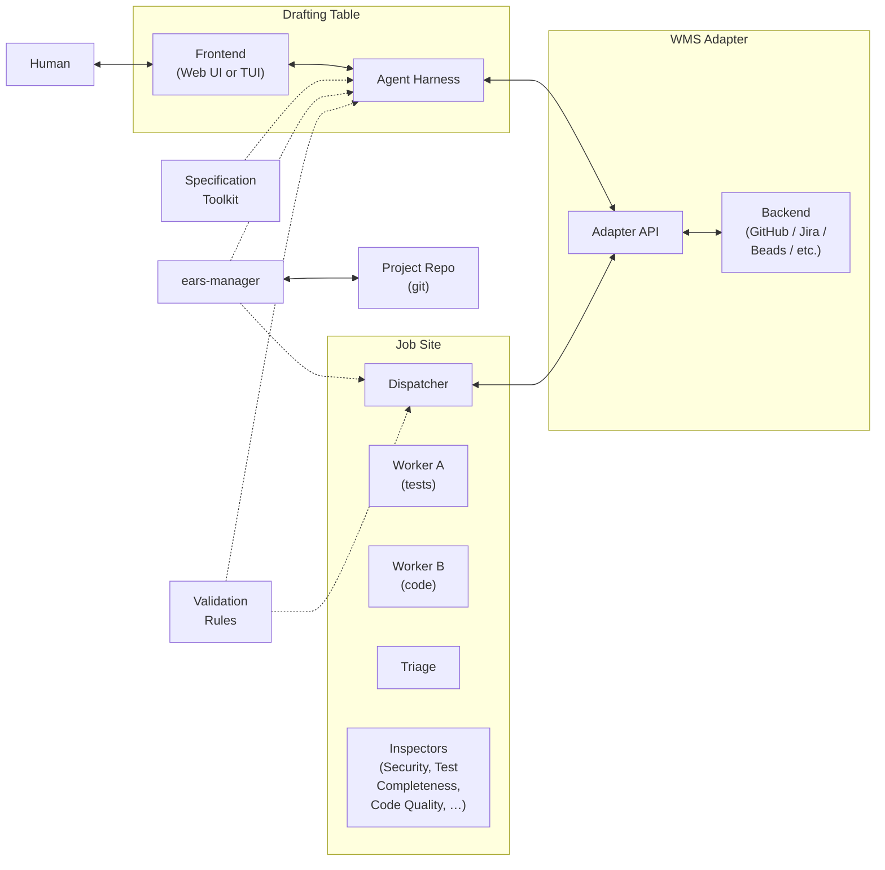
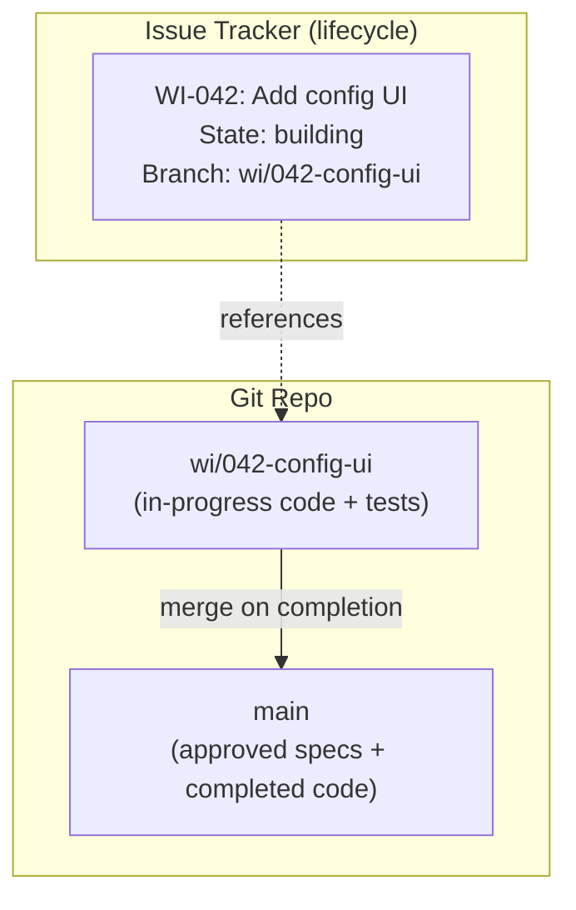

# ProtoBot: System Components

> Design document — draft, July 2026

## Overview

This document identifies the major system components that ProtoBot
needs to be built from, and the interfaces between them. The goal is
to drive design decisions about what to build, what to reuse, and
where the hard integration problems are.

For the user-facing flow and phase details, see
[user-interaction-flow.md](user-interaction-flow.md).

---

## Components



ProtoBot has six major components:

1. **Drafting Table** — The environment where the human and an AI
   agent collaborate during Sketching and Dimensioning. It combines a
   frontend (web UI or TUI) with an agent harness that runs the
   specification work. Different Drafting Table implementations can be
   swapped in; what they share is the Specification Toolkit, the
   Validation Rules, and the WMS Adapter API.
2. **Specification Toolkit** — The portable set of skills, tools, and
   prompts that encode how to do Sketching and Dimensioning. Shared
   across all Drafting Table implementations — it's the domain logic
   that makes any compatible harness capable of driving the
   specification process.
3. **`ears-manager`** — A CLI tool that is the programmatic interface
   to the specification store. Manages the file-based spec database
   (EARS requirements, interfaces, features), enforces EARS formatting
   rules, and validates referential integrity. Used by agents via the
   Specification Toolkit, by CI for verification, and by humans
   directly.
4. **WMS Adapter** — A thin, pluggable integration layer over the
   chosen work management backend (GitHub Issues/Projects, GitLab,
   Jira, Beads, Trello). Translates ProtoBot's work item model
   to/from the backend's native concepts. One implementation is
   active per project. The adapter is deliberately "dumb" — it stores
   and retrieves state but does not enforce rules.
5. **Validation Rules** — Domain logic that enforces well-formedness
   on work item state transitions. Shared across the Drafting
   Table and the Job Site — both use these rules when writing to the
   WMS. Not a running service; a shared library or rule set.
   (Spec-level validation — EARS formatting, referential integrity —
   is handled by `ears-manager`, not here.)
6. **Job Site** — The autonomous execution engine that runs Workers and
   Inspectors to turn approved requirements into working, tested
   prototypes. The Job Site is also responsible for **dispatch** — it
   pulls ready work items from the WMS when it has capacity, rather
   than being pushed work by a scheduler.

---

## Drafting Table

The Drafting Table is where the human sits down with an AI agent to do
the architectural and specification work — Sketching (Phase 1) and
Dimensioning (Phase 2). It is also where the user receives
notifications about blocked work items and resolves them.

A Drafting Table implementation consists of two parts: a **frontend**
(what the user sees and interacts with) and an **agent harness** (what
runs the model, executes tools, manages the conversation). Different
implementations provide both parts together, but all load the same
Specification Toolkit and talk to the same WMS API.

### Reference implementations

**Web Drafting Table** — A web application similar to IdeaBot. The
frontend is a browser-based UI; the harness is a hosted agent runtime
running server-side. This is the natural choice when the user wants
persistent access, push notifications for blocked work items, and no
local setup.

- Provides its own agent harness (hosted runtime).
- Can push notifications to the user (blocked work items, Job Site
   status updates) at any time via the persistent browser connection.
- Needs a deployment target (cluster or hosted service).

**TUI Drafting Table** — A terminal-based interface using an existing
coding agent like OpenCode or Claude Code as the harness. The user
launches it locally; the harness runs on their machine and connects
to the WMS via MCP or API.

- The harness already exists (OpenCode, Claude Code, etc.) — the
  Drafting Table is the Specification Toolkit loaded into it plus
  WMS connectivity.
- Blocked-work notifications use a **pull model**: on session start,
  the harness checks the WMS for blocked items and presents them.
  ("You have 2 work items blocked on undefined behavior — resolve
  now or continue with other work?")
- For urgency between sessions, external notification channels
  (email, Slack) can alert the user that something needs attention.
  The TUI itself doesn't need to be the notification mechanism.

### Responsibilities (common to all implementations)

- Host the conversational interaction between user and agent during
  Sketching (producing the Sketch: Vision + Architecture) and
  Dimensioning (producing the Schematic: approved EARS requirements).
- Present the agent's gap-closing suggestions and allow the user to
  accept, modify, or reject them.
- Surface blocked work items from the WMS and let the user resolve
  them (add a requirement or mark out-of-scope).
- Display work item status from the WMS so the user has visibility
  into what the Job Site is doing.

### Interfaces

- **To WMS Adapter (via API/MCP):** Creates and updates work item
  lifecycle state. Reads work item state for display. Queries for
  blocked items. Applies Validation Rules before writes.
- **To project repo:** Reads and writes specification artifacts
  (Sketch, EARS requirements). Specs are authored on a branch and
  land on main via PR merge.
- **To User:** Conversational interface for Sketching and
  Dimensioning. Displays Job Site progress/status. Surfaces blocked
  work items.
- **From IdeaBot:** Receives IdeaBot output as input to Sketching
  (handoff format is an
  [open question](open-questions.md)).

### Open design questions

- **Async escalation UX.** The web implementation can push; the TUI
  pulls on session start. Is pull-on-start sufficient, or do some
  escalations need faster turnaround? If so, what external channel
  (email, Slack, webhook) should be used? See
  [open question #2](open-questions.md).
- **Spec gap surfacing pattern.** During Dimensioning, the agent
  must aggressively surface unspecified behaviors. What's the UX
  for this? Inline suggestions? A separate gap report? See
  [open question #1](open-questions.md).
- **Multi-interface orchestration.** When a project has many
  interfaces, does the user dimension them one at a time, or jump
  between them? See
  [open question #3](open-questions.md).
- **Session continuity across implementations.** A user might start
  Dimensioning in the TUI and continue in the web UI (or vice
  versa). The WMS backend holds the state, so this should work —
  but does conversational context (the agent's memory of the
  discussion so far) need to transfer too, or is the specification
  state in the WMS sufficient?

---

## Specification Toolkit

The Specification Toolkit is the portable domain logic that any
Drafting Table implementation loads to become capable of driving
Sketching and Dimensioning. It is not a running service — it is a
shared asset consumed by the agent harness.

### Contents

- **Skills** — Structured instructions for the agent: how to conduct
  a Sketching session (elicit Vision, enumerate interfaces, identify
  interface types), how to conduct Dimensioning (translate
  Architecture into EARS requirements, surface spec gaps, handle
  each EARS pattern type).
- **Tool definitions** — MCP tool schemas or API client code for
  interacting with the WMS Adapter (creating/reading/updating work
  items, querying blocked items) and `ears-manager` (adding,
  listing, and validating specifications on the work item's
  branch).
- **Prompts** — System prompts, templates, and reference material:
  EARS pattern definitions, the interface-type taxonomy, the
  undesired-behavior taxonomy, gap-closing heuristics, the
  specification hierarchy (Vision → Architecture → Interface →
  Requirement).

### Design principles

- **Harness-agnostic.** The toolkit must work in any compatible agent
  harness — OpenCode, Claude Code, a hosted web runtime, or future
  harnesses. This means no dependencies on harness-specific APIs
  beyond standard tool execution and prompt loading.
- **Two external dependencies: WMS Adapter and `ears-manager`.** Work
  item lifecycle state lives in the WMS backend (via the adapter).
  Specification content lives in the project's git repo (on work
  item branches), accessed exclusively through `ears-manager`. The
  toolkit does not maintain its own state store.
- **Versioned and testable.** The toolkit should be versioned
  alongside the WMS Adapter API it targets. Changes to EARS patterns,
  gap-closing heuristics, or the specification hierarchy should be
  testable independently of any particular Drafting Table
  implementation.

### Open design questions

- **Toolkit packaging format.** What does the toolkit look like on
  disk? A directory of markdown skills + JSON tool schemas (like
  OpenCode's skill system)? A plugin/extension package? The answer
  depends partly on what the target harnesses support.
- **Tool surface split.** The toolkit needs tools for two systems:
  the WMS Adapter (work item lifecycle CRUD and queries) and the
  spec store (via `ears-manager`). The WMS Adapter tools handle
  work item lifecycle; `ears-manager` handles all spec read/write
  operations. The agent should not need to manipulate spec files
  directly.

---

## `ears-manager`

`ears-manager` is a CLI tool that serves as the programmatic
interface to the specification store. It abstracts the underlying
file format (JSONL, directory-of-files, or whatever is chosen) and
enforces EARS methodology rules deterministically — no LLM judgment
involved.

It is used by three callers:

- **Agents** (via the Specification Toolkit) — the Drafting Table
  agent calls `ears-manager add requirement`, `ears-manager add
  interface`, etc. during Dimensioning. The Job Site reads spec
  content via `ears-manager list` / `ears-manager show`, and
  queries the WMS Adapter for lifecycle state (which requirements
  are pending, claimed, or implemented). Workers must consider the
  full set of approved requirements — not just those claimed by the
  current work item — because some requirements are ongoing
  obligations that apply to every new instance of something (e.g.,
  "All CLI subcommands shall provide `--help`"). See
  [ongoing obligations](user-interaction-flow.md#ongoing-obligations)
  and [open question #19](open-questions.md).
- **CI** — `ears-manager check` runs on every branch push to
  validate that spec files are well-formed, all EARS statements
  match required templates, and referential integrity holds.
- **Humans** — a developer or architect can run `ears-manager`
  directly to inspect, add, or modify requirements without
  involving an agent.

### Subcommands

| Subcommand | Purpose |
|---|---|
| `ears-manager check` | Validate all spec files: EARS formatting, required fields, referential integrity (requirements → interfaces, requirements → features). Exit non-zero on failure. Suitable for CI gates. |
| `ears-manager add requirement` | Add a new EARS requirement, associated with an interface and optionally a feature. Validates the EARS statement against the methodology templates before writing. |
| `ears-manager add interface` | Register a new interface in the Architecture, with its type (API, CLI, GUI, etc.). |
| `ears-manager add feature` | Register a new feature associated with an interface. |
| `ears-manager list` | List requirements, interfaces, or features. Filterable by interface (`--interface api-gateway`), by EARS pattern type (`--pattern ubiquitous`), and combinations. Pattern-type filtering is particularly useful for surfacing ongoing obligations: ubiquitous and state-driven requirements are likely candidates for follow-up work when a work item touches their interface (see [ongoing obligations](user-interaction-flow.md#ongoing-obligations)). |
| `ears-manager show` | Show details of a specific requirement, interface, or feature by ID. |
| `ears-manager update` | Modify an existing requirement, interface, or feature. Re-validates after update. |
| `ears-manager remove` | Remove a requirement, interface, or feature. Checks for dangling references before allowing removal. |

### What it validates

- **EARS formatting.** Each requirement statement must match one of
  the six EARS patterns (ubiquitous, event-driven, state-driven,
   unwanted behavior, optional feature, and complex/combined). The
   tool parses the statement and rejects free-form text that doesn't
   fit a pattern.
- **Required metadata.** Each requirement must have an ID, an
  associated interface, an EARS pattern type, and provenance.
  Missing fields are rejected. Lifecycle state (`pending`,
  `in-progress`, `implemented`) is tracked by the WMS Adapter, not
  by `ears-manager` — see
  [Requirement Lifecycle](#requirement-lifecycle) below.
- **Referential integrity.** Requirements reference interfaces;
  features reference interfaces; interfaces are defined in the
  Architecture. Dangling references (a requirement pointing to a
  non-existent interface) are flagged.
- **File format consistency.** Whatever storage format is chosen
  (JSONL, directory-of-files, etc.), `ears-manager` ensures files
  are syntactically valid and follow the expected schema.

### Design principles

- **Deterministic, not AI-driven.** `ears-manager` is conventional
  code — a linter/validator/CRUD tool, not an LLM. It enforces
  rules mechanically. The *agent* decides what requirements to
  write; `ears-manager` ensures they're well-formed.
- **Statically linked Go binary.** Implemented in Go and distributed
  as a single static binary with zero runtime dependencies. This
  ensures it works identically across all deployment contexts — dev
  containers, CI runners, OpenShell sandboxes, local machines —
  without depending on what's installed in the local environment.
- **Format-agnostic interface.** Callers interact via subcommands,
  not by reading/writing files directly. This means the underlying
  storage format can change (JSONL → directory-of-YAML → SQLite)
  without breaking agents, CI, or human workflows.
- **Single source of truth for spec structure.** All spec reads and
  writes go through `ears-manager`. No other component should parse
  or modify spec files directly. This eliminates the class of bugs
  where different callers interpret the file format differently.

### Open design questions

- **Storage format.** JSONL is tentatively chosen for
  git-friendliness, but `ears-manager` abstracts this. The choice
  can be deferred and changed later without affecting callers. See
  [open question #7](open-questions.md).
- **Spec directory layout.** One file per interface? One file per
  requirement? A hierarchy mirroring the specification levels
  (Vision → Architecture → Interface → Requirement)? The layout
  affects merge conflict frequency and `ears-manager`'s internal
  complexity.
- **Query richness.** How far does `ears-manager list` go? Simple
  filtering (by interface, by status, by pattern type)? Or richer
  queries like "requirements that reference no feature" or
  "interfaces with no requirements"? Richer queries make the agent's
  job easier but increase `ears-manager`'s complexity.
- **EARS template strictness.** How strictly does `ears-manager`
  enforce EARS patterns? Exact keyword matching ("When...",
  "While...", "If...then...")? Or does it allow minor variations?
  Too strict may fight the agent; too loose defeats the purpose.

---

## WMS Adapter

The WMS Adapter is a thin, pluggable integration layer between
ProtoBot and the user's chosen work management backend. It is
deliberately "dumb" — it translates ProtoBot's work item model
to/from the backend's native concepts (issues, cards, tickets) and
handles CRUD, but does not enforce business rules, determine pipeline
routing, or manage dispatch.

One adapter implementation is active per project. Unlike the Drafting
Table (where multiple implementations may be used simultaneously —
e.g., TUI and web for the same project), the WMS backend is a
per-project choice.

### Adapter implementations

Each adapter maps ProtoBot's work item model onto a specific backend:

| Backend | Native concept | Requirement claim mechanism |
|---|---|---|
| GitHub Issues/Projects | Issues + Project boards | One issue per dispatch (work item), listing claimed requirement IDs. Issue assignment = claim. Design requirement: must be supported. |
| GitLab | Issues + Boards | Same pattern as GitHub. |
| Jira | Issues + Boards | Same pattern — one ticket per dispatch. Jira assignment as claim (Forge and Rehor both use this pattern). |
| Beads | Beads (graph issue tracker) + dependency links | One bead per requirement. `bd update --claim` provides native atomic CAS. `bd ready` returns claimable work. |
| Trello | Cards + Boards | One card per dispatch. |

### Responsibilities

- **Store and retrieve** work item lifecycle state: pipeline phase,
  blocked/ready status, change type, provenance, and a reference to
  the work item's content (branch name).
- **Translate** between ProtoBot's work item model and the backend's
  native data model.
- **Expose a uniform API** (the WMS Adapter API) so that callers
  (Drafting Table, Job Site) don't need to know which backend is in
  use.

The adapter does **not**:

- Store work item content (specs, code, tests, inspection reports).
  That lives in the git repo. See
  [Content Storage Model](#content-storage-model) below.
- Determine pipeline entry point (that's a Validation Rules
  concern).
- Decide whether a work item is ready for the Job Site (that's a query
  the Job Site makes against the adapter's state, evaluated by the
  Job Site using Validation Rules).
- Push work to the Job Site (the Job Site pulls).

### Adapter API

The Adapter API is the stable contract that the Drafting Table and
the Job Site both talk to. Lifecycle state persists across sessions: a
TUI session can start Dimensioning, the user can close the terminal,
and the web UI (or a new TUI session) can pick up where it left off
because the lifecycle state lives in the issue tracker and the
content lives in the git repo.

The API surface includes:

- **Requirements:** Track lifecycle state (`pending`, `in-progress`,
  `implemented`) per requirement ID. Claim requirements atomically
  (compare-and-swap from `pending` to `in-progress`, recording the
  claiming work item). Query by status (e.g., "all pending
  requirements", "all requirements claimed by work item X").
  Revert claimed requirements to `pending` if a work item is
  abandoned.
- **Work items:** Create, read, update status, query by state
  (e.g., "all items in state `ready-for-building`", "all blocked
  items").
- **Branch references:** Associate a work item with its content
  branch in the project repo.
- **Context:** Read/write change type, provenance, and
  cross-references between work items.

### Requirement Lifecycle

Requirement lifecycle state is tracked by the WMS Adapter, not by
`ears-manager`. This separation exists because lifecycle state is
coordination data (who's working on what, across multiple actors)
while `ears-manager` stores specification content (what the
requirement says, which interface it belongs to, its EARS pattern
type). Coordination state needs atomic claim operations and
multi-actor visibility — the issue tracker backend provides this;
files in a git repo do not.

```text
pending ──claim──► in-progress ──complete──► implemented
   ▲                    │
   └────abandon─────────┘
```

- **`pending`** — The requirement's PR has been merged to main.
  It is approved and awaiting implementation.
- **`in-progress`** — A work item has claimed this requirement.
  The claiming work item is recorded. Other work items cannot
  claim it.
- **`implemented`** — The work item's branch has merged to main.
  Code satisfying this requirement is on main.

If a work item is abandoned, its claimed requirements revert to
`pending` and become available for future work items.

**The claim mechanism is per-adapter.** The Adapter API requires
atomic claim semantics (a concurrent claim for an already-claimed
requirement must fail), but how that atomicity is achieved depends
on the backend. Each adapter implementation must provide this
guarantee using its backend's native primitives:

- **Beads:** One bead per requirement. `bd update --claim` is a
  native atomic CAS (SQL conditional UPDATE + RowsAffected).
- **GitHub/GitLab:** One issue per dispatch (work item), listing
  the claimed requirement IDs in the issue body. The Job Site
  creates the issue and assigns it to itself atomically. The
  requirement-to-work-item mapping lives in the issue content,
  not as one issue per requirement.
- **Jira:** Same pattern as GitHub — one ticket per dispatch.
  Jira assignment as the claim signal (the pattern Forge and
  Rehor both use).

`ears-manager` knows nothing about this lifecycle. It stores and
validates requirement content. The Job Site queries the WMS (not
`ears-manager`) to discover work and prevent concurrent claims.

### Open design questions

- **Adapter API granularity.** How rich does the query surface need
  to be? Simple key-value CRUD, or structured queries like "all
  blocked items with their blocking reason"? Richer queries reduce
  round-trips but may be hard to map onto simpler backends (Trello).
- **Notification channels.** The WMS backend knows when work items
  are blocked (the Job Site or Drafting Table sets that state). For
  time-sensitive escalations, should there be an optional
  notification layer (email, Slack, webhook) on top of the adapter,
  or is that the Drafting Table's responsibility to poll?

---

## Content Storage Model

Project content lives in the **project's git repo**, not in the
issue tracker. Approved specifications live on main (with lifecycle
state tracked by the WMS Adapter). Each work item gets its own branch for
code and tests; the issue tracker holds lifecycle state and a
reference to the branch.



### How it works

- **During Sketching/Dimensioning,** the contributor writes
  specification artifacts (Vision, Architecture, EARS requirements)
  on a branch and opens a PR against main. On merge, the specs land
  on main with status `pending`.
- **Creating a work item** creates a branch off main (e.g.,
  `wi/042-config-ui`). The issue tracker records the branch name.
  The branch inherits the approved specs from main.
- **During Building,** Workers write generated code and tests to the
  branch. Inspectors read from the branch and write inspection
  reports there.
- **On completion** (all tests pass, Inspectors clear, final test
  pass succeeds), the `wi/` branch merges to main via merge commit.
  Code, tests, and inspection reports land on main. The WMS Adapter
  marks the corresponding requirements `implemented`.
- **Blocked/abandoned** work items are branches whose corresponding
  issue is marked blocked or abandoned. The branch is inert until
  the issue state changes. Abandoned branches can be archived or
  deleted.

### Why this split

| Concern | Where it lives | Why |
|---|---|---|
| Which work items exist, their pipeline phase, blocked status | Issue tracker | Issue trackers are built for this. |
| Approved specifications (Sketch, EARS) | main branch (via PR merge) | Structured, versionable, diffable, CI-lintable. Lifecycle state tracked by the WMS Adapter. |
| Draft specifications (pre-approval) | Contributor branch (PR) | Standard fork-and-PR or branch-and-PR workflow. |
| In-progress code and tests | Work item branch (`wi/`) | Created by the Job Site for Building/Inspecting. |
| Inspection reports | Work item branch | Travel with the work item through rework cycles; accumulated history is preserved in git. |
| Completed specs + code | main branch (via work item merge) | Canonical state of the project. |

### Key properties

- **Requirement state tracks progress.** EARS requirements on main
  have an explicit lifecycle status (`pending`, `in-progress`,
  `implemented`) tracked by the WMS Adapter. Requirements become
  `pending` when their PR is merged — they are approved but not yet
  implemented. The Job Site queries the WMS for pending requirements
  and claims them atomically before building.
- **Sketch updates are regular work items.** Updating the Vision or
  Architecture follows the same branch → review → merge lifecycle
  as any other change. No special case needed.
- **CI can validate branches.** Spec format, well-formedness, and
  consistency checks run on branch pushes, just like code linting.
- **Concurrent work items don't conflict until merge.** Each work
  item has its own branch. Conflicts surface at merge time, which
  is when they need to be resolved anyway.
- **The Job Site reads from the branch.** When processing a work item,
  the Job Site checks out the work item's branch. It reads specs from
  there and writes code/tests there. No ambiguity about which
  version of the specs to use.
- **Regressions expand the work item's scope.** Each work item must
  move the project from one working state to another. If a change
  breaks a previously passing test for a different requirement, that
  regression is the work item's responsibility to fix — the scope
  expands rather than spawning a separate work item. The branch
  doesn't merge to main until all tests pass, including pre-existing
  ones.
- **Concurrent work items follow the standard dev branch model.**
  The Job Site should prefer picking non-overlapping work items, but
  when concurrent items do touch the same areas, the standard
  rebase-before-merge workflow applies: before merging to main, the
  branch is rebased onto the latest main, retested, and any
  conflicts or regressions from the rebase are the delivering Job Site
  agent's responsibility to resolve. This is the same workflow most
  developers are already accustomed to — no special concurrency
  machinery beyond what git provides.

### Open design questions

- **Requirements storage format.** EARS requirements need to be
  structured files at known paths. JSONL (one requirement per line)
  is tentatively chosen for git-friendliness, but cross-references
  and hierarchy may require a different format. See
  [open question #7](open-questions.md).
- **Spec directory layout.** What does the spec directory look like?
  One file per interface? One file per requirement? A hierarchy
  mirroring the specification levels (Vision → Architecture →
  Interface → Requirement)? The layout affects merge conflict
  frequency and queryability.
- **Branch naming and lifecycle.** Convention for branch names
  (e.g., `wi/<id>-<slug>`), when branches are created (on work item
  creation or on first content write), and cleanup policy for
  completed/abandoned branches.

### Merge strategy (decided)

**Merge commits**, not squash or rebase. The work item branch will
have been rebased onto the latest main during the final stages
(see concurrent work items above), so git history won't be
cluttered with long-lived parallel branches. But the merge commit
preserves where overlaps exist, and — critically — does not destroy
the intermediate commits created by the Drafting Table and the Job Site.
Every operation is auditable: Dimensioning edits to EARS, each
Job Site triage cycle's fixes, Inspector-driven rework. This history is
essential for optimization work (understanding how many cycles the
Job Site needed, what Inspectors flagged, where Workers struggled).

### Job Site-internal branching (decided)

Within the Job Site, Worker A (tests) and Worker B (code) must be
isolated from each other. Each gets a **sub-branch** off the work
item branch:

```
wi/042-config-ui            (work item branch)
├── wi/042-config-ui/tests  (Worker A)
└── wi/042-config-ui/code   (Worker B)
```

Each Worker commits to its own sub-branch. At each test cycle, both
sub-branches are merged (via **merge commit**) onto the work item
branch, the artifact is built, and tests run. Each merge commit on
the work item branch records the exact state of both Workers'
outputs at that cycle. Metadata (cycle number, triage results) can
be included in the merge commit message to make tracking easier.

**The sub-branches live for the duration of the work item.** They
are not re-created after a failed test run — doing so would expose
one Worker's output to the other (the new branch point would
include the merged code/tests from the previous cycle), breaking
dual-model isolation. After a triage, each Worker receives fix
instructions and continues committing to its existing sub-branch
without seeing the other's work.

**On work item completion,** the sub-branches are deleted. All
history is preserved: the merge commits on the work item branch
have parent links back to both Workers' commit histories, so the
full iteration record — what each Worker produced at each cycle,
how triage routed fixes, what changed between cycles — remains
reachable through normal git log traversal. No tags or permanent
refs are needed; they would only clutter the ref tree.

This gives merge commits all the way down: Job Site sub-branches
merge into the work item branch (per triage cycle), and the work
item branch merges into main (on completion). The entire history
from initial EARS through every Job Site iteration to final merge is
a single, navigable git DAG.

---

## Validation Rules

Validation Rules are the domain logic that enforces well-formedness
on work items and state transitions. They answer questions like:

- Does this work item have approved requirements before it can move
  to `ready-for-building`?
- Are all interfaces referenced in these requirements defined in the
  Architecture?
- Is a blocked item's escalation actually resolved before unblocking?
- What pipeline entry point does this change type require?
  (Undefined/changes → Dimensioning; contradictions → Building
  directly. See
  [Incremental Development](user-interaction-flow.md#incremental-development-and-change-types).)

Validation Rules are **not a running service** — they are a shared
library or rule set consumed by the Drafting Table and the Job Site.
Both callers apply these rules when writing to the WMS Adapter.

### Why not in the adapter?

Putting validation in the adapter would mean every adapter
implementation (GitHub, Jira, Beads, ...) would need to reimplement
the same business rules. Keeping validation as a shared library that
callers use before writing to the adapter means the rules are defined
once and the adapters stay thin.

The tradeoff: validation is client-side, so both the Drafting Table
and the Job Site must use it correctly. Since both are our code (not
third-party integrations), this is acceptable — but it means the
adapter API itself does not reject invalid transitions. If a future
integration point needs server-side enforcement, a thin validation
gateway in front of the adapter could be added without changing the
adapter or the rules.

### Scope boundary with `ears-manager`

The line between Validation Rules and `ears-manager` is:

- **`ears-manager`** handles **spec-level** validation: EARS
  formatting, required metadata, referential integrity between
  specs (requirements → interfaces → features), file format
  consistency. These are rules about the *content* of
  specifications.
- **Validation Rules** handle **lifecycle** validation: work item
  state transitions, pipeline entry point determination, readiness
  checks (e.g., "are all requirements approved before moving to
  `ready-for-building`?"). These are rules about the *workflow*
  around specifications.

### Open design questions

- **Rule packaging.** Are these rules expressed as code (a library
  imported by the Drafting Table and Job Site), as a declarative
  schema (state machine definition), or as part of the
  Specification Toolkit's skills/prompts (so the agent itself
  enforces them)? The answer affects testability and how tightly
  coupled the rules are to specific implementations.

---

## Job Site

The Job Site is the autonomous execution engine — the entire background
phase (Building + Inspecting). It pulls work items with approved
requirements from the WMS Adapter and produces working, tested,
inspected code.

### Responsibilities

- **Dispatch:** Query the WMS Adapter for work items in
  `ready-for-building` state and pull them when the Job Site has capacity.
  The Job Site decides what to work on and when — there is no external
  scheduler or push mechanism.
- Run Worker A (test generator) and Worker B (code generator)
  concurrently from the same EARS requirements, under strict
  dual-model isolation (neither sees the other's output).
- Merge Worker outputs, build a runnable artifact, and execute the
  test suite against it.
- Triage test failures (bad test, bad code, or both) and route fixes
  back to the appropriate Worker(s).
- Loop the triage → fix → retest cycle until all tests pass.
- Hand passing code to Inspector agents (Security, Test Completeness,
  Code Quality, and potentially others depending on project type).
- Route Inspector findings: code/test defects go back through the
  fix loop; undefined behavior blocks the work item (via the WMS
  Adapter) and escalates to the user via the Drafting Table.
- Run a final test pass after Inspectors clear, then produce the
  output prototype and demo artifacts.
- Run mutation testing as a hidden quality audit — results go to
  Inspectors, not back to Workers.
- Enforce isolation and safety constraints at the sandbox level
  (not just via prompts): prevent Workers from seeing each other's
  output, prevent shortcutting (e.g., mocking instead of real
  implementations), enforce network policy (allow package registries
  and docs, block exfiltration).
- Apply Validation Rules before writing state transitions to the
  WMS Adapter.

### Internal structure

The Job Site itself has sub-components that need design:

- **Workers (A and B):** The agents that generate tests and code.
  Their execution environment, tool access, and isolation boundaries
  need to be defined. OpenShell is the leading sandbox candidate.
- **Triage mechanism:** Something needs to look at test failures and
  decide fault. This could be another agent, a heuristic, or a
  hybrid. It has access to both Workers' outputs (which is a tension
  with the isolation model). See
  [open question #15](open-questions.md).
- **Inspector roster:** Which Inspectors run depends on the project.
  A CLI tool doesn't need an Accessibility Inspector. This could be
  derived from the Architecture's interface types or explicitly
  selected by the user. See
  [open question #12](open-questions.md).
- **Build/merge infrastructure:** The merge step is not just "put
  files together" — it must build Worker B's code into a runnable
  artifact (container, listening API, CLI binary) and start it so
  Worker A's tests can execute against it. See
  [open question #8](open-questions.md).
- **Mutation testing:** When it runs, how results are triaged, and
  how surviving mutants reach Inspectors. See
  [open question #10](open-questions.md).

### Interfaces

- **To WMS Adapter:** Queries for ready work items (pull-based
  dispatch). Reports status updates (in progress, tests passing,
  inspection underway, done). Pushes escalations (undefined
  behavior) that block work items.
- **To project repo:** Checks out the work item's branch. Reads
  specs from there. Writes generated code, tests, and inspection
  reports there. Merges to main on completion.
- **To CI / Build System:** Needs build and test execution
  infrastructure. May need self-contained CI for parallel prototype
  experiments.
- **Outputs:** Prototype artifacts, demo artifacts (showboat docs,
   animated GIFs, screenshots), inspection reports.

### Open design questions

- **Job Site as a product vs. orchestration of existing tools.** The
  Forge project (Red Hat Israel)
  was evaluated as a potential backbone and covers some of the
  hardest parts (autonomous codegen, sandboxed execution, CI
  feedback, approval gates), but has gaps (no interactive phase, no
  project bootstrapping, Jira-only). Is ProtoBot's Job Site built from
  scratch, adapted from Forge-the-project, or an orchestration
  layer over other tools?
- **Worker isolation enforcement.** Dual-model isolation is
  architecturally critical. How is it actually enforced? Separate
  sandboxes? Separate repos/branches? Separate file trees with
  access controls? This is an infrastructure design question, not
  just a prompt engineering question.
- **Isolated vs. implementation-aware tests.** Some requirements
  can't be practically tested at the interface boundary (timing,
  caching, internal state). These need DI/mock time, which breaks
  isolation. What fraction of requirements fall into this category,
  and how do we mitigate oracle gaming for them? See
  [open question #9](open-questions.md).
- **HU-02 compliance gate.** Does merging code to main count as a
  "write action" under Red Hat's AIA/HU-02? The
  [multi-player workflow](#multi-player-workflow) places the human
  checkpoint at PR merge (specs landing on main). Everything after
  is autonomous execution of approved intent. This may satisfy
  HU-02, but needs confirmation. See
  [open question #13](open-questions.md).

---

## Cross-Cutting Concerns

These are not components in themselves but affect the design of
multiple components.

### Evaluability

**Architectural constraint:** Every agentic component in the system
must be independently evaluable. Learning where the inefficiencies
are and being able to measurably improve them is a high priority.
This must be supported in the architecture from the beginning, not
retrofitted.

This means each component needs:

- **Defined inputs and outputs** that can be captured and replayed.
  If you can't feed a component a known input and measure its
  output, you can't eval it.
- **Structured trace data** recorded during operation — not just
  "did it succeed" but how it got there: how many iterations, what
  decisions were made, where time was spent, what was discarded.
- **Isolation boundaries that allow component-level testing.** You
  should be able to eval the Triage mechanism without running the
  full Job Site, or eval gap-closing heuristics without a live
  Dimensioning session.

**Per-component eval surfaces:**

| Component | Key eval questions | Data source |
|---|---|---|
| Sketching agent (Toolkit) | Does it elicit a complete Architecture? Does it surface unstated assumptions? | Recorded Sketching sessions (input descriptions → produced Sketches) |
| Dimensioning agent (Toolkit) | Does it produce complete EARS coverage? How many gaps does it surface vs. miss? | Recorded Dimensioning sessions; compare agent-surfaced gaps against gaps found later by Inspectors |
| Worker A (test generator) | Do generated tests actually verify the requirements? What's the mutation kill rate? | Generated test suites vs. EARS requirements; mutation testing results |
| Worker B (code generator) | Does generated code pass independently-generated tests on first try? How many triage cycles? | Job Site sub-branch history (cycle count, fix types) |
| Triage mechanism | Does it correctly attribute failures to tests, code, or both? | Triage decisions vs. actual root causes (measurable when the fix confirms or contradicts the triage) |
| Inspectors | Do they catch real defects? What's the false positive rate? Do they miss things mutation testing catches? | Inspector findings vs. mutation testing results; rework cycles caused by Inspector misses |
| Gap-closing heuristics | How often does the Job Site or Inspector discover undefined behavior that Dimensioning should have caught? | Async escalation frequency; "unspecified" bin in the undesired-behavior taxonomy |

**The git history is a natural eval dataset.** The merge-commit and
Job Site sub-branch history preservation decisions (see
[Content Storage Model](#content-storage-model)) were made partly
for this reason: the full iteration history of every work item —
Dimensioning edits, Job Site cycles, Inspector findings, rework — is
recorded in git and available for analysis without additional
instrumentation.

**Open design questions:**

- **Trace format and storage.** What structured trace data does each
  component emit beyond git commits? Logs? OpenTelemetry spans?
  Something custom? Where is it stored and how is it queried?
- **Eval harness.** How do you run an eval? Feed a component
  recorded inputs and compare outputs against a reference? The
  Eval Hub and
  Agent Eval Harness
  are existing Red Hat eval infrastructure — should ProtoBot use
  them, or does the component-level eval need something different?
- **Baseline establishment.** What's the first set of evals to
  build? The Job Site cycle count (how many triage iterations before
  tests pass) is probably the easiest high-signal metric to start
  with, since the git history captures it directly.

### Multi-Player Workflow

Specifications and code are decoupled on main. Approved EARS
requirements land on main via normal PR merge. The WMS Adapter
tracks their lifecycle state as `pending`. The Job Site
independently picks up pending requirements, groups them into work
items, and builds them. Code lands on main when the work item's
branch merges — at which point the WMS marks the requirements
`implemented`.

This means main can have requirements without corresponding code
(state: `pending`). This is an explicit, queryable state, not a
gap — it's the project's approved backlog, visible via the WMS.

#### The PR → merge → build model

```mermaid
sequenceDiagram
    actor Contributor
    actor Reviewer
    participant Repo as Main Repo
    participant WMS as WMS Adapter
    participant JS as Job Site

    Contributor->>Repo: Open PR adding EARS requirements
    Reviewer->>Repo: Review specs, merge PR
    Note over Repo,WMS: Requirements land on main;<br/>WMS records status: pending
    JS->>WMS: Query for pending requirements
    JS->>WMS: Claim requirements (atomic)
    JS->>Repo: Create wi/ branch,<br/>Workers + Inspectors operate
    JS->>Repo: On completion: merge wi/ branch<br/>to main
    JS->>WMS: Mark requirements implemented
```

1. **Contributor** writes specs (via Drafting Table +
   `ears-manager`) and opens a PR against main. Contributors
   without write access use the standard fork-and-PR workflow.
2. **Reviewer** reviews the specs using GitHub's standard review
   tools (line comments, request changes, approve) and merges the
   PR. This is the human approval gate — standard branch
   protection rules, CODEOWNERS, and required reviews all apply.
   CI runs `ears-manager check` as a merge gate to validate spec
   well-formedness.
3. **Requirements land on main.** The WMS Adapter records them
   as `pending` — approved but not yet implemented.
4. **Job Site** queries the WMS for pending requirements, claims
   them atomically (preventing concurrent build runs from picking
   up the same requirements), groups them into work items at
   whatever boundaries make sense for implementation (by
   interface, by dependency, by complexity), creates a `wi/`
   branch, and runs the Building/Inspecting pipeline.
5. **On completion**, the `wi/` branch merges to main. The WMS
   marks the requirements `implemented`.

#### Why this model

- **Standard GitHub permissions.** PR merge is the approval gate,
  which is exactly what branch protection rules, CODEOWNERS, and
  required reviews are designed for. No custom label-based
  permission scheme needed.
- **Standard contributor workflow.** Branch, commit, open PR, get
  review, merge. No special labels, no "don't merge — only label
  it" confusion.
- **Decoupled granularity.** A contributor can add 30 requirements
  in one PR (or across several PRs over a week). The Job Site
  groups them into work items at whatever boundaries make sense
  for implementation — by interface, by dependency chain, by
  estimated complexity — rather than being forced to match the
  contributor's submission boundaries. This is particularly
  valuable for large initial spec drops or cross-cutting
  requirements that touch multiple interfaces.
- **Explicit backlog.** Pending requirements on main are the
  project's approved backlog, visible and queryable. The current
  state of every requirement is tracked by the WMS Adapter, not
  hidden in issue tracker labels.
- **Traceability.** Every requirement has clear provenance: which
  PR merged it, who approved the merge, when. Standard git/GitHub
  audit trail.
- **HU-02 compliance.** The human confirmed the intent (the specs)
  by merging the PR — a more recognized, auditable approval action
  than applying a label. Everything after is autonomous execution
  of that approved intent.

#### Escalations

When the Job Site discovers undefined behavior during Building or
Inspecting, it cannot resolve this autonomously — it needs human
input:

1. **Job Site opens an issue** in the main repo describing the
   undefined behavior. The work item is marked blocked in the WMS.
2. **Any team member** writes the missing spec changes and opens
   a PR against main (the normal contribution flow).
3. **Reviewer** merges the PR. The new requirements land on main
   as `pending`.
4. The Job Site picks up the new requirements and resumes the
   blocked work item (or incorporates them into its next work
   item, depending on grouping).

This uses the same PR → merge flow as initial contributions —
no special escalation mechanism needed.

#### Single-player mode

In single-player mode, the contributor has write access and can
push specs directly to main (or merge their own PRs). The flow
is identical — the WMS Adapter tracks requirement lifecycle state
the same way, and the Job Site picks up `pending` requirements the same
way. The difference is ceremony, not architecture.

#### Open design questions

- **Work item grouping strategy.** How does the Job Site decide
  which pending requirements to group into a single work item?
  By interface? By dependency analysis? By estimated complexity?
  A simple starting point: all pending requirements for a single
  interface become one work item.
- **Bot account model.** The Job Site needs a GitHub identity with
  write access for creating `wi/` branches and merging completed
  work. GitHub App? Bot account? Machine user? Each has different
  permission scoping, rate limits, and audit characteristics.
- **Race conditions.** If specs land incrementally, the Job Site
  might start building against an incomplete set. Mitigations: a
  configurable delay before picking up new pending requirements,
  or a "ready for building" signal from the contributor.

### Sandbox / Execution Environment

The Job Site's Workers and Inspectors need a secure execution
environment. OpenShell is the leading candidate (per-binary,
per-destination L7 network policy, not blanket isolation). IdeaBot
rejected OpenShell in May 2026 (OpenShift SCC issues); ProtoBot
should re-evaluate independently.

The sandbox is also the primary enforcement mechanism for the
"safeguard" function: constraints are enforced at the sandbox/tooling
level, not via a separate safeguard agent or prompting alone.

### Authentication and Credential Isolation

Inherited from IdeaBot's design: MCP servers must terminate inbound
client tokens and use server-owned credentials downstream (the
Alcove Bridge/Gate pattern). OAuth 2.1 is the ESS-required baseline.
This affects all components that call external services.

### Compliance (ESS + AIA)

ProtoBot shares IdeaBot's CMDB record but its autonomous
code-generation design likely rates **High risk** on the AI Agent Risk
Evaluator — higher than IdeaBot — requiring a fresh AIA submission.
The main design-relevant control is HU-02 (Agentic Authorization):
human confirmation before write/deploy actions. The
[multi-player workflow](#multi-player-workflow) places the human
checkpoint at PR merge time (when specs land on main). Everything
after is autonomous execution of approved intent. Whether this
satisfies HU-02 for the subsequent automated code merge needs
confirmation.

---

## Related Documents

- [Overview](overview.md) — What ProtoBot is, guiding principles,
  and workflow summary
- [User Interaction Flow](user-interaction-flow.md) — Phase details
  and sequence diagrams
- [Open Design Questions](open-questions.md) — Unresolved design
  questions across all areas
- [Related Work](related-work.md) — Red Hat internal projects,
  external factory projects, and lessons learned
