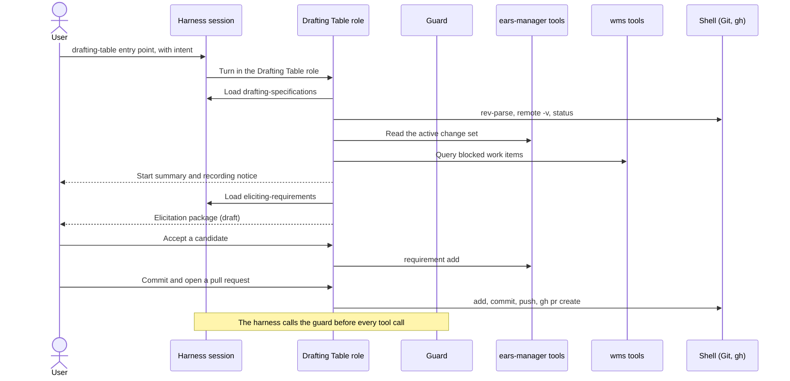

# ProtoBot: Specification Toolkit Harness Adapters

> Design document — September 2026
>
> Defines how the Specification Toolkit becomes the TUI Drafting Table
> inside any coding-agent harness, what is written once for every
> harness, and what each harness binding adds.

**Contents:**

- [Purpose and scope](#purpose-and-scope)
- [The three layers](#the-three-layers)
- [Adapter core](#adapter-core)
- [Session entry and resume](#session-entry-and-resume)
- [What the harness layer stops](#what-the-harness-layer-stops)
- [Repository and credential capabilities](#repository-and-credential-capabilities)
- [Deployment modes](#deployment-modes)
- [Artifacts and traces](#artifacts-and-traces)
- [Resumable state](#resumable-state)
- [Exit conditions](#exit-conditions)
- [Harness obligations](#harness-obligations)
- [Adding a harness](#adding-a-harness)
- [Toolkit skill rules](#toolkit-skill-rules)
- [Fixture session](#fixture-session)
- [Out-of-scope decisions](#out-of-scope-decisions)
- [Related Documents](#related-documents)

---

## Purpose and scope

This document answers the question posed by issue #33: _What is the
smallest useful Drafting Table adapter when the user invokes ProtoBot
inside an existing OpenCode session?_

OpenCode is the first harness, not the only one. The Toolkit must work
in any compatible agent harness
([Specification Toolkit](../architecture.md#specification-toolkit)),
and ProtoBot is expected to run in Claude Code, Codex, OpenCode, and
harnesses that do not exist yet. The answer therefore has two parts:

- **This document is the harness-neutral adapter contract.** It defines
  what is written once and shared by every harness, and what every
  harness binding must provide.
- **[OpenCode Adapter](opencode-adapter.md) is the first binding.** It
  defines the OpenCode files that meet this contract, checked against
  OpenCode 1.18.30.

A binding for another harness is one more document beside the OpenCode
binding and one more row in [Binding status](#binding-status). It
changes no Toolkit file and no rule in this document.

This document defines:

- the three layers and the rules that keep them apart;
- the adapter core: the manifest, the Drafting Table role, the governed
  tools, the permitted shell operations, and the guard;
- how a session starts and resumes in any harness;
- what the harness layer stops, and what it leaves to later layers;
- repository and credential capabilities, and deployment modes;
- artifacts, traces, resumable state, and exit conditions;
- the obligations a binding must meet, and how a harness is added; and
- a harness-neutral fixture session that proves skill discovery,
  governed calls, exit conditions, and resumable draft state without a
  live model.

There is no `protobot` program. In every harness the user invokes
ProtoBot through an entry point named `drafting-table`, which loads the
Toolkit skills. The adapter core adds one executable, the
[guard](#the-guard).

The first Toolkit consumer is the `eliciting-requirements` skill from
PR #64. The contract is defined for the **single-player TUI Drafting
Table** first
([Overview — Single-player mode](overview.md#single-player-mode)).
The Web Drafting Table and a standalone session manager are out of
scope: the Web Drafting Table replaces the local harness with a hosted
runtime
([Drafting Table Boundary](../architecture.md#drafting-table-boundary)),
and every harness already owns its sessions.

### Relationship to sibling contracts

- **#28** (Drafting Table MVP user experience — PR #81, pending)
  defines what the user sees and decides. It defers skill packaging,
  adapter hooks, the session-recording notice, and chat persistence to
  #33.
- **#30** (`ears-manager` CLI integration) defines the operations and
  their request and result shapes. This document decides how the agent
  reaches those operations from a harness, and depends on #30 for the
  tool set.
- **#31** (Drafting Table WMS integration) defines the WMS operations.
  This document registers them as tools and does not name them.
- **#32** (Validation Rules) defines lifecycle validation. The adapter
  loads no rules; the WMS write boundary applies them.
- **#34** ([Git and Project-Repository Integration](git-integration.md))
  defines the Git rules. It leaves the harness permission layer and the
  Git host client binding to #33; both are decided in
  [Shell operations](#shell-operations).
- **#56** and PR #64 supply `eliciting-requirements`.
- **#77** implements the adapter core and the OpenCode binding, and
  runs the [fixture session](#fixture-session) as its test plan.

---

## The three layers

| Layer | Contains | Written | Changes when |
| --- | --- | --- | --- |
| Specification Toolkit | Skills: the session protocol, elicitation, Sketching and Dimensioning guidance, and the [host mapping](#host-mapping). MCP tool definitions for `ears-manager` and the WMS Adapter. Reference material. | Once, for every harness | The specification method changes |
| Adapter core | The [manifest](#the-adapter-manifest), the [Drafting Table role](#the-drafting-table-role), the [shell operations](#shell-operations), the [guard](#the-guard) and its test vectors, and the [fixture](#fixture-session) | Once, for every harness | This contract changes |
| Harness binding | The harness's own files: MCP registration, skill discovery, the role's native rules, the entry point, the hook that calls the guard, and access to the session record | Once per harness | That harness changes |
| Governed systems | `ears-manager`, the WMS Adapter, Git and the Git host | Their own contracts (#30, #31, #34) | Their contracts change |

Three rules keep the layers apart:

1. **No Toolkit file names a harness.** A Toolkit skill names
   operations — `ears-manager requirement add`, a WMS operation from
   issue #31, a Git operation from issue #34 — and never a harness
   tool, a permission key, or a harness config file.
2. **The adapter core names a harness in one place only:** the guard's
   [tool vocabulary](#tool-vocabulary), which has one row per harness.
3. **A binding holds no domain logic and no policy of its own.** It
   connects the harness to the Toolkit and to the guard. Its native
   rules may copy the core's rules as an early layer, but they never
   allow what the core refuses.

### The session protocol is a skill

The start, resume, checkpoint, and approval protocol of #28 is domain
logic. If it lived in a harness's agent prompt, every harness would
have to copy it, and the copies would drift. It therefore lives in a
Toolkit skill, `drafting-specifications`, which issue #77 writes from
the contract of issue #28. The skill also holds the protocol rules that
do not depend on a harness:

- a refused tool call is a result, reported and not retried in another
  form;
- the resume steps run again after a continued or compacted
  conversation, before the next governed write; and
- the start summary tells the user once that the harness records the
  session on this machine.

A binding's prompt only loads that skill and states how operation names
map to the harness's tool names.

`eliciting-requirements` stays a general-purpose capability, as PR #64
defines it, and knows nothing about ProtoBot or any harness.
`drafting-specifications` is its host.

### The swap test

The layers hold when one harness binding can replace another while
every Toolkit file and every adapter-core file stays byte-identical.
[Adding a harness](#adding-a-harness) turns that test into a procedure.

---

## Adapter core

### Installed layout

```text
<project root>/
├── .agents/
│   ├── drafting-table.yaml        adapter manifest
│   └── skills/                    Toolkit skills
│       ├── drafting-specifications/
│       └── eliciting-requirements/
└── <binding files>                one set per harness, in its own directories

On PATH: ears-manager, drafting-table-guard, the WMS Adapter MCP server
```

`.agents/` is the directory that several harnesses already read for
skills, so the shared layer lives there. Each binding keeps its files in
its harness's own directories, so bindings for several harnesses sit in
one project without touching each other.

ProtoBot's first project is the ProtoBot repository itself
([Vision — Self-hosting](../vision.md#self-hosting-the-first-project)).
Its Toolkit skills already live in `.agents/skills/`, so the adapter
adds the manifest and the binding files.

These are ordinary project files. They are not registered specification
artifacts, the Drafting Table never stages them, and the deny-by-default
projection manifest keeps them out of Worker projections
([Worker repository projections][projections]). A change to them
arrives as a normal pull request and is reviewed as code, because a
binding runs its hook on the machine of everyone who opens the project.

A project that does not carry the adapter can install the same shared
files under `~/.agents/` and each binding under its harness's user
config directory. The guard does nothing in a directory that is not a
ProtoBot project, so a user-scope install leaves other work unchanged.

### The adapter manifest

`.agents/drafting-table.yaml` is the single list that every binding and
the guard read:

```yaml
adapter_layout: 1
entry_point: drafting-table
session_skill: drafting-specifications
toolkit_skills:
  - drafting-specifications
  - eliciting-requirements
governed_mcp_servers:
  - ears-manager
  - wms
```

- A binding takes its entry-point name, its skill allowlist, and its
  MCP server list from the manifest. Where a harness needs the values
  written into its own config, the binding copies them, and the fixture
  checks that the copy matches.
- A new Toolkit skill is one manifest line, plus the same line in each
  binding's native copy.
- The manifest holds no credential and no path rule.

### The Drafting Table role

Each binding gives exactly one agent, profile, or session mode the
Drafting Table role. Only that role performs governed mutations.

| Capability | Drafting Table role | Through |
| --- | --- | --- |
| Read project files | Yes, except `.protobot/` and `.env` files | The harness's read and search tools |
| Read files outside the project | No, except a user-scope Toolkit skill root | — |
| Read and write registered specifications | Yes, validated | `ears-manager` tools |
| Write a file directly | No | — |
| Read work items and submit reviewed resolutions | Yes | `wms` tools |
| Transition a work item | No | — |
| Git and pull-request operations | Only the [shell operations](#shell-operations) | The harness's shell tool |
| Register an approved change set | Yes, single-player | `register-approved-change-set` |
| Load skills | Toolkit skills only | The harness's skill mechanism |
| Subagents, web fetch, web search, other MCP servers | No | — |
| Credentials | None held and none readable | — |

In an existing session, the conversation so far is context, not state:
the resume steps read authoritative state whatever it says (#28). A
turn outside the role has no governed tools, so choosing the wrong
agent cannot mutate governed state.

### Governed tools

Toolkit tool definitions reach every harness as two MCP servers, named
by the manifest: `ears-manager` and `wms`. MCP tool schemas are the
specification approach the Architecture names for the Toolkit
([Interface Specification Approach][interface-approach]), the
single-player WMS Adapter already runs as a local MCP process
([WMS Adapter API](../architecture.md#wms-adapter-api)), and OpenCode,
Claude Code, and Codex all load MCP servers. No harness-specific tool
code exists.

Inside each server, one tool serves one Toolkit-used operation and is
named `<group>_<verb>`: the operation `change-set create` is the tool
`change-set_create`. Each harness then adds its own prefix, for
example `ears-manager_change-set_create` in OpenCode and
`mcp__ears-manager__change-set_create` in Claude Code. The binding's
prompt states that mapping.

This contract depends on #30 for `ears-manager` tools that follow these
rules:

- **No shell.** The server runs the `ears-manager` binary with an
  argument list, so a tool argument cannot become shell syntax.
- **Content travels as an argument.** Requirement text or a Vision
  document is a tool argument, not a file the agent writes first. That
  is why the role needs no file-writing tool.
- **Results are unchanged.** A tool result is the command's structured
  output. A non-zero exit is a tool error that carries the diagnostic
  as the command printed it.
- **Reads use the same tools.** The role does not read files under
  `.protobot/`. The resume steps and the guard still need the Git-facing
  fields of `project.yaml`, such as `repository.canonical_remote`,
  `repository.default_branch`, and `repository.branch_prefix`
  ([Repository fields](git-integration.md#repository-fields)), so this
  contract depends on #30 exposing them through a read operation.

Whether `ears-manager` serves MCP itself or a Toolkit wrapper runs it
is #30's decision. Every binding registers a server named `ears-manager`
either way.

The `wms` tools carry the operations and result shapes of #31.
Validation Rules run at the WMS write boundary; an early diagnostic
reaches the agent as a `wms` tool result (#32). The Drafting Table never
transitions a work item itself
([Registration](git-integration.md#registration)).

#### The first consumer: `eliciting-requirements`

| Need of the skill (PR #64) | Met by |
| --- | --- |
| Loaded by name | The manifest's `toolkit_skills` |
| Reads `references/ears-and-review.md` and `references/quality-guidance.md` on demand | The role's read access to the skill directory |
| Host metadata to preserve: IDs, tags, trace links | The session skill passes records it read through `ears-manager` |
| No file output in normal use | Nothing; the package stays in the conversation |
| Usable without ProtoBot | No adapter file is needed to load the skill in any harness |

#### Host mapping

The skill leaves approval, persistence, identifiers, and lifecycle to
its host. In ProtoBot the host is `drafting-specifications`. The
mapping below is Toolkit content that lives in that skill, not in the
adapter core or a binding; it is recorded here because the fixture
asserts it.

| Elicitation package content | ProtoBot decision | Governed write |
| --- | --- | --- |
| A candidate with status `ready for review` that the user accepts | Becomes a proposed requirement in the change set | `ears-manager requirement add`, or `requirement update` for a revision |
| A candidate with status `needs clarification` or `candidate` | Never written. Its open question or finding stays a gap (#28). | None |
| `Template:` one of the six patterns | The record `type` ([ADR-0002][adr2-pattern]) | Same call |
| `Template: unresolved` | Not writable | None |
| `Requirement:` sentence | The record `text`, validated by `ears-manager` | Same call |
| `Affected interfaces` | `applies_to.interfaces`. The skill produces no scopes; the host asks for `applies_to.scopes` when they matter. | Same call |
| `Observable at the named boundary alone: yes` | `verification.mode: isolated-interface` | Same call |
| `Observable at the named boundary alone: no`, with its rationale | `verification.mode: implementation-aware` with that rationale ([ADR-0002][adr2-verification]) | Same call |
| A candidate that restates behavior the user stated | `provenance: user-authored` | Same call |
| A suggested supporting requirement that the user accepts | `provenance: agent-suggested` | Same call |
| Supporting-requirement labels, such as Required companion | Not relationships. A `relationships` entry is written only when the user picks one of the four relationship types ([ADR-0002][adr2-relationships]). | Same call, when picked |
| Clarifying questions, consistency findings, assumptions | Draft conversation state, handled as gaps and proposals (#28) | None |

### Shell operations

Git runs through the harness's own shell tool, as the strawman states
([OpenCode-plus-skill strawman][strawman]). The Drafting Table role may
run only the operations below, which are
[Permitted Git operations](git-integration.md#permitted-git-operations)
written as commands. `<remote>` is the remote whose URL equals
`repository.canonical_remote`, `<prefix>` is `repository.branch_prefix`,
and `<default>` is `repository.default_branch`.

| Operation | Command forms | Constraint |
| --- | --- | --- |
| Read repository state | `git status`, `git log`, `git diff`, `git show`, `git ls-files`, `git rev-parse`, `git merge-base`, `git remote -v`, `git remote get-url <name>` | Read-only forms |
| Fetch | `git fetch <remote>` | No refspec with a colon |
| Create or switch a change-set branch | `git switch -c <prefix><nnn>-<slug>`, `git switch <prefix><nnn>-<slug>` | #34's branch name |
| Stage | `git add -- <path> ...` | Explicit paths; never `.` |
| Commit | `git commit -F -` with the message in a quoted here-document | No `--amend`, `-a`, or `--all` |
| Merge the default branch in | `git merge --no-ff <remote>/<default>`, `git merge --abort` | No `--squash`, no `--ff-only` |
| Discard a direct edit | `git checkout -- <path>` | Only on the user's choice; never `.` |
| Push the change-set branch | `git push <remote> <prefix><nnn>-<slug>` | No force, no `+`, no refspec with a colon |
| Delete a merged branch | `git push <remote> --delete <prefix>...`, `git branch -d <prefix>...` | After the merge commit exists on `<default>` |
| Open, update, inspect a pull request | `gh pr create`, `gh pr edit` with `--body-file -` and a quoted here-document, `gh pr view`, `gh pr checks` | Base is `<default>` |
| Merge the author's own pull request | `gh pr merge <number> --merge` | Single-player; no `--squash`, `--rebase`, `--admin`, or `--auto` |
| Register an approved change set | `register-approved-change-set ...` | Single-player |

Every command is one simple command. It contains no output
redirection, no command substitution, and no variable expansion outside
a quoted here-document body, and no option that writes a file or runs a
program: `--output`, `--upload-pack`, `--receive-pack`, or `--exec`.
Any other command is refused, so a push to the default branch is refused
before it runs, as the
[repository fixture](git-integration.md#repository-fixture) requires.

- **Messages and bodies are data.** A commit message or a pull-request
  body travels in a quoted here-document, so its text cannot become
  shell syntax. A harness whose native patterns match here-document text
  may refuse a message that contains a forbidden option; reword it.
- **Stricter than #34 in one place.** #34 allows amending an unpushed
  commit on explicit request. The shell operations refuse every amend,
  because a command alone does not show whether a commit was pushed.
- **The Git host client is `gh`.** The first project is hosted on
  GitHub, so the same client serves every harness. `gh api`, `gh auth`,
  and every other `gh` command are refused. A non-zero exit of `gh` is
  reported with its status and message, and matches the rows
  "Pull-request creation failed" and "Merge refused by branch
  protection" of #34's [failure table](git-integration.md#failure-behavior).
  A merge in multi-player mode is refused by the host: the host decides
  who may merge.

A binding may copy these operations into its harness's native command
rules as an early layer. Native patterns usually cannot read project
fields, so a native copy uses the defaults `origin`, `cs/`, and `main`,
and a project with other values edits that copy. The guard always uses
the real values.

### The guard

`drafting-table-guard` is the only adapter code shared by every harness.
It is one executable with no runtime dependency, like `ears-manager`.
Every binding calls it before each tool call, and it answers allow or
refuse.

#### Guard input and output

- **Input.** JSON on standard input, in the `PreToolUse` hook shape that
  Claude Code and Codex already send: `hook_event_name`, `session_id`,
  `cwd`, `tool_name`, and `tool_input`. The binding adds two arguments:
  `--harness <name>` and `--role drafting-table` or `--role other`. A
  harness without that hook shape, such as OpenCode, gets a binding
  shim that builds the same JSON.
- **Allow.** Exit status 0 with no output. The harness's own rules then
  decide.
- **Refuse.** Exit status 2 and one line on standard error that names
  the rule and the governed route, for example
  `ears-manager artifact put`. Claude Code and Codex both block a tool
  call on status 2 and show the line to the model, so they can call the
  guard directly.
- **Fail closed.** The guard exits with status 2 on any internal error,
  because some harnesses treat other non-zero statuses as warnings.

#### Tool vocabulary

The guard carries one vocabulary row per harness. A row lists which
tool names write files and where their target paths are, which tool runs
shell commands and where the command is, which tools read files, which
tool loads a skill, and how MCP tool names are formed. It is data, not
logic. Adding a harness adds a row and its test vectors. Under the
Drafting Table role, a tool name that the row does not list is refused.

#### Guard rules

1. **Find the project.** The guard looks for `.protobot/project.yaml`
   at the root of the Git working tree that contains `cwd`, by the rule
   in [The project root](git-integration.md#the-project-root). Without
   one, it allows everything.
2. **Ask `ears-manager`.** For each decision it reads the registered
   paths and the project fields through the `ears-manager` CLI (#30). It
   never parses `project.yaml` itself
   ([`ears-manager` CLI](../architecture.md#ears-manager-cli)). If that
   read fails, it refuses every file write and every Drafting Table
   shell command in the project, and names the failure.
3. **Guarded paths, every role.** A file write under `.protobot/` or to
   a registered path is refused. Paths are compared after symlink
   resolution, a registered directory guards everything below it, and a
   write whose target path cannot be read is refused.
4. **Governed tools.** A tool of a server in `governed_mcp_servers` is
   refused outside the Drafting Table role. Any other MCP tool is
   refused inside it.
5. **The role's tool set.** Under the Drafting Table role, the guard
   refuses every file write, subagent launch, web fetch, and web search,
   every read under `.protobot/` or of an `.env` file, and every skill
   load not listed in `toolkit_skills`.
6. **The role's shell commands.** Under the Drafting Table role, a
   command that is not one of the [shell operations](#shell-operations)
   is refused.
7. **Other roles' shell commands.** A command that redirects output and
   contains a guarded path written from the project root, such as
   `docs/vision.md`, is refused.

The guard runs no Git command that writes, opens no network connection,
writes no file, and does nothing when a session is idle or ends.

#### Guard test vectors

The adapter core ships test vectors: a JSON input, a harness, a role,
the expected exit status, and a fragment of the expected reason. The
vectors run against the guard directly, and again through each
binding's hook, in [the fixture](#guard-vectors).

---

## Session entry and resume

Every binding provides the same session behavior:

- **One entry point named `drafting-table`.** Depending on the harness
  it is a command, an agent, or a profile. It gives the turn the
  Drafting Table role and loads the `drafting-specifications` skill.
  Its name differs from every Toolkit skill name, because harnesses can
  also invoke a skill by name as a command.
- **Resume on every start.** The resume steps of the session skill run
  on every entry, on a continued session, and after compaction. They
  read the project, the change-set branch, and blocked work through
  governed tools and shell operations only, as #28 describes.
- **One recording notice.** The start summary tells the user once that
  the harness records the session on this machine. #28 left that
  decision to #33.
- **No action on idle or exit.** No binding commits, pushes, registers,
  or cleans up when a session is idle or ends.
- **No session upload.** A binding turns off any harness feature that
  uploads or shares a session, because a session carries unapproved
  specification text and pasted IdeaBot material.
- **No permission prompt inside the governed path.** A binding's rules
  allow or refuse. A headless run then behaves like an interactive one,
  and the fixture can replay it.



---

## What the harness layer stops

The harness layer is the optional early layer of the
[Governed tool integrations](../architecture.md#governed-tool-integrations).
The mandatory layers stay where #34 puts them
([Ungoverned-edit detection](git-integration.md#ungoverned-edit-detection)),
so a harness whose binding is weaker changes how early a violation is
caught, never whether it is caught.

| Write route to a guarded path | Drafting Table role | Every other role | Caught later by |
| --- | --- | --- | --- |
| File-writing tool | Refused by the guard; hidden by native rules where the harness can hide tools | Refused by the guard | Pre-stage digest comparison, `ears-manager check`, CI path ownership |
| Shell writer, such as `sed -i`, `cp`, or `tee` | Refused by the guard | Not stopped | Same |
| Output redirection in a shell command | Refused by the guard | Refused by the guard when the command contains the path as written from the project root | Same |
| Tool of a non-governed MCP server | Refused by the guard | The user's own configuration | Same |
| Subagent | Refused by the guard | Not applicable | Same |

A route marked "not stopped" is real. An agent outside the role can
still change a registered file through its shell, for example after
`cd docs`. The pre-stage digest comparison refuses to stage the change,
`ears-manager check` fails in CI, and the Drafting Table offers the two
routes forward from [The pre-stage digest comparison][pre-stage].

A user can also switch the harness layer off, by editing a binding or
starting the harness without hooks. The later layers do not depend on
any harness.

---

## Repository and credential capabilities

### Credentials

- **No binding file holds a credential.** Binding config names servers
  and commands, not tokens, in the same way that `project.yaml` never
  holds one ([Repository fields](git-integration.md#repository-fields)).
- **Single-player.** Git uses the user's credential helper, `gh` uses
  its own credential store, and the `wms` server obtains the user's own
  Git host token itself, as the
  [WMS Adapter API](../architecture.md#wms-adapter-api) topology states.
  The Drafting Table role cannot print a credential: environment and
  file-printing commands are not shell operations, `.env` reads and
  reads outside the project are refused, and variable expansion is
  refused.
- **The limit of single-player mode.** The agent runs as the user, on
  the user's machine. The adapter narrows what the Drafting Table role
  can reach; it does not isolate a token from the user's own shell or
  from another agent. Credential isolation by the Bridge/Gate pattern
  is a property of the hosted modes
  ([Environmental Constraints](../architecture.md#environmental-constraints)).
- **Multi-player.** The `wms` server is remote. The harness's MCP client
  authenticates the user to the hosted WMS Adapter, which terminates the
  token and uses its own credentials downstream: OAuth 2.1 with Red Hat
  SSO as the issuer and the Bridge/Gate pattern
  ([Authentication and Credential Isolation][credential-isolation]). A
  harness keeps that token in its own store outside the project, where
  the role's reads cannot reach it.
- **The harness's own model credentials** belong to the harness and its
  user. The adapter neither reads nor configures them.

### Untrusted input

IdeaBot material, repository files, and project instructions such as
`AGENTS.md`, which harnesses load for every agent, all enter the
agent's context. They can change what the agent says. They cannot
change what the agent can do, because the guard and the native rules
bound every effect ([Enforce constraints structurally][structural]).
The guard and the resume steps take the project identity from the
working tree only, never from a caller
([The project root](git-integration.md#the-project-root)).

IdeaBot material enters as pasted text or as a file attached to the
user's prompt. The role does not read IdeaBot files outside the
project, and nothing in the adapter depends on IdeaBot input
([IdeaBot material](git-integration.md#ideabot-material)).

---

## Deployment modes

| Mode | Harness bindings | `wms` server | Git host credential | Who merges |
| --- | --- | --- | --- | --- |
| Single-player | Used, in any bound harness | Local, MCP over stdio | The user's own token, held by Git and `gh` | The author, with `gh pr merge --merge`, followed by registration |
| Multi-player | Used by each contributor, each in the harness they choose | Remote, OAuth 2.1 | As #34 states for the mode; the agent holds none | A reviewer; the host refuses the agent's merge |
| Web | Not used. A hosted runtime loads the same Toolkit | Hosted | Bridge/Gate | As #34 states |

Contributors to one project may use different harnesses at the same
time. The Toolkit, the manifest, the guard, and the Git rules are the
same for all of them, so the specification history they produce is the
same.

A binding runs on the user's machine and needs no cluster
([Vision — Intended users](../vision.md#intended-users)). The
deployment-level registry of hosted modes decides which projects a user
may open and never supplies the project identity
([Persistent State](../architecture.md#persistent-state)).

---

## Artifacts and traces

### Artifacts

| Artifact | Produced by | Where | Status |
| --- | --- | --- | --- |
| Registered specification artifacts and the change-set manifest | `ears-manager`, through its tools | Working tree on the change-set branch | Proposed; approved on merge |
| Commits, the pushed branch, the pull request | Git and `gh`, through the shell operations | Project repository and Git host | #34 |
| Registration call | `register-approved-change-set` | Job Site intake | #34 |
| Resolutions of blocked work | `wms` tools | WMS backend | WMS Adapter |
| Elicitation packages | `eliciting-requirements` | The conversation only | Draft; never a file |
| Session record | The harness | The harness's own store on the user's machine | Non-authoritative trace source |
| Exported session | The binding's export route | Where the user writes it | Evaluation input |

The adapter produces no demonstration artifact and writes nothing under
`.protobot/attestations/`; those belong to the Job Site
([Job Site Handoff Boundary](../architecture.md#job-site-handoff-boundary)).

### Traces

The Architecture requires replayable inputs, outputs, and decision
records for every agentic operation, and leaves the trace format open
([Evaluability](components.md#evaluability)). In every harness the trace
source is the harness's own session record. The adapter adds no trace
store.

A usable session record holds the role, the model and provider, the
harness and its version, every message, and every tool call with its
arguments, status, and result or error text, including guard refusals.
The adapter places three more facts in it:

| Fact | How it enters the record |
| --- | --- |
| Adapter layout and binding | The entry point's prompt states `adapter_layout` and the binding name |
| Toolkit skill content | The skill-load result holds the loaded `SKILL.md`; read results hold its references |
| Project, branch, and base commit | The results of the resume reads |

- Each binding names its record and its export route, and states what
  the record lacks. The fixture captures anything missing, such as the
  resolved native rules, next to the export.
- A full export holds unapproved specification text and pasted
  material, so it is handled as confidential to the project. A
  redacted export, where the harness offers one, shows the shape of a
  session without its content.
- The session record is harness state. It is not one of the six stores
  in [Persistent State](../architecture.md#persistent-state), no
  component reads it to resume or decide, and a harness-neutral trace
  format remains an open question.

---

## Resumable state

A session resumes from authoritative state, never from the
conversation (#28). The adapter keeps no state of its own, so a session
started in one harness can resume in another.

| State | Where it lives | Survives the end of a session | Read on resume through |
| --- | --- | --- | --- |
| Registered artifacts written by `ears-manager`, not yet committed | Working tree on the change-set branch | Yes | `ears-manager` tools |
| Commits on the change-set branch | Git | Yes | Shell operations, `ears-manager` tools |
| Work-item and request state | WMS backend | Yes | `wms` tools |
| Proposals, open questions, elicitation packages | The conversation | Only as part of the session record | Not read; asked again |
| The harness conversation | The harness's session store | Yes, in that harness only | Only when the user continues that session, and never as authority |

- **Every entry resumes,** including a continued session.
- **Compaction is a resume.** After a harness compacts a conversation,
  the role runs the resume steps again before its next governed write.
- **Authoritative state wins.** When a continued conversation and the
  working tree, Git, or WMS disagree, the role presents the
  authoritative state and asks for review again, as #28 requires after
  a stale presentation.
- **Uncommitted output stays.** Nothing commits on exit, so
  uncommitted `ears-manager` output is the next session's draft
  ([When a commit happens](git-integration.md#when-a-commit-happens)).

A draft item that must survive a new session must be written through
`ears-manager`. #28 expects unresolved gaps to survive a resume, but
the change-set manifest of [ADR-0002][adr2-changeset] has no field for
an unresolved gap. The adapter keeps no store for one, so this contract
depends on #28 and #30 giving unresolved gaps a governed home. Until
they do, a new session finds its gaps again by running
`eliciting-requirements` on the written records.

---

## Exit conditions

| Exit | Harness shows | Adapter behavior | State left behind |
| --- | --- | --- | --- |
| The user ends the session | The session closes | Nothing runs on exit: no commit, no push, no registration | Uncommitted output stays in the working tree for the next session |
| A tool call is refused | A tool error with the guard's or the native rule's text | The role reports the refusal and stops that step | Unchanged |
| A governed call fails | A tool error with the command's diagnostic | The checkpoint is kept, as #28's failure rules state | As the diagnostic says. An unknown result is read again before the next write. |
| An MCP server is not running | Its tools are missing | Without `ears-manager`, no governed write is possible and drafting stops. Without `wms`, blocked work is marked unavailable and drafting continues (#28). | Unchanged |
| The model or provider fails, or the context overflows | A session error | Handled as a failed call. No governed write is replayed automatically. | As for a failed call |
| The user interrupts a governed call | The call is aborted | Its result is unknown | Read again on resume |
| A permission prompt appears in a headless run | The harness rejects or stops | A defect in the binding, which has no prompt rules | Unchanged |
| The work is complete | The approval handoff of #28 is reached | Commit, push, pull request, and single-player registration run on explicit request (#34) | A committed branch and a pull request. Another change set starts another session (#28). |

---

## Harness obligations

A harness can host the Drafting Table when its binding meets these
obligations. **Required** obligations make the binding usable at all.
**Enforcement** obligations form the early layer: a binding that cannot
meet one records the gap, and the later layers still hold.

| # | Obligation | Kind | Shared by the core | Added by the binding | Fixture |
| --- | --- | --- | --- | --- | --- |
| H1 | Discover Toolkit skills from `.agents/skills/` without changing them | Required | Skill location | Native discovery, or a link — never a copy | 1, 3 |
| H2 | Expose the governed MCP tools to the Drafting Table role | Required | `governed_mcp_servers` | MCP registration | 2, 5 |
| H3 | Provide the `drafting-table` entry point, which gives the role and loads the session skill | Required | `entry_point`, `session_skill` | Command, agent, or profile | 2 |
| H4 | Run the resume steps on every entry, continued session, and compaction | Required | The session skill | The entry point's prompt | 2, 11, 12 |
| H5 | Do nothing when a session is idle or ends | Required | The guard has no exit action | No exit hook | 10 |
| H6 | Keep a replayable session record with the facts in [Traces](#traces) | Required | The facts | The record and its export route | 15 |
| H7 | Run headless with replayed model turns and no permission prompt | Required | The fixture steps | A replay mechanism and a headless command | All |
| H8 | Call the guard before every tool call, with the harness name and the role | Enforcement | The guard | A hook, a plugin, or a shim | 6, 7, 14, vectors |
| H9 | Hide file-writing, subagent, and web tools from the role | Enforcement | Guard rule 5 refuses them anyway | Native tool rules | 6 |
| H10 | Let the role load Toolkit skills only | Enforcement | `toolkit_skills`, guard rule 5 | Native skill rules | 3, 4 |
| H11 | Hold no credential in binding files, and turn off session upload | Enforcement | — | Binding config | Vectors, harness checks |
| H12 | Publish the binding's status for each obligation | Required | [Binding status](#binding-status) | The binding document | — |

### Binding status

| Harness | Binding | Status |
| --- | --- | --- |
| OpenCode | [OpenCode Adapter](opencode-adapter.md) | H1 to H12 met on OpenCode 1.18.30 |
| Claude Code | Not written | — |
| Codex | Not written | — |

---

## Adding a harness

1. Add the harness's row to the guard's
   [tool vocabulary](#tool-vocabulary), with test vectors for its tool
   names.
2. Write a binding document beside [OpenCode Adapter](opencode-adapter.md)
   and the binding files, using the manifest's values.
3. Wire the guard: a pre-tool hook, a plugin, or a shim that passes the
   harness name and the role.
4. Provide a headless run and a way to replay recorded model turns.
5. Run the [fixture session](#fixture-session), and check that every
   Toolkit and adapter-core file is byte-identical before and after.
6. Add a row to [Binding status](#binding-status), and add the binding
   document to the Related Documents lists.

A binding that can meet a required obligation only by editing a Toolkit
or adapter-core file fails the boundary for that obligation, and its
status names it.

### Known extension points

The table records what each harness offers for each obligation. The
OpenCode column is bound and checked. The Claude Code and Codex columns
were read from their published documentation and CLI help on
2026-09-15 (Claude Code 2.1.272, Codex CLI 0.154.0). They are starting
points, not decisions, and "Open" marks what is not yet known. Each
future binding verifies its column against the version it pins.

| Extension point | OpenCode | Claude Code | Codex |
| --- | --- | --- | --- |
| Skills in `.agents/skills/` (H1) | Read natively | Reads `.claude/skills/` only; ProtoBot links it to `.agents/skills/` | Read natively, walking up to the repository root; `~/.agents/skills/` at user scope |
| The same skill name found twice | Listed once | Open | Both entries listed |
| Governed MCP servers (H2) | `mcp` in `opencode.json`; tools named `<server>_<tool>` | MCP configuration, such as `--mcp-config`; tools named `mcp__<server>__<tool>` | `codex mcp`; tools named `mcp__<server>__<tool>` in hooks |
| Drafting Table role (H3) | A primary agent file | An agent file, run as the main session with `--agent` | No agent files; a profile (`--profile`) is the candidate |
| Hide tools from the role (H9) | `"*": deny` in the agent | The agent's `tools` and `disallowedTools` | Open |
| Restrict skills (H10) | `permission.skill` | `Skill(<name>)` permission rules | `[[skills.config]]` with `enabled = false` |
| Call the guard (H8) | A plugin's `tool.execute.before` and a shim | A `PreToolUse` command hook; status 2 blocks and the reason reaches the model | A `PreToolUse` hook in `.codex/hooks.json`; status 2 blocks; covers shell, `apply_patch`, and MCP tools; hooks need trust |
| Role signal for the guard | The agent name from `chat.params` | `agent_type` in the hook input, when run with `--agent` | Not in the hook input; open |
| Headless run (H7) | `opencode run --format json` | `claude -p --output-format stream-json` | `codex exec --json` |
| Continue a session (H4) | `--continue`, `--session` | `--continue`, `--resume` | `codex exec resume` |
| Session record (H6) | `opencode export`, with `--sanitize` | The transcript file named by `transcript_path` | Open |
| Model replay (H7) | A custom OpenAI-compatible provider | Open | Open |

Two differences already shape the core. Claude Code and Codex share the
`PreToolUse` input shape and the status-2 convention, so the guard
adopts them and OpenCode gets a shim. Codex lists duplicate skill names
and Claude Code reads only `.claude/skills/`, so the Toolkit keeps
unique names in one place and bindings link, never copy.

---

## Toolkit skill rules

Every skill the Drafting Table loads:

1. Is a directory `<name>/SKILL.md` under `.agents/skills/`. A harness
   that reads another directory gets a link to it, never a copy.
2. Has a `name` that matches the directory and
   `^[a-z0-9]+(-[a-z0-9]+)*$`, is at most 64 characters long, and has a
   `description` of 1 to 1024 characters. These are the strictest limits
   among the known harnesses.
3. Has a name used by no other skill in any discovery location of any
   bound harness.
4. Relies on no frontmatter field beyond `name` and `description`.
5. Links to its references by relative path inside its own directory.
6. Names operations, never harness tools, as
   [The three layers](#the-three-layers) requires.
7. Assumes no file write, subagent, web access, or permission prompt.
8. Works without ProtoBot, as `eliciting-requirements` does, or names
   the host it needs, as `drafting-specifications` names `ears-manager`
   and the WMS Adapter.

---

## Fixture session

The fixture proves skill discovery, governed calls, exit conditions,
and resumable draft state in any bound harness. It needs no live model,
no Git host, and no WMS backend. Issue #77 runs it for the OpenCode
binding; every later binding runs the same steps. Where a step needs a
harness command, the binding document supplies it.

### Setup

- A bare repository as `origin`, and one clone in the state after step
  8 of the [repository fixture](git-integration.md#repository-fixture):
  `CS-001` and `CS-002` merged, with `docs/vision.md` and
  `docs/architecture.md` registered and committed. Change set `CS-003`
  is open on its branch.
- The manifest, the Toolkit skills at a pinned commit in
  `.agents/skills/`, one maintenance skill `review-pr`, the guard, and
  the binding under test.
- `ears-manager` behind its MCP server. Until #30 delivers the server,
  a recording stub with the same tool names returns scripted results
  and writes the files `ears-manager` would write.
- A recording `wms` stub that reports one blocked work item.
- A recording `gh` stub on `PATH`, because a bare repository has no
  pull-request API. #34's fixture stands in for the host in the same
  way.
- The binding's replay mechanism, which serves recorded model turns in
  order. The harness then runs its real skill loader, rules, hooks, MCP
  clients, and shell, so the fixture tests the binding and the guard,
  not model quality. The quality of `eliciting-requirements` is
  measured by its own evaluation (#63).

Each run keeps the harness's event stream, the session export, the
resolved native rules where the harness can print them, and the
repository state.

### Steps

| # | Action | Expected result |
| --- | --- | --- |
| 1 | List the skills the harness discovers, from a subdirectory of the clone | `drafting-specifications`, `eliciting-requirements`, and `review-pr` are listed from `.agents/skills/`. Discovery is not permission. |
| 2 | Start a session outside the role with any prompt, then continue it through the `drafting-table` entry point with an intent | The second turn runs in the role. It loads `drafting-specifications`, and its resume reads — `git rev-parse --show-toplevel`, `git remote -v`, the change-set reads, and the blocked-work query — all complete before any governed write. The start summary names the blocked item and carries the recording notice. |
| 3 | A replayed turn loads `eliciting-requirements` and reads `references/ears-and-review.md` | Both calls complete. The skill text in the session record equals the pinned files. |
| 4 | A replayed turn loads `review-pr` | Refused. The refusal text is in the record. |
| 5 | The user accepts a `ready for review` candidate, and a replayed turn calls the `requirement_add` tool of `ears-manager` | The stub records one call whose arguments follow the [host mapping](#host-mapping). The record file exists. `git status` lists only registered paths and the manifest. No commit exists. |
| 6 | In the role, replayed turns write a record under `.protobot/requirements/` with a file tool, run `sed -i` on `docs/vision.md`, and run `git log -1 > docs/vision.md` | All three are refused, by the guard or earlier by native rules. Every file is byte-identical. |
| 7 | Outside the role, replayed turns write `docs/vision.md` and edit `.protobot/change-sets/cs-002.yaml` with file tools | Both are refused. Both files are unchanged. |
| 8 | The `ears-manager` stub fails the next `requirement_add` with a diagnostic | The tool error carries the diagnostic unchanged. No second write follows. The working tree is as it was after step 5. |
| 9 | Outside the role, a replayed turn runs `cd docs && echo x >> vision.md`; then the user asks the role for a commit | The shell write succeeds, because the command does not contain the path as written from the project root. The pre-stage digest comparison stages nothing, and its diagnostic names `docs/vision.md` and both digests. After the user chooses discard, `git checkout -- docs/vision.md` restores the file. |
| 10 | The session ends | No commit and no push since setup. The step-5 record is still in the working tree. No harness or MCP stub process remains. |
| 11 | Start a new session, without continuing, through the entry point | A new session ID. The resume reads present `CS-003`, its branch, and the step-5 requirement as an uncommitted draft. No call reads an earlier session. |
| 12 | Push a commit to the default branch of `origin` from outside the session, then continue the session through the entry point | The resume reads run again, and the summary reports that the default branch moved since `base_commit`, as #34's failure table states, instead of trusting the conversation. |
| 13 | Start a session with the `wms` stub stopped | The summary marks blocked work as unavailable. Drafting continues. No `wms` call succeeds. |
| 14 | The user approves and asks for a commit and a pull request | Only shell operations run. One commit follows #34's message format. The branch is pushed to `origin`. The `gh` stub records one `pr create` against `main` whose body came from a quoted here-document containing `>` characters. No call follows the handoff. |
| 15 | Export every session | Each export names the role, the model, and the harness version, and holds the adapter line and every tool call with its status and error text. |

A session started in one bound harness and resumed in another, at step
11, gives the same result. That is the swap test run end to end.

### Guard vectors

Each vector runs against the guard directly and through the binding's
hook, and must be refused before it runs:

| Role | Tool call | Expected refusal |
| --- | --- | --- |
| Drafting Table | `git push --force origin cs/003-<slug>` | Not a shell operation |
| Drafting Table | `git push origin cs/003-<slug>:main` | Refspec with a colon |
| Drafting Table | `git push origin main` | Not a shell operation |
| Drafting Table | `git commit -F - --amend` | Amend |
| Drafting Table | `git add -A` | Not a shell operation |
| Drafting Table | `git log --output=docs/vision.md` | Option that writes a file |
| Drafting Table | `gh pr merge 1 --squash` | Merge form |
| Drafting Table | `gh api repos/<owner>/<repo>` and `gh auth token` | Not a shell operation |
| Drafting Table | `gh pr create --title "$GH_TOKEN"` | Variable expansion |
| Drafting Table | A subagent launch, a web fetch, or a tool of a non-governed MCP server | Outside the role's tool set |
| Drafting Table | A read of `.env` or `.protobot/project.yaml` | Outside the role's tool set |
| Other | A tool of the `ears-manager` server | Governed tool outside the role |
| Other | A file write to `.protobot/change-sets/cs-002.yaml` | Guarded path |
| Any | A file write while `ears-manager` cannot list the registry | The failed read, named |

Harness checks: no headless run shows a permission prompt, session
upload is off, and the whole fixture gives identical results with no
IdeaBot material.

---

## Out-of-scope decisions

| Decision | Rationale |
| --- | --- |
| Web Drafting Table and its hosted runtime | Excluded by #33. The Web Drafting Table loads the same Toolkit without a harness binding. |
| A standalone session manager | Excluded by #33. Each harness owns its sessions. |
| Bindings for Claude Code, Codex, and other harnesses | Not written here. Their known extension points are recorded in [Adding a harness](#adding-a-harness). |
| `ears-manager` tool set, request and result shapes, and MCP server packaging | Defined by #30. |
| WMS operations and result shapes | Defined by #31. |
| Validation Rules packaging | Defined by #32 ([Validation Rules](components.md#validation-rules)). |
| Interaction semantics and presentation | Defined by #28. |
| Branch, commit, pull-request, and registration rules | Defined by #34 ([Git and Project-Repository Integration](git-integration.md)). |
| The content of `drafting-specifications` | Written by #77 from #28. This document reserves the name and requires the host mapping. |
| The guard's implementation language and packaging | Chosen by #77, within the limits in [The guard](#the-guard). |
| How the Toolkit and the adapter core reach a project other than ProtoBot, and how they are versioned | Open: the Toolkit packaging question in [Specification Toolkit](components.md#specification-toolkit) and [Q5](open-questions.md#q5-kit-package-and-future-capabilities). |
| A harness-neutral trace format | Open: [Evaluability](components.md#evaluability). |
| Git hosts other than GitHub | The first project is on GitHub. Another host's client gets the same shell-operation shape. |
| Model and provider choice | The harness's choice, recorded in the trace. Skill quality per model is #63. |
| Push notifications | The TUI pulls blocked work on start (#28). |
| Moving a conversation between harnesses | Not supported. A session in any harness resumes from authoritative state (#28). |
| Job Site, sandbox, claim coordinator, and evidence store | The adapter loads none of them and writes to none of them. |
| Kit import | Kit packaging is open ([Kits](components.md#kits)). |

---

## Related Documents

- [OpenCode Adapter](opencode-adapter.md) — The first harness binding:
  OpenCode files, native rules, and observed behaviors.
- [Vision](../vision.md) — Purpose, intended users, desired
  outcomes, prototype scope, and non-goals.
- [Architecture](../architecture.md) — External interface
  inventory, persistent state, environmental constraints, and the
  Drafting Table Boundary.
- [Overview](overview.md) — Guiding principles, EARS format,
  single-player and multi-player modes, workflow, and platform.
- [System Components](components.md) — Component architecture,
  the Specification Toolkit, and cross-cutting concerns.
- [Git and Project-Repository Integration](git-integration.md) —
  Branches, commits, pull requests, permitted Git operations, and
  ungoverned-edit detection.
- [User Interaction Flow](user-interaction-flow.md) — Phase
  details, sequence diagrams, and change types.
- [Open Design Questions](open-questions.md) — Unresolved design
  questions across all areas.
- [Related Work](related-work.md) — Internal and external
  projects informing the design.
- [ADR-0002](../decisions/0002-ears-specification-record-schema.md)
  — Record schemas, provenance, verification modes, and relationships.

[adr2-changeset]: ../decisions/0002-ears-specification-record-schema.md#change-set-manifests
[adr2-pattern]: ../decisions/0002-ears-specification-record-schema.md#ears-pattern-enum
[adr2-relationships]: ../decisions/0002-ears-specification-record-schema.md#relationship-structure
[adr2-verification]: ../decisions/0002-ears-specification-record-schema.md#verification
[credential-isolation]: components.md#authentication-and-credential-isolation
[interface-approach]: ../architecture.md#interface-specification-approach
[pre-stage]: git-integration.md#the-pre-stage-digest-comparison
[projections]: components.md#worker-repository-projections-decided
[strawman]: ../architecture.md#opencode-plus-skill-strawman
[structural]: overview.md#enforce-constraints-structurally-not-through-trust
