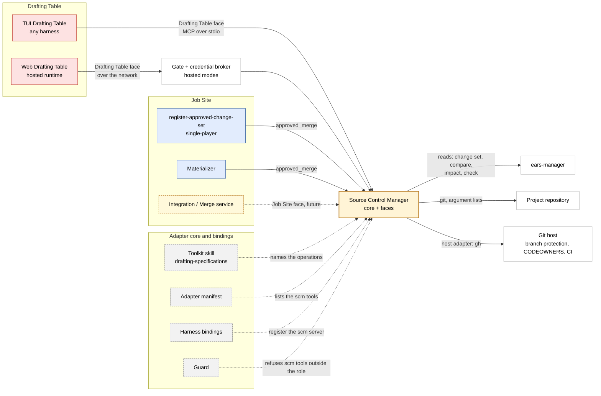

# ProtoBot: Source Control Manager

> Design document — September 2026
>
> Defines the Source Control Manager (SCM): the one deterministic
> component that turns the user's decision about a governed object into
> Git and Git host state, for every caller and in every deployment mode.

**Contents:**

- [Purpose and scope](#purpose-and-scope)
- [Decision](#decision)
- [Responsibility](#responsibility)
- [Callers and faces](#callers-and-faces)
- [Drafting Table face](#drafting-table-face)
- [Approved-state read face](#approved-state-read-face)
- [Job Site face](#job-site-face)
- [Authorization](#authorization)
- [Deployment topology](#deployment-topology)
- [Host adapter boundary](#host-adapter-boundary)
- [Result protocol](#result-protocol)
- [Failure behavior](#failure-behavior)
- [Audit record](#audit-record)
- [Security posture and persistent state](#security-posture-and-persistent-state)
- [Answers to the open questions of #125](#answers-to-the-open-questions-of-125)
- [Repository fixture against the SCM](#repository-fixture-against-the-scm)
- [Out-of-scope decisions](#out-of-scope-decisions)
- [Related Documents](#related-documents)

---

## Purpose and scope

This document answers the question posed by issue #125: _Should Git and
Git host mutations go through a Source Control Manager, one
deterministic component that turns an approved decision into branches,
commits, and pull requests, instead of through the shell of each agent?_

The answer is yes. This document defines:

- the SCM's responsibility, and what it does not own;
- its callers, and the operation set of each caller's role;
- the authorization model, locally and behind the Gate;
- the deployment topology in single-player, multi-player, and Web
  modes;
- the host adapter boundary;
- the result protocol, the failure mapping, and the audit record;
- the shape and the packaging; and
- how the #34 repository fixture runs against the SCM, with every
  negative check and no shell in the caller.

The **Drafting Table face** and the **approved-state read face** are
defined here. The Job Site face is named and bounded, not designed
([Job Site face](#job-site-face)).

### Relationship to sibling contracts

- **#34** ([Git and Project-Repository Integration](git-integration.md))
  defines the Git rules: branch names, commit content, the message
  format, the pull-request body, approval, registration, and the failure
  table. The SCM enforces those rules. It does not change them.
- **#33** ([Agent Harness Adapter Contract][adapter]) defined the Git and
  `gh` shell operations of the Drafting Table role. The SCM replaces
  them. The role keeps `ears-manager`, the clock, and registration as
  shell operations, and reaches Git and the Git host through the `scm`
  MCP server that every binding registers.
- **#30** ([`ears-manager` CLI Integration Contract](ears-manager-cli.md))
  defines the governed specification boundary. The SCM reads it, the way
  the Drafting Table does, and never writes through it.
  `ears-manager change-set create` still cuts the change-set branch.
- **#31** ([Drafting Table WMS Integration](drafting-table-wms.md)) and
  **#32** ([Validation Rules](validation-rules.md)) are the model for a
  governed boundary: a closed operation set, a trusted authorization
  context, and structured failures. The SCM follows that model for Git.
- **#28** ([Drafting Table UX](drafting-table-ux.md)) decides when the
  user asks for a commit or a pull request. The SCM decides how.

---

## Decision

ProtoBot already keeps the agent away from the stores it governs. The
agent decides _what_ requirement to write, and `ears-manager` makes it
well-formed. The agent decides _which_ work-item change to ask for, and
the WMS Adapter validates it. Git was the one governed system where the
agent still ran the raw tool itself. The SCM closes that gap with the
same split:

- **The agent decides _when_**, on the user's word.
- **The SCM decides _how_:** which branch, which files, which message,
  which pull request, and whether the action is allowed at all.

The decision has three parts:

1. **Shape.** An SCM core, plus one narrow face per role. A face is the
   operation set of one role. The core holds project identity, the ref
   policy, argument-list Git, the host adapter, rendering, the failure
   mapping, and the audit record. The first faces are the
   [Drafting Table face](#drafting-table-face) and the
   [approved-state read face](#approved-state-read-face). The Job Site
   face reuses the core later, if its design fits it.
2. **Packaging.** One executable, `source-control-manager`. It runs
   `git` and the host client as child processes with argument lists,
   never through a shell. `source-control-manager serve --face
   drafting-table` is the MCP server that a harness binding starts over
   stdio. It speaks the stateless MCP revision 2026-07-28, and still
   serves clients of the legacy revision 2025-11-25
   ([MCP protocol](#mcp-protocol)). The same subcommands form a CLI for
   people and for services. Hosted, the same face serves MCP over
   Streamable HTTP behind the Gate.
3. **Adoption.** The adapter contract and every harness binding use the
   SCM now, so the Drafting Table MVP (#77) needs the SCM and no Git
   shell operation. Issue #160 implements the SCM once this design is
   merged.

### Packaging

```text
source-control-manager [--output human|json] <operation> [options]
source-control-manager serve --face drafting-table [--transport stdio|streamable-http]
source-control-manager --version
```

The operations are `repo-state`, `branch-init`, `branch-resume`,
`commit`, `publish`, `refresh`, and `approved-merge`, with the fields of
[Requests](#requests) as options. The MCP tool names use `_` where the
CLI uses `-`. An option is its field's name with `_` replaced by `-`
and a trailing `_id` dropped: `change_set_id` is `--change-set`, and
`branch_prefix` is `--branch-prefix`.

`serve` fixes the transport when it starts: `stdio`, the default, for a
harness binding, or `streamable-http` for the hosted face behind the
Gate, which also takes the Gate's verification key from the deployment.
The transport decides whether the process is hosted
([Checks on every call](#checks-on-every-call)), and no request changes
it.

A CLI call runs under the face that its operation belongs to: the
first six under the Drafting Table face and the `drafting-table` role,
and `approved-merge` under the approved-state read face and the
`materializer` or `reconciler` role that the caller's configuration
names. It gets the same checks as an MCP call. The CLI is a
convenience for people and services, not a boundary,
because a person at a terminal has Git anyway. In the Drafting Table
role it is not a shell operation, so the guard refuses it, and the role
reaches the SCM only through the face that its binding started.

The core is a library inside the executable. The executable, the core,
and the result schema share one version until a second deployable
exists. The implementation language is the choice of #160, the
implementation issue, as the guard's is #77's
([Out-of-scope decisions][adapter-oos]).
It needs an MCP SDK that serves both eras below on stdio, such as
`mcp` 2.0 for Python, within the executable's constraints in
[Environmental Constraints][env-constraints].

### MCP protocol

The MCP face is a dual-era server, as the specification defines it
([Versioning and Compatibility][mcp-versioning]):

- **Modern clients** get MCP revision 2026-07-28, "MCP v2", the
  stateless protocol, or a later revision
  ([changelog](https://modelcontextprotocol.io/specification/2026-07-28/changelog)).
  `server/discover` advertises these revisions.
- **Legacy clients** get revision 2025-11-25 on stdio. A client that
  opens with `initialize` is served under that revision for the life of
  the stdio process, and a request that carries the modern `_meta` is
  served statelessly. A harness whose MCP client speaks only the legacy
  revision therefore still loads the `scm` server. The official Python
  SDK, `mcp` 2.0.0, serves both eras on stdio without extra code: an
  `mcp` 1.30.0 client negotiated 2025-11-25 against an `mcp` 2.0.0
  server and called its tools (observed on 2026-09-21).

The SCM's own rules are the same in both eras, and they fit the
stateless protocol:

- **No state between calls.** A modern call carries no session. A
  legacy client has a session for the life of the stdio process, but
  the SCM keeps nothing in it. Every call resolves the project, the
  change set, and the refs again
  ([Checks on every call](#checks-on-every-call)). Hosted, the Gate's
  signed context travels with each request, never with a session.
- **No server-initiated request.** The SCM uses no sampling,
  elicitation, or roots, which 2026-07-28 deprecates and which a legacy
  client would still offer. The project comes from the working tree,
  never from roots. Every tool result is complete in one round trip;
  the SCM never returns `input_required`, and a call that would need
  the user's answer is refused with a code instead.
- **Transports.** stdio for a harness binding, in both eras. Streamable
  HTTP behind the Gate for the Web, in the modern era only: its only
  client is the Web Drafting Table's hosted runtime, which ProtoBot
  builds, and the Gate relies on the `Mcp-Method` and `Mcp-Name`
  headers, which name the operation before the Gate reads a body. The
  deprecated HTTP+SSE transport is not offered.
- **Tool list.** `tools/list` returns the face's six tools in a fixed
  order, and, in the modern era, with a cache hint, because the list
  changes only with the executable.
- **Trace context.** When a request's `_meta` carries an OpenTelemetry
  trace context, the SCM copies it into its [audit record](#audit-record),
  so a call joins the caller's trace ([Evaluability][evaluability]).
- **Authentication.** None locally, where the harness starts the server
  over stdio. Hosted, OAuth 2.1 through the Gate, with Client ID
  Metadata Documents for client registration instead of Dynamic Client
  Registration, which revision 2026-07-28 deprecates.

Each binding's fixture records which revision its harness negotiates.
Both work; the result envelopes and the rules do not change with the
revision.

### What it brings

- **A smaller question to guard.** The shell guard asks "is this command
  text safe?", which has no end. The SCM asks "may this role do this
  action on this change set?", which is a short, closed list.
- **Less responsibility per agent.** The Drafting Table stops knowing
  Git syntax, the commit format, and the pull-request body format. It
  keeps specification work.
- **Fixed-format text written by code.** The commit subject, the
  `Change-Set:` trailer, and the pull-request body are rendered by the
  SCM from `ears-manager` output. A model cannot drop or change a line.
- **One Git boundary for every caller and every harness.** One set of
  rules, one host adapter, and one audit record, in every deployment
  mode. A binding registers one MCP server instead of copying Git
  command rules of different strength.
- **The Gate gets a home.** Hosted modes require a Gate at every
  mutation boundary
  ([Authentication and Credential Isolation][credential-isolation]).
  The SCM is that boundary for Git.

### The case against, answered

Issue #125 states the case against the SCM as strongly as it can. Each
argument keeps the weight shown here:

| # | Argument against | Answer in this design |
| --- | --- | --- |
| 1 | The #33 tightening can be enough | It closes part of the gap. Three gaps stay with any shell rule: text that the model writes in a fixed format, one copy of the rules per harness, and a hosted runtime that needs a mutation boundary behind the Gate. The SCM closes all three, and #77 builds on it once instead of twice. |
| 2 | Models already know Git and `gh` | Six operations replace the eighteen Git and `gh` command forms of #33, each with a fixed option order. Their names are the steps the user asks for: commit, publish, refresh. Every result lists the Git and host commands that ran ([Result protocol](#result-protocol)), so a reader of the session record still sees them. |
| 3 | It does not remove the shell | Accepted. `ears-manager`, the clock, and registration stay shell operations until #30 moves `ears-manager` to tools. The Git and `gh` forms leave the shell. They were the riskiest part of it, because they reach shared remote state: other people's branches and pull requests. |
| 4 | The local security gain is small | Accepted. Locally the SCM runs as the user, with the user's credentials. It narrows the Drafting Table role and isolates nothing ([Security posture](#security-posture-and-persistent-state)). The real boundary exists only behind the Gate. |
| 5 | Flexibility moves to the user | Accepted, with a bound. A state that no operation covers, such as a merge conflict, a diverged branch, or commits that someone else pushed to the change-set branch, is refused with a diagnostic that names the state and what the user can run. The user already merges, discards, and deletes branches under #33. |
| 6 | The Job Site reuse is speculative | Accepted. This document defines no Job Site operation. The core holds no lease, fencing token, or patch concept. The Job Site face uses the core only if its own design fits it ([Q21][q21]). |
| 7 | It creates a split transaction | Avoided. `ears-manager change-set create` still allocates the ID, writes the manifest, records `base_commit`, and cuts the branch in one command. The SCM never writes a manifest. Where a Git step and an `ears-manager` step follow each other, as in a refresh, the SCM detects the half-done state deterministically (`BASE_COMMIT_STALE`). |
| 8 | Smaller changes close the text gap | A rendered text that the agent passes through can still be changed on the way. The SCM calls `ears-manager` itself, so no model is in that path, and no guard has to compare a copy. |
| 9 | Host neutrality is not needed yet | Accepted. The host adapter is one internal boundary with one implementation, for GitHub. No second adapter is designed. The boundary exists so that the failure codes and the audit record do not depend on `gh` output. |
| 10 | Every binding carries more | One MCP server entry per binding, the same shape as `wms`. The `scm` server is local in single-player and multi-player alike, because the working tree is local, so it needs no MCP authentication (H13 stays a `wms` concern). |
| 11 | Cost and time | One more executable. The fixture reuses #34's repository fixture and the `gh` recording stub of #33. If the SCM does not start, drafting continues and only the Git steps stop ([Exit conditions][exit-conditions]). |

Two more facts count for the SCM:

- **The Codex sandbox keeps `.git/` read-only and has no network.** Under
  #33 every Git write and every `gh` command in Codex was the user's.
  Codex documents that it starts an MCP server as its own process,
  outside the tool sandbox. The Codex fixture has not confirmed it yet
  ([Codex open point 8][codex-open]). If it holds, the role in Codex
  reaches Git and the Git host through the `scm` server
  ([Codex binding][codex-user-runs]). The user then no longer types the
  push and the pull request by hand. That is a deliberate trade, with
  a recorded risk: the session skill tells the role to publish only on
  the user's explicit request, but no mechanism enforces it, because
  every binding allows `publish` without a prompt. A model steered by
  injected text can publish a proposed change set. It can publish only
  what the SCM's rules allow, and a reviewer sees it as a pull request
  before anything merges.
- **The guard's Git and `gh` vectors were the largest group.** Each
  new command form was another shell grammar to get right. They leave
  the guard.

---

## Responsibility

**One sentence:** the SCM turns the user's decision about a governed
object, a change set today and a build work item later, into Git and
Git host state, and reports that state back. The decision is a request
to commit, publish, or refresh a proposed change set. It is never the
approval, which is the merge of the pull request.

| Owns | Does not own |
| --- | --- |
| Project and repository identity, read from the working tree, never from the caller ([The project root][project-root]) | File content of specifications: `ears-manager` |
| Refs, by the ref policy of the caller's role | File content of code and tests: Job Site Workers, through validated patches |
| Commits: the file set derived from the change set, the message, and the trailer | Approval, which is the merge of a specification pull request: a person, on the host |
| Pull requests: create, update, and read their state; the body rendered by code | Work-item state: the WMS Adapter |
| The host adapter: GitHub first | Branch protection, CODEOWNERS, and CI gates: the host and CI |
| Structured failures: the #34 [failure table][git-fail] as error codes | Registration: the Job Site's `register-approved-change-set` and Materializer |
| The audit record: caller, role, object, action, refs, commands, and result | Issues on the project repository: the WMS Adapter and the Job Site |

### How far it goes

- **It never decides content.** It applies content that `ears-manager`
  already validated, and it renders text from that content by fixed
  rules.
- **Clean merge or abort.** On a conflict it aborts, leaves the tree as
  it was, and names the files. The owner of the content resolves it.
- **No generic Git operation.** A tool such as `git_push(ref)` is a
  shell with a new name. Every operation takes a governed object, or
  nothing, and derives the refs, the files, and the pull request from
  it.
- **No history rewrite, no push to the default branch, no merge of a
  specification pull request, no branch deletion, and no discard of a
  working-tree edit.** The user does the last three, as #33 decided
  ([Stricter than #34][stricter]).

### Design principles

- **Deterministic, not AI-driven.** The SCM is conventional code, like
  `ears-manager`. The same repository state and the same request give
  the same result, byte for byte.
- **Argument lists, never a shell.** Every Git and host command is an
  argument list. No request value reaches a shell.
- **No repository program runs.** A hook, an `fsmonitor` program, or a
  clean or merge driver is a program that the SCM does not control: it
  could change a registered file after the digest check, or drop the
  trailer, and hosted it would run next to a credential. The SCM runs
  every Git command with an empty hooks directory of its own and
  `core.fsmonitor` off, and commits with `--cleanup=verbatim`, so no
  cleanup mode or comment character strips the trailer. At the digest
  check it records the content of every path it will stage, and after
  staging it compares every staged blob with that record, so a clean
  filter or a write between the two steps stops the commit with
  `STAGED_CONTENT_CHANGED`. Locally, the programs of the user's own Git
  configuration, the clone's `.git/config` included, still run as the
  user's: a credential helper, a signing program, and a filter or merge
  driver that `.gitattributes` names and that configuration defines. A
  repository cannot ship them, because it cannot ship configuration.
  Hosted, the SCM runs Git with its own global configuration and no
  system configuration, so none of them exists
  ([Hosted isolation](#hosted-isolation)). CI still runs the project's
  own checks on every push.
- **Stateless.** The SCM keeps no store. Every operation reads Git, the
  host, and `ears-manager` again, so a retry after a lost response is
  safe ([Security posture and persistent state][scm-state]).
- **Refuse, never guess.** A state that the operation does not cover is
  a structured failure, not a best effort.

---

## Callers and faces

| Caller | Kind | Needs | Face and role | Refs |
| --- | --- | --- | --- | --- |
| TUI Drafting Table, in any harness | Agent | Read state, cut the initialization branch, resume, commit, publish, refresh | Drafting Table face, `drafting-table` | Its own change-set branch and pull request |
| Web Drafting Table | Agent in a hosted runtime | The same, over the network | Drafting Table face behind the Gate, `drafting-table` | The same |
| A person at a terminal | Person | The same operations, through the CLI | The face of each subcommand, as [Packaging](#packaging) states | The same as the face's role |
| `register-approved-change-set`, single-player | Job Site command | The merge commit of an approved change set | Approved-state read face, `materializer` | The default branch, read only |
| Materializer | Service | The merge commit, to verify a registration | Approved-state read face, `materializer` | The default branch, read only |
| Materializer/Dispatcher recovery | Service | The merge commit, to reconcile Git with WMS after a partial failure | Approved-state read face, `reconciler` | The default branch, read only |
| Integration/Merge service | Service | `wi/` branches, patches, merges | Job Site face, future ([Q21][q21]) | Its own `wi/` branch, under a lease |
| Workers, the Implementation-aware Test Worker, Inspectors, the Patch/Ownership Validator | Agents and services | None | None | None |

Workers never receive the canonical remote or repository credentials
([Job Site internal structure][js-internal]), and "Workers and
implementation-aware test agents receive no Git or WMS mutation role"
([Authentication and Credential Isolation][credential-isolation]). So
the Drafting Table is the only agent with a Git mutation role. Every
other Git mutation comes from a deterministic service. The permission
table has one agent row. It grows with services, not with agents.

### Where it sits

Red pieces mutate through the SCM. Blue pieces read through it. Gray,
dashed pieces name it or bind it. The yellow, dashed piece is the
future Job Site face.



| Piece | Needs the SCM | For |
| --- | --- | --- |
| TUI Drafting Table, any harness | Mutate | The six Drafting Table operations, on its own change-set branch and pull request |
| Web Drafting Table | Mutate, through the Gate | The same operations; the credential comes from the broker, never from the runtime |
| `register-approved-change-set` | Read | The merge commit of the change set it registers |
| Materializer | Read | The merge commit, to verify a registration and to reconcile after a partial failure |
| Integration/Merge service | Mutate, future face | `wi/` branches, validated patches, merges ([Q21][q21]) |
| Toolkit skill, adapter manifest, harness bindings, guard | Reference | The skill names the operations, the manifest lists the tools, a binding registers the server, the guard refuses its tools outside the role |
| `ears-manager` | No. The SCM calls it | `change-set show`, `change-set compare`, `impact`, and `check`; `ears-manager` never calls the SCM |
| WMS Adapter | No | It records the commit hashes that its callers supply |
| Workers, Inspectors, Projector, Patch/Ownership Validator, Fullsend phases | No | No Git mutation role; the Projector keeps its own read path ([Answers](#answers-to-the-open-questions-of-125)) |
| Git host, branch protection, CI | No. Downstream | What the SCM talks to; final in every mode |

---

## Drafting Table face

The Drafting Table face is the SCM for the `drafting-table` role. It
serves six operations, as MCP tools named `repo_state`, `branch_init`,
`branch_resume`, `commit`, `publish`, and `refresh`. A harness adds its
server prefix: `scm_commit` in OpenCode, `mcp__scm__commit` in Claude
Code and Codex ([The adapter manifest][manifest]).

### What moves out of the role's shell

| #33 shell operation | Drafting Table face |
| --- | --- |
| `git rev-parse --show-toplevel`, `git rev-parse --abbrev-ref HEAD`, `git rev-parse --verify <rev>`, `git status --porcelain`, `git merge-base <rev> <rev>`, `git merge-base --is-ancestor <rev> <rev>`, `git remote -v`, `git fetch <remote>`, `gh pr view` | `repo_state` |
| `git switch -c <prefix>00001-project-init <default>` | `branch_init` |
| `git switch <prefix><nnnnn>-<slug>` | `branch_resume` |
| `git add -- <path> ...`, `git commit -F -` | `commit` |
| `git push <remote> <branch>`, `gh pr create`, `gh pr edit` | `publish` |
| `git merge --no-ff --no-edit <remote>/<default>`, `git merge --abort` | `refresh` |
| `ears-manager ...`, `date -u +%Y-%m-%dT%H:%M:%SZ`, `register-approved-change-set` | Unchanged: shell operations of the role ([Shell operations][shell-ops]) |

### Operation matrix

Every row names the caller and role, the governed object, the refs, the
authorization, the result, and the failures. The caller of every row is
the Drafting Table in the `drafting-table` role, or a person through the
CLI in the same role. The authorization of every row starts with the
checks in [Authorization](#authorization); the column lists what the
operation adds. Every row can also fail with the codes that the
[failure table](#failure-behavior) marks _All_; every row that
reaches a remote with the remote codes: `REMOTE_NOT_FOUND`,
`REMOTE_CREDENTIAL_IN_URL`, `REMOTE_PUSH_REDIRECTED`,
`CREDENTIAL_UNAVAILABLE`, and `REMOTE_UNAVAILABLE`; every row except
`repo_state` and `branch_init` with `PROJECT_NOT_FOUND`; and every row
that reads `ears-manager` with `SPEC_TOOL_FAILED`.

| Operation | Object | Refs read and written | Authorization | Result | Failure |
| --- | --- | --- | --- | --- | --- |
| `repo_state` | The project, and the change set of the current branch when there is one | Reads `HEAD`, the refs of `<remote>` after a fetch, and the pull request of `<branch>`. Writes no branch, except the fast-forward of the local `<default>` that #34 allows | Read. Before `.protobot/` exists it reports the branch and nothing else | Project fields, the current branch and its change set, `base_commit` against the default head, uncommitted change-set paths, the pull request's number, state, URL, and merge commit, and the local change-set branches | `PROJECT_NOT_AT_ROOT`, `PROJECT_UNREADABLE`, and the remote codes, except that an unreachable remote or host, and an ambiguous pull request, are reported states, not failures |
| `branch_init` | The project before initialization | Fetches the upstream of the local `<default>` and fast-forwards it. Creates `refs/heads/<prefix>00001-project-init` from it | Only while no `.protobot/` exists at the working-tree root; `<default>` is the branch that its upstream remote's `HEAD` names; the prefix is not reserved | The branch and the commit it was cut from | `ALREADY_INITIALIZED`, `RESERVED_PREFIX`, `UNCOMMITTED_CHANGES`, `DEFAULT_NOT_FOUND`, `DEFAULT_DIVERGED`, `BRANCH_EXISTS`, and the remote codes for the upstream remote |
| `branch_resume` | The change set named in the request | Switches `HEAD` to the one local branch `<prefix><nnnnn>-<slug>` of that change set | The change set's manifest exists at the branch tip | The branch and its tip | `CHANGE_SET_NOT_FOUND`, `AMBIGUOUS_BRANCH`, `UNCOMMITTED_CHANGES` |
| `commit` | The change set of the current branch | Writes one commit on `refs/heads/<branch>` | The current branch is a change-set branch; every staged path is a path of the change set that #34 lets the Drafting Table stage | The commit, its subject and trailer, and its paths | `NOT_A_CHANGE_SET_BRANCH`, `INIT_REMOTE_MISMATCH`, `SPEC_DIGEST_MISMATCH`, `SPEC_CHECK_FAILED`, `PATH_NOT_STAGEABLE`, `STAGED_CONTENT_CHANGED`, `UNSAFE_TEXT`, `NOTHING_TO_COMMIT` |
| `publish` | The change set of the current branch and its pull request | Pushes `refs/heads/<branch>` to the same name on `<remote>`, without force and without tags. Creates or updates the pull request of `<branch>` | The same branch rule; the pull request is the one of `<branch>`, as the [host adapter](#host-adapter-boundary) finds it | The pushed commit, and the pull request's number, URL, and whether it was created, updated, or unchanged | `NOT_A_CHANGE_SET_BRANCH`, `UNCOMMITTED_CHANGES`, `NOTHING_TO_PUBLISH`, `BASE_NOT_ON_DEFAULT`, `DEFAULT_MOVED`, `BASE_COMMIT_STALE`, `UNSAFE_TEXT`, `PR_MERGED`, `PR_CLOSED`, `AMBIGUOUS_PULL_REQUEST`, `PUSH_REJECTED_NON_FAST_FORWARD`, `PUSH_REJECTED_PROTECTED`, `HOST_REQUEST_FAILED`, and the remote codes |
| `refresh` | The change set of the current branch | Merges `<remote>/<default>` into `refs/heads/<branch>` | The same branch rule | The merge commit, and the new default head that `change-set update --base-commit` must record | `NOT_A_CHANGE_SET_BRANCH`, `UNCOMMITTED_CHANGES`, `MERGE_CONFLICT`, and the remote codes |

The SCM fills every placeholder from the working tree and
`.protobot/project.yaml`, never from a request:

| Placeholder | Value |
| --- | --- |
| `<prefix>` | `repository.branch_prefix` |
| `<default>` | `repository.default_branch` |
| `<remote>` | The remote whose configured fetch URL, with any userinfo other than the fixed `git@` of the SCP form removed, equals `repository.canonical_remote` |
| `<repo>` | The `<host>/<owner>/<name>` of `repository.canonical_remote`, host included |
| `<branch>` | The current branch, of the form `<prefix><nnnnn>-<slug>`, where `CS-<nnnnn>` is a change set in the store. The slug is not bound, for the reason #33 gives ([Shell operations][shell-ops]) |

Every operation that reaches `<remote>` checks it first, and
`branch_init` checks the upstream remote of the local default branch
the same way:

- It refuses with `REMOTE_CREDENTIAL_IN_URL` when the configured URL,
  or an effective URL after Git's `insteadOf` and `pushInsteadOf`
  rewrites, carries userinfo, by the rule of `ears-manager project
  init` ([Project initialization grammar][em-init-grammar]): any
  userinfo in an `https://` or `ssh://` URL, a user name alone
  included, and any SCP-style form other than the fixed
  `git@host:path`. A token given as the user name is refused like any
  other userinfo.
- It refuses with `REMOTE_PUSH_REDIRECTED` when the remote has more
  than one fetch URL or push URL, or when its effective push URL
  differs from its effective fetch URL, for example through
  `remote.<name>.pushurl` or a second `remote.<name>.url`, so a push
  never goes somewhere that a fetch does not read.

Both errors name the remote, never a URL. A rewrite that applies to
fetch and push alike, as the fixture's `insteadOf` rule does, passes:
locally it is the user's own configuration, and hosted the SCM's own
configuration has none ([Hosted isolation](#hosted-isolation)).

### Requests

The requests are closed. An unknown field, a wrong type, or a value that
does not match its rule is `INVALID_REQUEST`, and nothing runs.

| Operation | Fields |
| --- | --- |
| `repo_state` | None |
| `branch_init` | `branch_prefix`, optional, default `cs/`, of the form `^[a-z0-9][a-z0-9._-]*/$`; `default_branch`, optional, default `main`, a valid branch name that starts neither with `wi/` nor with the prefix |
| `branch_resume` | `change_set_id`, required, `^CS-[0-9]{5}$` |
| `commit` | `body`, optional prose of at most 2000 characters, with no line that starts with `Change-Set:` and no [text that GitHub acts on](#text-that-github-acts-on) |
| `publish` | None |
| `refresh` | None |
| `approved_merge` | `change_set_id`, required, `^CS-[0-9]{5}$` |

No request names a ref, a remote, a repository, a path, a title, or a
commit, with one exception: `branch_init` takes the prefix and the
default branch, because no project records them yet, and checks both.
Its prefix rule is stricter than `ears-manager`'s, which refuses only a
reserved prefix: a project whose prefix has more than one segment, such
as `team/cs/`, is initialized by the user outside the role.
The only text that the model writes is the optional commit body, which
is prose that #34 allows.

### `repo_state`

1. Resolve the project by the rule in [The project root][project-root].
   Without a `.protobot/` directory at the working-tree root, return
   `initialized: false` and the current branch. With the directory but
   no readable `project.yaml`, fail with `PROJECT_UNREADABLE`. With a
   `project.yaml` below the working-tree root, fail with
   `PROJECT_NOT_AT_ROOT`.
2. Read the Git-facing fields of `.protobot/project.yaml`, which #34
   lets the Drafting Table read ([Repository fields][repo-fields]).
3. Find and check `<remote>`, as the placeholders above state.
4. Fetch `<remote>`, without tags. When the fetch fails, report
   `remote.reachable: false` with the failure code and continue with
   the local refs.
5. Read the current branch. Classify it as a change-set branch, the
   default branch, another branch, or a detached `HEAD`. For a
   change-set branch, read the manifest through `ears-manager --output
   json change-set show`, and compare `base_commit` with the head of
   `<remote>/<default>`.
6. List uncommitted changes. Name each changed path of the change set.
   Count every other changed path, and never name it.
7. Read the pull request of `<branch>` through the host adapter. When
   the host cannot be reached, report the pull request as
   `unavailable`, and when more than one matches, as `ambiguous`.
8. List the local branches whose names start with `<prefix>`, with the
   change-set number in each name and whether `<remote>` has it.
9. Fast-forward the local `<default>` to `<remote>/<default>` when that
   is a fast-forward. When `<default>` is checked out, do it only when
   no tracked file has an uncommitted change. `git fetch` alone does not
   move the local default branch, and #34 cuts every change-set branch
   from that local ref ([When the branch is created][branch-created]),
   so #34 allows this one write to a branch that no change set owns
   ([Permitted Git operations][git-ops]). A local `<default>` that has
   commits the remote lacks is never moved. The result reports it as
   `diverged`. This is the last step, and it runs only when every step
   before it succeeded, so the fast-forward never comes with a failed
   result.

The result is what the session skill's resume steps need
([resuming a session][ux-resume]): the project, the branch, the change
set, `base_commit`, whether the default branch moved, uncommitted work,
and the pull request. Its `data` fields are:

| Field | Holds |
| --- | --- |
| `initialized` | Whether `.protobot/project.yaml` exists at the working-tree root |
| `project` | `id`, `default_branch`, `branch_prefix`, and `review_mode` |
| `remote` | `name`, and `reachable` with a failure code when it is `false` |
| `default_branch` | `head` of `<remote>/<default>`, and `local`: `current`, `fast-forwarded`, `behind`, or `diverged` |
| `branch` | `name`, `kind`, and for a change-set branch `change_set_id`, `base_commit`, `default_moved`, and `default_merged_in` |
| `working_tree` | `change_set_paths`, sorted, and the count `other_paths` |
| `pull_request` | `number`, `state` (`open`, `merged`, `closed`, `none`, `unavailable`, or `ambiguous`), `url`, and `merge_commit` |
| `change_set_branches` | For each local `<prefix>` branch: `change_set_id`, `branch`, and `on_remote` |

### `branch_init`

1. Refuse with `ALREADY_INITIALIZED` when `.protobot/` exists at the
   working-tree root.
2. Refuse with `RESERVED_PREFIX` when the prefix is `wi/`, the one
   reserved prefix today ([Repository fields][repo-fields]).
3. Refuse with `UNCOMMITTED_CHANGES` when a tracked file has an
   uncommitted change. Untracked files carry over. A Vision or
   Architecture path that `project init` registers must already be
   committed on the default branch: the initialization commit holds
   only the control namespace (#34), so an untracked one would fail
   `ears-manager check` in CI.
4. Refuse with `DEFAULT_NOT_FOUND` when the local `<default>` does not
   exist, has no commit, has no upstream branch, or is not the branch
   that its upstream remote's `HEAD` names. This ties the default
   branch to the host's default branch before any project records it.
5. Check that upstream remote as the placeholders above state, and
   fetch it, without tags. A fetch moves only remote-tracking refs.
6. Refuse with `DEFAULT_DIVERGED` when the local `<default>` has commits
   that its upstream lacks, so the initialization branch never carries
   unpublished commits. Refuse with `BRANCH_EXISTS` when
   `<prefix>00001-project-init` exists locally or on any remote.
7. Fast-forward `<default>` to its upstream, as `repo_state` does.
8. Create and check out `<prefix>00001-project-init` from `<default>`.

This is the one operation whose ref parts come from the request,
because no project records them yet. The role then runs `ears-manager
project init` with the same prefix and default branch, and the guard
checks the prefix against the branch it is on ([Guard rules][guard-rules]).
`project init` also takes the canonical remote from the command, so the
first `commit` on the initialization branch refuses with
`INIT_REMOTE_MISMATCH` unless `repository.canonical_remote` equals the
fetch URL of the upstream remote of `<default>`, the remote that
`branch_init` checked. A fork's URL therefore never becomes the
project's canonical remote.
Every later operation reads both from `project.yaml`. If the prefix
differs, the branch is not a change-set branch of the project, and
`commit` refuses. If the default branch differs, the first `publish`
fails with `BASE_NOT_ON_DEFAULT` or `DEFAULT_MOVED`.

A normal change-set branch is not cut by the SCM.
`ears-manager change-set create` cuts it, as #30 decides
([Answers](#answers-to-the-open-questions-of-125)).

### `branch_resume`

1. Find the local branches `<prefix><nnnnn>-*` for the requested change
   set. More than one match is `AMBIGUOUS_BRANCH`. No match is
   `CHANGE_SET_NOT_FOUND`. A change-set branch that only `<remote>` has
   is the user's to check out, because its commits were never reviewed
   in this checkout.
2. Read the manifest at the branch tip through `ears-manager --output
   json change-set show --change-set CS-<nnnnn> --at <tip>`. A read
   that finds no manifest is `CHANGE_SET_NOT_FOUND`, with the
   `ears-manager` envelope. Status `2`, `3`, `6`, or `70` is
   `SPEC_TOOL_FAILED`.
3. Refuse with `UNCOMMITTED_CHANGES` when a tracked file has an
   uncommitted change, so that one change set's draft never moves into
   another's branch.
4. Switch to the branch.

### `commit`

1. Resolve the change set of the current branch, or refuse with
   `NOT_A_CHANGE_SET_BRANCH`. On the initialization branch, refuse with
   `INIT_REMOTE_MISMATCH` unless `repository.canonical_remote` equals
   the fetch URL of the upstream remote of `<default>`
   ([`branch_init`](#branch_init)).
2. **Derive the file set.** Take the paths that `change-set show`
   returns for the change set, its manifest included, and add
   `.protobot/project.yaml`. Add `.protobot/projection.yaml` only on
   the initialization branch, where `project init` writes it, or when
   its difference from `HEAD` is limited to `shared` entries for paths
   of the change set, which `ears-manager` writes when it registers a
   path or repeats a registration (#34,
   [What is committed][what-committed]). Any other change to
   `projection.yaml` is project policy that a person edits: it stays
   out of the commit, and the result names it in `diagnostics`. Keep
   the paths whose content differs from `HEAD`. Refuse with
   `PATH_NOT_STAGEABLE` when a path breaks #34's
   [path rules][path-rules]: outside the working tree, under
   `.protobot/attestations/`, `.protobot/test-catalog.jsonl`, or owned
   by a component other than `ears-manager` or `user`; when it lies
   under `.agents/`, `.claude/`, `.codex/`, `.opencode/`, `.github/`,
   or `.git/`, or is `opencode.json`, `AGENTS.md`, or `CLAUDE.md`,
   which the guard keeps from `artifact put`
   ([Shell operations][shell-ops]) and the SCM refuses too, because
   hosted no guard runs; or when it is `.gitattributes` or
   `.gitmodules`, which name filters, drivers, and submodules. Refuse
   with `NOTHING_TO_COMMIT` when no path is left.
3. **Run the pre-stage digest check.** Record the content of every path
   of the file set, then run `ears-manager --output json check
   --change-set CS-<nnnnn>`. A failed `check` refuses the commit, and
   nothing is staged, with two exceptions that are returned as
   warnings: status `5` alone, an impact assessment that is incomplete
   or stale, so a draft can be committed before impact review ends, and
   a digest mismatch of a registered path outside the file set, which
   the commit leaves out. CI still gates the merge on the impact
   assessment (#34).
   - A diagnostic with the code `artifact.digest_mismatch` for a path of
     the file set makes the refusal `SPEC_DIGEST_MISMATCH`. The error
     names each path with `ears-manager`'s diagnostics unchanged, and
     the two routes forward of #34
     ([The pre-stage digest comparison][pre-stage]). The user runs the
     discard, `git checkout -- <path>`, as #33 decided. A mismatch of a
     registered path outside the file set is the second warning: #34
     checks the artifacts that the change set touches, and the commit
     leaves that path out. #30 lists no code for a digest mismatch; the
     `ears-manager` implementation of #110 adds this one, as #30 allows.
   - Any other status `4`, apart from that warning, a specification
     that is not valid, is `SPEC_CHECK_FAILED`, with the envelope. A
     `.protobot/` file that carries a credential, which #34 makes a
     `check` failure, is refused here, before it can be pushed.
   - Status `2`, `3`, `6`, or `70` is `SPEC_TOOL_FAILED`, as for every
     other `ears-manager` read.
4. **Render the message.** The subject is `spec(CS-<nnnnn>):
   <intent>`, where `<intent>` is the manifest `intent` on one line, with
   every run of white space replaced by one space. The body, when the
   request has one, follows after a blank line. The last paragraph is
   the trailer `Change-Set: CS-<nnnnn>` ([Message format][message]).
   Refuse with `UNSAFE_TEXT` when the intent holds
   [text that GitHub acts on](#text-that-github-acts-on); the user
   revises it through `change-set update`.
5. **Stage and commit exactly those paths.** Stage each path by name.
   Compare every staged blob with the content recorded in step 3, and
   refuse with `STAGED_CONTENT_CHANGED` when a filter or a write since
   the check changed it. Commit only those paths, with
   `--cleanup=verbatim`. A change that is staged for any other path
   stays staged and stays out of the commit. When a step fails after
   staging, the SCM unstages the paths it staged, so the index is as it
   was.

The commit is authored with the user's configured Git identity, as #34
requires ([History rules][history-rules]). Signing follows the user's
Git configuration; #34 leaves signing policy open. `commit` never
amends. #34 allows an amend before the first push on explicit request,
but #33 refused it, and the SCM keeps that refusal
([Stricter than #34][stricter]).

### `publish`

1. Resolve the change set of the current branch, or refuse with
   `NOT_A_CHANGE_SET_BRANCH`.
2. Refuse with `UNCOMMITTED_CHANGES` when a path of the change set has
   an uncommitted change. The body is rendered from the working tree, so
   the working tree must equal the commit that is pushed.
3. Fetch `<remote>`.
4. Find the pull request of `<branch>` through the host adapter. A
   merged one is `PR_MERGED`: the change set is approved, and the next
   step is registration. A closed one is `PR_CLOSED`: #34 never reopens
   a pull request to hide history, so the user decides.
5. Check the base, in this order:
   - `NOTHING_TO_PUBLISH` when `HEAD` has no commit that
     `<remote>/<default>` lacks;
   - `BASE_NOT_ON_DEFAULT` when the manifest's `base_commit` is not
     reachable from `<remote>/<default>`, for example when it was cut
     from a local default branch with commits that the remote lacks;
   - `DEFAULT_MOVED` when `<remote>/<default>` is not reachable from
     `HEAD`. This is #34's "Default branch has moved since
     `base_commit`" row, and the retry is `refresh-branch`; and
   - `BASE_COMMIT_STALE` when `<remote>/<default>` is reachable from
     `HEAD` but differs from `base_commit`: the default branch was
     merged in, and `change-set update --base-commit` did not run.
6. Render the title and the body ([Title and body](#title-and-body)).
   Refuse with `UNSAFE_TEXT` when the intent holds text that GitHub acts
   on.
7. Push `refs/heads/<branch>` to the same name on `<remote>`, without
   force and without tags, even when the user's Git configuration
   follows tags. A rejection because `<remote>/<branch>` has commits
   that `HEAD` lacks is `PUSH_REJECTED_NON_FAST_FORWARD`. The SCM never
   merges those commits: someone else pushed them, and they were never
   reviewed in this checkout. The user inspects and integrates them in
   their own shell.
8. Create the pull request with base `<default>` and head `<branch>` in
   `<repo>`, or update the title and body of the one that exists. An
   update whose title and body are unchanged changes nothing.

A host failure after the push leaves the branch pushed. The result says
so, with `mutation: partial`: `error.details.pushed` names the pushed
commit, as `data.pushed` does on success, and `error.details.refs`
names the pushed ref. The same call
completes the work: the push is then a no-op, and the pull request is
created. This matches #34's "Pull-request creation failed" row.

#### Title and body

The title is the commit subject without the `spec()` prefix: the
manifest `intent`, on one line ([Title and body][pr-body]).

The body is rendered by code from `ears-manager --output json
change-set show`, `change-set compare`, and `impact`, in #34's order:

1. A heading with the change-set ID, then the intent and the
   `base_commit`.
2. The changed set: every `add`, `revise`, and `retire` operation with
   its requirement ID, and for a revision the text before and after.
3. The interface and artifact operations, when the change set has any.
4. The impact assessment: every candidate with its disposition, its
   rationale, and its origin, `mechanical` or `semantic`, or a note
   that the candidate has no disposition yet.
5. `implementation_required`, with the rationale when it is `false`.
6. The files that the pull request changes, from the merge base of
   `<remote>/<default>` and `HEAD` to `HEAD`.

The body opens with an HTML comment that says the SCM rendered it and
that the next `publish` replaces it. Every value taken from a record,
the intent included, is rendered inside a code span or a fenced block,
so it renders as text and never as Markdown structure, a link, or HTML.
A value that spans lines goes in a fenced block. The delimiter of each
span or fence is a backtick run one longer than the longest backtick
run in the value, and at least three for a fence, so no value can close
its own span or fence. The same inputs give the same body, byte for
byte.

#### Text that GitHub acts on

GitHub acts on some text outside code: a closing keyword with an issue
reference, such as `Fixes #12`, closes that issue when the commit or
the pull request reaches the default branch, and `@name` notifies
people. With GitHub Issues as the WMS backend, an issue is a build work
item, so a closed issue would be a lifecycle change that the Drafting
Table must never make. The SCM therefore keeps such text out of every
line it writes outside a code span: the commit subject and body, and
the pull-request title. A request body that holds a closing keyword
with a reference, or an `@` mention, is `INVALID_REQUEST`. An intent
that holds one is `UNSAFE_TEXT`.

The match is wide on purpose. A closing keyword is any of GitHub's
nine, `close`, `closes`, `closed`, `fix`, `fixes`, `fixed`,
`resolve`, `resolves`, and `resolved`, in any letter case, with or
without a colon, followed by a reference: `#12`, `GH-12`,
`owner/repo#12`, or an issue URL. A mention is `@` followed by a user
or a team name, such as `@name` or `@org/team`.

### `refresh`

1. Resolve the change set of the current branch, or refuse with
   `NOT_A_CHANGE_SET_BRANCH`.
2. Refuse with `UNCOMMITTED_CHANGES` when a tracked file has an
   uncommitted change. A merge commit records only committed work.
3. Fetch `<remote>`.
4. When `<remote>/<default>` is not reachable from `HEAD`, merge it
   with a merge commit. The message is `Merge <remote>/<default> into
   <branch>`, then a blank line and the trailer `Change-Set:
   CS-<nnnnn>`. `refresh` merges nothing else: commits on
   `<remote>/<branch>` that `HEAD` lacks are the user's to review, as
   [`publish`](#publish) states.
5. On a conflict, abort the merge. The working tree, the index, and
   `HEAD` are as they were before the call. Fail with `MERGE_CONFLICT`
   and classify each conflicting file as #34's failure table does: a
   change-set manifest or index file, a requirement record, another
   registered artifact, or another path.
6. Return the new default head as `base_commit_update`. The role then
   runs #34's [refresh sequence][refresh-seq]: `ears-manager change-set
   update --base-commit <default head>`, `impact`, a reviewed
   `change-set update --impact-file -`, `check`, and `commit`.

When nothing needs a merge, `refresh` returns `outcome: unchanged`.

### Mapping to #34's permitted operations

The [Permitted Git operations][git-ops] of #34 are the most that the
Drafting Table may do. The Drafting Table face offers the subset that
the adapter contract (#33) chose, plus one ref update that #34 lists for
it: the fast-forward of the local default branch.

| #34 operation | Who does it |
| --- | --- |
| Initialize the control namespace | `ears-manager project init`, after `branch_init` |
| Read repository state | `repo_state` |
| Fetch | `repo_state`, `publish`, and `refresh`, from `<remote>` only; `branch_init`, before a project exists, from the upstream of the local default branch |
| Fast-forward the local default branch | `repo_state` and `branch_init`, only by fast-forward |
| Create a change-set branch | `ears-manager change-set create`; the initialization branch is `branch_init` |
| Switch to an existing change-set branch | `branch_resume`, to a local branch only |
| Stage | `commit`, by explicit path, and it unstages those paths again after a failed commit |
| Commit | `commit`, on explicit user request |
| Push a change-set branch | `publish`, without force, to `<remote>` only |
| Open or update a pull request | `publish`, against `<default>`, with the body rendered by code |
| Merge the default branch into the change-set branch | `refresh`, with a merge commit, and an abort on conflict |
| Merge one's own pull request | The user, on the host ([Stricter than #34][stricter]) |
| Delete a merged change-set branch | The host, or the user |

Every entry of #34's forbidden list has no operation at all. Force,
rebase, amend, squash, `git add -A`, a direct write to a registered
file, `wi/` and integration branches, attestation paths, the default
branch on the remote, tags, remotes, submodules, and any repository
other than the canonical remote cannot be named in a request.

---

## Approved-state read face

The approved-state read face serves one read-only operation,
`approved_merge`, to two roles: `materializer`, for
`register-approved-change-set` in single-player mode and for the
Materializer, and `reconciler`, for the Materializer/Dispatcher's
recovery. It is a CLI subcommand, `source-control-manager --output
json approved-merge --change-set CS-<nnnnn>`, run in the caller's own
checkout with the caller's own read credential.

| Operation | Caller and role | Object | Refs | Authorization | Result | Failure |
| --- | --- | --- | --- | --- | --- | --- |
| `approved_merge` | `register-approved-change-set` and the Materializer, `materializer`; the Materializer/Dispatcher's recovery, `reconciler` | An approved change set | Reads `<remote>/<default>` after a fetch, and the host's record of the change set's merged pull request; writes nothing | Read | The change-set ID, its merge commit, and the default head that was read | `NOT_APPROVED`, `NOT_A_MERGE_COMMIT`, `MERGE_COMMIT_MISMATCH`, `HOST_UNAVAILABLE`, `PROJECT_NOT_FOUND`, `SPEC_TOOL_FAILED`, the codes that the failure table marks _All_, and the remote codes of the [operation matrix](#operation-matrix) |

The merge commit is derived from Git and confirmed by the host:

1. Fetch `<remote>`, and read the change set's manifest path through
   `ears-manager --output json change-set show --change-set CS-<nnnnn>
   --at <default head>`. When the change set is not approved there,
   fail with `NOT_APPROVED`.
2. Walk the first-parent history of the default head and find the one
   commit that added that manifest. A pull request merged with a merge
   commit puts that commit on the first-parent chain, and #34 forbids
   squash and rebase merges ([The merge is the approval
   event][approval-event]).
3. Refuse with `NOT_A_MERGE_COMMIT` when that commit has one parent.
   The manifest then reached the default branch outside a merged pull
   request, and the case needs reconciliation.
4. Find the change set's merged pull request through the host adapter:
   base `<default>`, and head `<prefix><nnnnn>-<slug>` in `<repo>`. A
   pull request is the approval event, so without one the result is
   `NOT_APPROVED`, and when the host cannot be reached it is
   `HOST_UNAVAILABLE`, with `retry: retry`. A merge commit that differs
   from the one Git gave is `MERGE_COMMIT_MISMATCH`, for
   reconciliation. A two-parent commit that someone pushed past branch
   protection therefore never creates work.

**Registration reads the merge commit itself.** In single-player mode,
the role runs `register-approved-change-set` with the change-set ID of
its branch and nothing else. The command gets the merge commit from
`approved_merge`, derives both keys by #34's canonical tuple, and calls
the Materializer ([Registration][registration]). No hash passes through
the model. A retry after a failed registration reads the same merge
commit, so it is the same idempotent call, never a second merge.

**The Materializer verifies what it receives.** A registration from the
multi-player merge hook carries the merge commit of the host event. The
Materializer compares it with `approved_merge` before it reads the
manifest at that commit. A different commit is the "different merge
commit" rejection of #34's failure table. After a partial failure, the
recovery in the `reconciler` role finds the merge of a change set the
same way.

---

## Job Site face

The Job Site's Git work runs in a private integration environment, with
leases, fencing tokens, patch import, attestation commits, and a merge
of `wi/` branches to the default branch, or a pull request if
[Q13](open-questions.md#q13-hu-02-compliance) needs a human gate. None
of it is designed in detail yet, and Fullsend, the first Job Site
backend, has its own pre-script, sandbox, and post-script mutation
model ([Fullsend][fullsend]).

This document therefore defines no Job Site operation. It fixes three
rules for a future face:

- The Job Site face is a separate deployable in the Job Site's
  environment, with its own role, its own ref policy for `wi/` and
  integration branches, and a bot or app identity.
- The core gains no Job Site concept, such as a lease, a fencing token,
  or a patch bundle, until that face is designed. If the Job Site's
  needs do not fit the core, the Job Site keeps its own Git code.
- The Drafting Table face never reaches a `wi/` branch, an integration
  branch, or an attestation path, whatever the Job Site face becomes.

[Q21][q21] records the open design.

---

## Authorization

Three layers control what a caller can do. They are the same in every
mode; only the second one gains a trusted context behind the Gate.

1. **Tool exposure.** A caller gets only the operations of its role. A
   harness binding starts `source-control-manager serve --face
   drafting-table`, which serves the six Drafting Table tools and no
   other. The adapter manifest lists them, the binding's native rules
   allow them in the role only, and the guard refuses any other `scm`
   tool ([Guard rules][guard-rules], rule 4).
2. **Authorization in the SCM.** Role, object, action, and ref policy,
   checked on every call. Locally the role comes from the launch
   configuration: it narrows what an agent can do, but the process still
   runs as the user. Hosted, the role comes from the OAuth token through
   the Gate, which is a real boundary.
3. **The host.** Branch protection, CODEOWNERS, required reviews, and
   token scope stay final in every mode. The SCM is an early layer in
   front of them, not a replacement.

**The SCM has its own authorization namespace**, as the WMS request
namespace does ([Boundary and ownership][wms-namespace]). It takes the
fields and the fail-closed rules of #32's
[authorization context][auth-context], with five differences:

- The faces are the command families. An SCM operation is allowed only
  when it is in the caller's face and in `allowed_actions`; #32's
  lifecycle command families do not apply.
- `change_set_id` names the proposed change set of the call, not an
  approved one.
- Gate step 3 of [Authentication and Credential
  Isolation][credential-isolation] checks the change set, because a
  proposed change set has no WMS contract version.
- `allowed_refs` may be empty for an operation that writes no ref of
  `<remote>`, because before a change set exists there is no branch to
  name ([Checks on every call](#checks-on-every-call)).
- An `UNAUTHORIZED_ACTION` names the face, the operation, and the
  context field that failed, in the SCM's
  [result protocol](#result-protocol), not #32's rejection fields.

The roles are #32's names: `drafting-table`, `materializer`, and
`reconciler`, and later `job-site`.

### Checks on every call

The SCM runs checks 1 to 5 in order before an operation's own steps,
and check 6 before every write in those steps. It reports the first
check that fails. No Git write and no host call runs before checks 1 to
5 pass, and no write runs without check 6:

1. **Operation.** The operation is one of the face's. Otherwise
   `UNAUTHORIZED_ACTION`.
2. **Trusted context, hosted only.** Hosted means that the process
   serves Streamable HTTP. The deployment fixes the transport when it
   starts the process; the SCM never infers the mode from a request, a
   header, or a missing context. On that transport every request needs
   a context that reaches the SCM signed by the Gate, with the SCM as
   its audience; a missing, unsigned, forged, or expired context is
   refused, never served as a local call. The context has an
   authenticated `subject`, the face's role, a trusted `project_id`,
   the `change_set_id` when the operation acts on a change set,
   non-empty `allowed_actions` with no wildcard, `allowed_refs` with no
   wildcard, which is non-empty when the operation writes a ref of
   `<remote>`, an unexpired `expires_at`, and a `policy_version`, and
   the operation is in `allowed_actions`. The `Mcp-Method` and
   `Mcp-Name` headers name the same method and tool as the body,
   because the Gate authorizes and records the call by them. Otherwise
   `UNAUTHORIZED_ACTION`.
3. **Request.** The fields match the request schema. Otherwise
   `INVALID_REQUEST`.
4. **Project.** The project resolves from the working tree. Hosted, it
   equals the context's project. Otherwise a project failure, or
   `UNAUTHORIZED_ACTION` for a mismatch. `repo_state` and `branch_init`
   skip this check while no `.protobot/` exists, because initialization
   is what creates the project.
5. **Object.** For `commit`, `publish`, and `refresh`, the change set
   comes from the current branch and exists in the store of the
   working tree, or the call fails with `NOT_A_CHANGE_SET_BRANCH`. For
   `branch_resume` and `approved_merge`, it comes from the request, and
   the operation's own steps find it where it lives: at the tip of its
   local branch (`CHANGE_SET_NOT_FOUND`), or at `<remote>/<default>`
   (`NOT_APPROVED`). Hosted, it equals the context's change set, or
   the call fails with `UNAUTHORIZED_ACTION`. `repo_state` skips this
   check, and reports the branch it finds.
6. **Refs, before each write.** The ref that the write changes is in
   the role's ref policy below. Hosted, a ref of `<remote>` is also in
   `allowed_refs`. Otherwise `UNAUTHORIZED_ACTION`, and nothing is
   written. The operation's own steps run first up to that write, so a
   precondition such as `ALREADY_INITIALIZED` or `RESERVED_PREFIX` is
   reported before this check could refuse the ref.

### Ref policy

| Role | May write | May read |
| --- | --- | --- |
| `drafting-table` | On `<remote>`: `refs/heads/<prefix><nnnnn>-<slug>` of its change set, and the pull request of that branch. Locally: the same branch; `refs/heads/<prefix>00001-project-init` while `.protobot/` does not exist; and the fast-forward of `refs/heads/<default>` | Every ref of `<remote>`, and the pull request of its branch |
| `materializer`, `reconciler` | Nothing | `<remote>/<default>`, and the host's record of merged pull requests |
| `job-site` | Defined by the Job Site face ([Q21][q21]) | Defined by the Job Site face |

`allowed_refs` in a hosted context names refs of `<remote>` only. The
local fast-forward writes only the SCM's own workspace. No role writes
`refs/heads/<default>` on `<remote>`, a `wi/` branch from the Drafting
Table face, a tag, or a remote's configuration.

No request carries a ref, so the Gate has no ref on the request to
check. It still mints `allowed_refs` in its step 2
([Authentication and Credential Isolation][credential-isolation]) from
trusted state, never from the request: for the Drafting Table face,
the one branch of the session's change set on `<remote>`,
`refs/heads/<prefix><nnnnn>-<slug>`, as the Web Drafting Table's
session record names it. The session record learns that branch from
the SCM's own `repo_state` result, which passes through the Gate,
never from the runtime. Before a change set exists, `allowed_refs` is
empty, and only an operation that writes no ref of `<remote>`, such as
`repo_state` or `branch_init`, passes. Behind the Gate, the SCM is
therefore the only check of the refs a call writes, and the host's
branch protection is the check behind it.

---

## Deployment topology

Single-player, multi-player, and Web differ only in where the SCM runs
and where its credential comes from. The operations, the results, and
the rules are the same; the hosted face adds the Gate's context to the
checks.

| Mode | Where the Drafting Table face runs | Transport | Credential | Who merges |
| --- | --- | --- | --- | --- |
| Single-player | On the user's machine, started by the harness binding in the project | MCP over stdio | The user's own: Git's credential helper and `gh`'s store | The author, on the host |
| Multi-player | On each contributor's machine, started by the harness binding | MCP over stdio | The user's own, as for every local harness ([Credentials][credentials]) | A reviewer, on the host |
| Web | Hosted, beside the session's workspace, behind the Gate | MCP over Streamable HTTP from the hosted runtime, through the Gate | Broker-issued, short-lived, scoped to the project and the action; the runtime never sees it | A reviewer, on the host |

The approved-state read face runs where its caller runs: the
registration command on the user's machine, and the Materializer in the
Job Site's environment, each with its own read credential.

Multi-player on a laptop keeps the user's own credential, the recorded
deviation from the Bridge/Gate constraint that #33 describes: the model
never sees the token, because Git's credential helper and `gh`'s store
give it to those programs only, but no Gate stands between the SCM and
the token. The Web Drafting Table is a non-goal of the first project
([Vision — Non-goals][vision-nongoals]), so the hosted face is defined
here and built later.

### Hosted isolation

The hosted face is a boundary only when the runtime cannot go around
it. The deployment therefore keeps these rules:

- The runtime reaches the SCM only through the Gate, and the SCM
  accepts only a context that the Gate signed for it.
- The runtime has no write access to the workspace's `.git/`. Only the
  SCM, and `ears-manager` for the branch that `change-set create` cuts,
  write Git state there, so the repository's own configuration is the
  SCM's.
- The runtime writes neither `.protobot/` nor a registered path
  directly, because the SCM trusts both: `project.yaml` names the refs
  and holds the registry digests that `check` compares. Hosted,
  `ears-manager` therefore runs outside the runtime, beside the SCM. How
  the runtime calls it is the Web Drafting Table deployment's decision
  ([Out-of-scope decisions](#out-of-scope-decisions)).
- The SCM runs Git with its own global configuration and no system
  configuration, and with the pins of [Design principles](#design-principles).
- The broker-issued credential reaches the SCM's Git and host adapter
  only, never the runtime, a result, or an audit record.
- The hosted face is one more process of the Web Drafting Table's
  deployment, so it inherits that deployment's constraints, such as no
  CRDs or operators ([Environmental Constraints][env-constraints]).

### Identity

| Face | Acts as | Recorded as |
| --- | --- | --- |
| Drafting Table, local | The user: commits carry the user's configured Git identity (#34), and pushes and host calls use the user's own token | The Git identity in the commit, and the host's own record of the token's user |
| Drafting Table, Web | The authenticated user as the commit author; the push and host calls use the broker-issued credential | Both the user and the service actor, in the Gate's record ([Authentication and Credential Isolation][credential-isolation]) |
| Approved-state read | The caller's own read credential | No write to record |
| Job Site | A bot or app identity, open in the [bot account model][multi-player] | [Q21][q21] |

Whether the hosted credential acts as the user or as an app is a
deployment choice. The Gate records it either way.

---

## Host adapter boundary

The host adapter is the only code in the SCM that talks to the Git host.
The core asks it for four things:

| Request | Answer |
| --- | --- |
| Find the pull request of a change-set branch | Its number, state (`open`, `merged`, `closed`, or none), URL, base, head, and merge commit |
| Create a pull request with a base, a head, a title, and a body | Its number and URL |
| Update the title and body of a pull request | The new state |
| Report the host's answer to a failed request | A stable class: not found, rejected by protection, credential missing or expired, rate limited, host unavailable, or other |

**The pull request of a branch** is the one pull request, in any state,
whose head is that branch in `<repo>` itself, never in a fork, and whose
base is `<default>`. A pull request from a fork whose branch has the
same name is not it. More than one match is `AMBIGUOUS_PULL_REQUEST`,
and the user decides. #34 pushes change-set branches to the canonical
remote only, so a Drafting Table pull request never comes from a fork.

**The first adapter is GitHub, through `gh`.** It runs `gh pr list`,
`gh pr create`, and `gh pr edit` with argument lists, `--repo <repo>`
on every call, and the body on standard input. `<repo>` names the host,
and the adapter clears `GH_REPO` and `GH_HOST`, so `gh` never falls
back to a default host: a pull request of a GitHub Enterprise project
never goes to github.com. `gh pr list` asks for
every state and for the head repository of each result, and the
adapter filters as stated above. In single-player and multi-player
mode, `gh` keeps the user's token in its own store, so the SCM never
holds it. Hosted, the deployment gives the adapter the broker-issued
token. No `gh pr merge`, `gh api`, or `gh auth` command exists in the
adapter.

The adapter maps every host answer into the SCM's
[failure codes](#failure-behavior), so no caller parses `gh` output.
A second host gets its own adapter behind the same four requests; none
is designed here.

---

## Result protocol

Every operation returns one JSON document. Over MCP it is the text of
the tool result, which is complete in one round trip, and the tool
result is an error when `ok` is `false`. On the CLI, `--output json`
prints it on standard output, and the exit status is `0` for success
and `1` for a failure.

Successful result:

```json
{
  "schema_version": 1,
  "ok": true,
  "operation": "commit",
  "face": "drafting-table",
  "object": {"project_id": "fixture", "change_set_id": "CS-00002"},
  "outcome": "applied",
  "data": {},
  "diagnostics": [],
  "commands": [],
  "mutation": {"applied": true, "refs": [], "remote": false}
}
```

Failed result:

```json
{
  "schema_version": 1,
  "ok": false,
  "operation": "publish",
  "face": "drafting-table",
  "object": {"project_id": "fixture", "change_set_id": "CS-00002"},
  "error": {
    "code": "DEFAULT_MOVED",
    "message": "The default branch moved since the change set's base.",
    "details": {},
    "mutation": "none",
    "retry": "refresh-branch"
  },
  "commands": []
}
```

- **`face`** is `drafting-table` or `approved-state`.
- **`object`** names the project and the change set once the
  [checks](#checks-on-every-call) have resolved them. It is empty for a
  failure that comes before the project check, and for an operation
  that runs before a project exists.
- **`outcome`** is `read`, `applied`, or `unchanged`. A `repo_state`
  that fast-forwards the local default branch is still `read`, and
  `mutation` shows the ref.
- **`commands`** lists every Git and host command that can change local
  or remote state, in the order it ran, as an argument list. A fetch is
  listed; a pure read is not. The SCM runs every Git command with the
  same fixed global options, `-C <root>`, its empty hooks directory,
  and `core.fsmonitor` off, and the list leaves them out. No argument
  list holds a credential or a remote URL.
- **`mutation`** counts changes to local branches, the index, the
  working tree, the remote, and the host. A fetch that only moves
  remote-tracking refs is not a mutation. On a failure it is `none`,
  `partial` (only `publish`, after the push), or `unknown`.
- **`retry`** is one of: `retry` (the same call is safe now),
  `refresh-branch` (call `refresh`, run #34's refresh sequence that its
  result names, then the same call), `revise` (change the request or the
  specification, then call again), `user` (the user acts on the host or
  in their own shell; the details name what), `authorize` (a credential
  or context must be renewed outside the agent), `reconcile` (read state
  with `repo_state` or `approved_merge` before anything else), or
  `never` (a bug in the caller). `refresh-branch` is named apart from
  #32's `refresh`, which means "read the state again", and `revise` is
  the SCM's name for #30's `revise-request`.
- **`diagnostics`** carries warnings, and every `ears-manager` envelope
  that the operation read, unchanged, when it explains the result.
- **`trace`** is present only when the MCP request's `_meta` carried an
  OpenTelemetry trace context, and copies it unchanged
  ([MCP protocol](#mcp-protocol)).

The result carries no timestamp, so a replay against the same
repository and the same host stub compares byte for byte, as the #30
envelope does. The hosted Gate stamps its own record.

---

## Failure behavior

Every failure leaves local branches, the index, the working tree, the
remote, and the host as they were, except the partial `publish` that
[`publish`](#publish) describes. An operation that cannot tell whether a
write happened returns `mutation: unknown` and `retry: reconcile`.

| Code | Operations | Meaning | #34 failure row | Retry |
| --- | --- | --- | --- | --- |
| `UNAUTHORIZED_ACTION` | All | The face, the Gate context, or the ref policy does not permit the operation, object, or ref | — | `authorize` |
| `INVALID_REQUEST` | All | A field is unknown, missing, or does not match its rule | — | `revise` |
| `PROJECT_NOT_FOUND` | All except `repo_state` and `branch_init` | No `.protobot/project.yaml` on the walk up | No `.protobot/project.yaml` found | `user` |
| `PROJECT_NOT_AT_ROOT` | All | `project.yaml` sits below the working-tree root | `project.yaml` is not at the working-tree root | `user` |
| `PROJECT_UNREADABLE` | All | `.protobot/` exists without a readable, valid `project.yaml` | — | `user` |
| `SPEC_TOOL_FAILED` | All that read `ears-manager` | `ears-manager` did not run, or returned status 2, 3, 6, or 70 on a read; its envelope is in `details` | Store schema version newer than the tool | `user`, or `reconcile` when the envelope says `mutation: unknown` |
| `ALREADY_INITIALIZED` | `branch_init` | `.protobot/` exists | — | `never` |
| `RESERVED_PREFIX` | `branch_init` | The prefix is `wi/` | — | `revise` |
| `DEFAULT_NOT_FOUND` | `branch_init` | The local default branch does not exist, has no commit or no upstream, or is not the branch that its upstream remote's `HEAD` names | — | `user` |
| `DEFAULT_DIVERGED` | `branch_init` | The local default branch has commits that its upstream lacks | — | `user` |
| `BRANCH_EXISTS` | `branch_init` | The initialization branch exists; the details say local, remote, or both | Branch `cs/<nnnnn>-<slug>` already exists | `user` |
| `REMOTE_NOT_FOUND` | All that reach `<remote>` | No remote has the canonical URL | — | `user` |
| `REMOTE_CREDENTIAL_IN_URL` | All that reach a remote | The configured or an effective URL of the remote carries userinfo other than the fixed `git@` of the SCP form; the details name the remote only | — | `user` |
| `REMOTE_PUSH_REDIRECTED` | All that reach a remote | The remote has more than one fetch or push URL, or its effective push URL differs from its effective fetch URL | — | `user` |
| `NOT_A_CHANGE_SET_BRANCH` | `commit`, `publish`, `refresh` | The current branch is not a change-set branch of the project | Push rejected by branch protection: the SCM refuses a push to the default branch before it runs | `never` |
| `CHANGE_SET_NOT_FOUND` | `branch_resume` | No local branch holds the requested change set, or its tip has no manifest of it | — | `revise` |
| `AMBIGUOUS_BRANCH` | `branch_resume` | Two local branches carry the requested change-set number | — | `user` |
| `UNCOMMITTED_CHANGES` | `branch_init`, `branch_resume`, `publish`, `refresh` | Uncommitted changes that the operation would carry or misreport; the details name them | — | `user` |
| `INIT_REMOTE_MISMATCH` | `commit` | On the initialization branch, `repository.canonical_remote` is not the fetch URL of the upstream remote of the default branch; the details name the discard of the uncommitted `.protobot/` and a new `project init` | — | `user` |
| `SPEC_DIGEST_MISMATCH` | `commit` | `check` reports `artifact.digest_mismatch` for a path of the file set; the details name each path and the two routes forward | Registered path digest mismatch | `user` |
| `SPEC_CHECK_FAILED` | `commit` | `check` failed with status `4`, and without a digest-mismatch diagnostic for a path of the file set | `ears-manager check` failed; registered path missing from the projection manifest | `revise` |
| `PATH_NOT_STAGEABLE` | `commit` | A path of the change set breaks #34's path rules, is one that the guard keeps from `artifact put`, or is `.gitattributes` or `.gitmodules` | — | `never` |
| `STAGED_CONTENT_CHANGED` | `commit` | A Git filter, or a write since the digest check, changed a staged file, so the commit would not hold what `check` saw | — | `user` |
| `UNSAFE_TEXT` | `commit`, `publish` | The intent holds text that GitHub acts on | — | `revise` |
| `NOTHING_TO_COMMIT` | `commit` | No path of the change set differs from `HEAD` | — | `never` |
| `NOTHING_TO_PUBLISH` | `publish` | The branch has no commit that the default branch lacks | — | `never` |
| `BASE_NOT_ON_DEFAULT` | `publish` | `base_commit` is not on the canonical default branch | — | `user` |
| `DEFAULT_MOVED` | `publish` | The default branch moved since `base_commit` | Default branch has moved since `base_commit` | `refresh-branch` |
| `BASE_COMMIT_STALE` | `publish` | The default branch was merged in, and `base_commit` was not updated | — | `revise` |
| `PR_MERGED` | `publish` | The pull request is merged | — | `never` |
| `PR_CLOSED` | `publish` | The pull request is closed without a merge | — | `user` |
| `AMBIGUOUS_PULL_REQUEST` | `publish` | More than one pull request matches the branch; `repo_state` reports it as a state instead | — | `user` |
| `PUSH_REJECTED_NON_FAST_FORWARD` | `publish` | The remote branch has commits that `HEAD` lacks | Push rejected, non-fast-forward | `user` |
| `PUSH_REJECTED_PROTECTED` | `publish` | The host protects the change-set branch | — | `user` |
| `CREDENTIAL_UNAVAILABLE` | All that reach the remote or host | The credential is missing or expired; the details name the credential source for the mode | Push rejected, missing or expired credential | `authorize` |
| `REMOTE_UNAVAILABLE` | All that reach the remote | The remote cannot be reached | — | `retry` |
| `HOST_UNAVAILABLE` | `approved_merge` | The host cannot be reached to confirm the merged pull request | — | `retry` |
| `HOST_REQUEST_FAILED` | `publish` | The host refused or failed the request; the details give the host class and `pushed` | Pull-request creation failed | `retry` |
| `MERGE_CONFLICT` | `refresh` | The merge conflicted and was aborted; the details name and classify each file | Merge conflict in a change-set manifest or index file; merge conflict in a requirement record | `user` |
| `NOT_APPROVED` | `approved_merge` | The change set is not approved on the default branch, or the host has no merged pull request of it | — | `user` |
| `NOT_A_MERGE_COMMIT` | `approved_merge` | The commit that added the manifest has one parent | — | `reconcile` |
| `MERGE_COMMIT_MISMATCH` | `approved_merge` | Git and the host name different merge commits | Registration rejected, different merge commit | `reconcile` |
| `GIT_FAILED` | All | An unexpected Git failure; the details give the command and its status | — | `reconcile` |
| `INTERNAL` | All | An internal invariant failed | — | `never` |

Two #34 rows are outside the SCM: "Merge refused by branch
protection", because the user merges; and "Merge succeeded,
registration failed", which registration owns, with `approved_merge`
giving the same merge commit on every retry.

---

## Audit record

Every call produces one audit record:

| Field | Value |
| --- | --- |
| `operation`, `face` | The operation and the face that served it |
| `object` | The project ID and the change-set ID |
| `refs` | Every ref the call wrote: `mutation.refs`, or `error.details.refs` for a partial `publish` |
| `commands` | The argument lists of the state-changing commands |
| `outcome` or `error.code` | The result |
| Commits and pull request | The `data` fields that name them, such as `commit`, `merge_commit`, `pushed`, `cut_from`, and `pull_request`, when the call made or read them |
| `subject`, `role`, `policy_version`, service actor | Hosted only, from the Gate |
| `trace` | The OpenTelemetry trace context that the MCP request carried, when it carried one ([MCP protocol](#mcp-protocol)) |

Locally, the result envelope is the audit record. The harness keeps it
in the session record with every other tool result, which is the trace
source of the TUI Drafting Table ([Traces][traces]), and Git history
keeps the commits. Hosted, the Gate also records the caller and the
service actor with the project, role, change set, action, ref, and
resulting Git object, as [Authentication and Credential
Isolation][credential-isolation] requires. The SCM adds no store for
either.

---

## Security posture and persistent state

### Security posture

- **The role holds no Git or host credential, and runs no Git or `gh`
  command.** The guard refuses both in the role's shell, and the binding
  gives the role only the `scm` tools for them.
- **Locally, the SCM narrows and does not isolate.** It runs as the user
  with the user's credentials. Every other session, agent, and terminal
  on the machine still has `git` and `gh`
  ([Credentials][credentials]).
- **No shell and no repository program.** Every command is an argument
  list. Hooks and `fsmonitor` do not run, and a filter or a write that
  changes a staged file stops the commit. Locally, the programs of the
  user's own Git configuration still run
  ([Design principles](#design-principles)).
  The SCM sets `GIT_TERMINAL_PROMPT=0` and `GH_PROMPT_DISABLED=1`, so a
  missing credential fails instead of prompting.
- **Requests are data.** No request names a ref, a path, a remote, or a
  repository, except the two checked `branch_init` fields. The commit
  body is a validated value, never syntax.
- **The SCM merges no unreviewed remote commit.** `refresh` merges only
  the default branch. Commits that someone else pushed to the
  change-set branch, and a change-set branch that only the remote has,
  are the user's to review. The SCM does not inspect the local branch:
  `publish` pushes every commit of it that the remote lacks, including
  one that another local session or tool made, and the reviewer sees
  them in the pull request.
- **No text that GitHub acts on.** The SCM writes no closing keyword or
  mention outside a code span ([Text that GitHub acts
  on](#text-that-github-acts-on)), so a commit or a pull request never
  closes an issue that is a build work item.
- **No credential leaves the SCM.** Results, errors, and audit records
  name remotes, never their URLs, and refuse a remote whose configured
  or effective URL carries userinfo other than the fixed `git@` of the
  SCP form. `project.yaml` never holds a
  credential ([Repository fields][repo-fields]), and a `check` failure
  for one stops the commit.
- **Hosted, the SCM is the ref boundary behind the Gate.** The Gate
  authenticates the caller, scopes the credential, and mints
  `allowed_refs` from trusted state; it checks no ref on the request,
  because no request carries one. The SCM checks every ref it writes
  against the ref policy and `allowed_refs`
  ([Checks on every call](#checks-on-every-call)), and
  [Hosted isolation](#hosted-isolation) keeps the runtime from going
  around it.

### Persistent state

The SCM keeps no store of its own. It adds no category to
[Persistent State][persistent-state]:

| Store | What the SCM does |
| --- | --- |
| Specification store (Git) | Reads through `ears-manager`; commits and pushes the paths `ears-manager` wrote |
| Project configuration (`.protobot/`) | Reads the Git-facing fields of `project.yaml`; commits `project.yaml` when it changed, and `projection.yaml` only at initialization or when the change set registers a new path; never touches the test catalog or attestations |
| Deployment-level registry | Hosted, the Gate uses it to decide which projects a user may open; it never supplies the project identity |
| Web session state | Hosted, the Gate's context names the session's workspace; the SCM never reads or writes the session store |
| Request backlog, work-item lifecycle, claim coordinator | None |
| Evidence and artifact store | None |

The Git host's pull requests are the host's state, created through the
host adapter.

---

## Answers to the open questions of #125

| # | Question | Answer |
| --- | --- | --- |
| 1 | One shared service, or a core with one face per role? | A core with one face per role. The role is fixed by the face a caller gets, and Job Site rules never enter a component that the Drafting Table depends on. |
| 2 | Who cuts the change-set branch? | `ears-manager change-set create`, as #30 decides. The branch name needs the change-set ID that it allocates and the slug of the intent that it records, and one command keeps the manifest, `base_commit`, and the branch together. The SCM cuts only the initialization branch, which needs neither. Hosted, `ears-manager` runs beside the SCM, outside the runtime ([Hosted isolation](#hosted-isolation)). |
| 3 | Does the SCM read the manifest, digests, `compare`, and `impact` itself? | Yes, through `ears-manager --output json`, with argument lists. The caller never passes them in, so no model-written content returns. |
| 4 | Where does single-player registration live? | It stays the Job Site's `register-approved-change-set`, a shell operation of the role. It takes the change-set ID only, and reads the merge commit through `approved_merge`. |
| 5 | Does `commit` run the project's Git hooks? | No, in every mode, and no other program that a repository can ship either. Locally, the programs of the user's own Git configuration still run ([Design principles](#design-principles)). |
| 6 | Is the Job Site's escalation issue an SCM action or a WMS action? | Not an SCM action. An issue is work-management state, and the WMS Adapter already owns the blocked state that the issue reports. The Job Site's escalation contract decides its route. |
| 7 | Which identity does each caller act as? | The Drafting Table acts as the user; the read face as its caller; the Job Site as a bot or app identity, still open ([Identity](#identity)). |
| 8 | Does the Projector read canonical source through the SCM? | No. SCM operations report state, and the Projector needs tree content at a commit inside the private integration environment, which it reads with its own read-only access. The Job Site face may revisit it ([Q21][q21]). |

---

## Repository fixture against the SCM

The [repository fixture][git-fixture] of #34 runs against the SCM, with
every negative check, and with no shell in the caller.
[`fixtures/source-control-manager-golden.jsonl`](fixtures/source-control-manager-golden.jsonl)
is its harness-neutral transcript.

### Setup

- #34's setup: a bare repository as `origin` with one commit on `main`,
  which holds `README.md`, `docs/vision.md`, and `docs/architecture.md`,
  and one clone with a Git identity. `repository.canonical_remote` is a
  GitHub-shaped URL that an `insteadOf` rule in the clone rewrites to
  the bare repository, for fetch and push alike, so `<repo>` has a
  host, an owner, and a name. The clone's `main` tracks `origin/main`,
  and `origin/HEAD` names `main`.
- A second clone that stands in for the host's merge button and for
  other contributors. It merges pull-request branches into `main` of
  `origin` with merge commits, and pushes other commits. The caller's
  clone never pushes `main`.
- The `gh` recording stub of #33's fixture on `PATH`, which answers the
  host adapter and records every call with its standard input. The
  transcript lists the calls that change host state; "no call" means
  none at all.
- A recording registration stub behind `register-approved-change-set`,
  and `ears-manager`, or its recording stub with #30's golden envelopes.
- A fake Gate for the hosted checks, as the WMS fixture has fake Gate
  contexts ([Fake adapter fixture][wms-fixture]). It signs contexts
  with a fixture key, for the SCM as audience.
- The driver. It starts `source-control-manager serve --face
  drafting-table` in the clone and calls its tools as a modern MCP
  client, revision 2026-07-28, with no harness and no model. For the
  hosted checks it starts a second instance with `--transport
  streamable-http` behind the fake Gate, and sends each call as a
  Streamable HTTP request. It starts `ears-manager` and
  `register-approved-change-set` with argument lists. No step runs a
  shell. A file edit in a step is the driver standing in for the user's
  text editor or shell, never a caller operation.

In the transcript, `<sha:NAME>` is a full 40-character commit hash: the
driver binds it on first sight and compares it on every later sight.
`<computed>` is a value derived from the fixture's files by the
component that owns it. `<rendered:CS-NNNNN>` is the pull-request body
that [Title and body](#title-and-body) renders from the `ears-manager`
envelopes of that step.

Step 4 expects an `ears-manager` that reports `artifact.digest_mismatch`.
With one that does not, the same step returns `SPEC_CHECK_FAILED`, which
also stages nothing ([`commit`](#commit)).

### Steps

| # | Action | Expected result |
| --- | --- | --- |
| 1 | `branch_init`; `ears-manager project init`; `ears-manager change-set create`; `commit` | `cs/00001-project-init` is checked out. `change-set create` records the existing branch. One commit of `.protobot/project.yaml`, `.protobot/projection.yaml`, and the manifest, with the subject `spec(CS-00001): <intent>` and the trailer `Change-Set: CS-00001`. `main` is unchanged, locally and on `origin`. `ears-manager check` exits zero. |
| 2 | `publish`; the second clone merges `cs/00001-project-init`; `register-approved-change-set` with `CS-00001`; `repo_state`; `ears-manager change-set create` for the initial Sketch | The `gh` stub records one `pr create` with `--repo`, `--base main`, and `--head cs/00001-project-init`. Registration reads the merge commit through `approved_merge`, and the registration stub records one call with it. `repo_state` fast-forwards the local `main` to the merge commit. `cs/00002-<slug>` is checked out, its tip equals the new `main`, and the manifest records that head as `base_commit`. No other branch was created. |
| 3 | `ears-manager artifact put` for the Vision and the Architecture; `repo_state` | `repo_state` names exactly the two artifacts, the manifest, and `project.yaml` as uncommitted change-set paths, and counts no other path. |
| 4 | The driver edits `docs/vision.md` directly; `commit` | `SPEC_DIGEST_MISMATCH`: nothing is staged and no commit is created. The details name `docs/vision.md` with `ears-manager`'s diagnostics, and name `git checkout -- docs/vision.md` as the discard that the user runs. `ears-manager check` exits non-zero for the same path. |
| 5 | The driver runs the discard; `commit` | Exactly one commit, of the two artifacts, the manifest, and `project.yaml`. The subject is `spec(CS-00002): <intent>`, and the trailer is `Change-Set: CS-00002`. |
| 6 | `publish` | `origin` has `cs/00002-<slug>` at the same commit, and `main` is unchanged. The `gh` stub records one `pr create` whose standard input is `<rendered:CS-00002>`: the intent, `base_commit`, every changed operation, every impact disposition with origin and rationale, `implementation_required`, and the file list. |
| 7 | The second clone pushes an unrelated commit to `main`; `publish`; `refresh`; `publish`; #34's refresh sequence: `ears-manager change-set update --base-commit`, `impact`, a reviewed `change-set update --impact-file -`, and `check`; `commit`; `publish` | The first `publish` fails with `DEFAULT_MOVED`. `refresh` adds a merge commit with two parents and returns the new `main` head. The second `publish` fails with `BASE_COMMIT_STALE`. After the update, `commit` records the manifest, and `publish` pushes and updates the pull request. The manifest's `base_commit` equals the new `main` head. `git log --walk-reflogs` shows no rebase, and the branch's first commit is unchanged. |
| 8 | The second clone merges `cs/00002-<slug>`; `register-approved-change-set` with `CS-00002`, twice; `publish`; `repo_state`; a write to the merged manifest through `ears-manager` | `main` of `origin` is a merge commit with two parents. The registration stub records one call with `CS-00002`, that merge commit, the materialization key, and the registration idempotency key; the second run records no new call and returns the first result. `publish` fails with `PR_MERGED`. `repo_state` fast-forwards the local `main` to the merge commit, and the write to the merged manifest is then refused. |

### Negative checks

Unless a row says otherwise, each check starts from a copy of the state
after step 6. The first table holds #34's eight negative checks.

| #34 check | Expected result |
| --- | --- |
| Force push: `publish` with a `force` field | `INVALID_REQUEST`; no command runs, and the remote branch is unchanged |
| Amend a pushed commit: `commit` with an `amend` field | `INVALID_REQUEST`; the pushed commit and `HEAD` are unchanged |
| Stage an unregistered file: the driver creates `notes.txt`, then `commit`, then `commit` with a `paths` field | `NOTHING_TO_COMMIT`, then `INVALID_REQUEST`; `notes.txt` stays untracked |
| Create or write a `wi/` branch: `branch_init` with `branch_prefix: "wi/"` in a copy of the state before step 1, and `branch_resume` with `WI-00042` | `RESERVED_PREFIX` and `INVALID_REQUEST`; no `wi/` ref exists |
| Write under `.protobot/attestations/`: the driver creates a file there, then `commit` | `NOTHING_TO_COMMIT`; the path is absent from every commit and from `origin` |
| Push to the default branch, in either `review_mode`: the driver checks out `main`, then `publish`; again with `review_mode: multi-player` | `NOT_A_CHANGE_SET_BRANCH` before any command runs; `main` of `origin` is unchanged |
| Register a second, different merge commit for `CS-00002`, after step 8: the fixture calls the registration stub directly with the step-7 `main` head | Rejected for reconciliation; the first registration stands, and `approved_merge` still returns the step-8 merge commit |
| Every step in a clone with no IdeaBot material | Identical results; no step depends on IdeaBot input |

The second table tests the SCM's own boundary.

| SCM check | Expected result |
| --- | --- |
| Push over a rewritten history: the driver amends the pushed commit, then `publish` | `PUSH_REJECTED_NON_FAST_FORWARD` with `retry: user`; the remote branch is unchanged |
| Foreign commits on the change-set branch: the second clone pushes a commit to `cs/00002-<slug>`, then `refresh`, then `publish` | `refresh` merges only `main` and returns `unchanged`; `publish` fails with `PUSH_REJECTED_NON_FAST_FORWARD`; the foreign commit is in no local branch |
| A branch only the remote has: the second clone pushes `cs/00009-<slug>`, then `branch_resume` with `CS-00009` | `CHANGE_SET_NOT_FOUND`; no local branch is created |
| A staged file outside the change set: the driver stages a change to `README.md`, then `commit` after an `ears-manager` write | The commit holds only the change-set paths; `README.md` stays staged and is in no commit |
| A commit on the default branch: the driver checks out `main`, then `commit` | `NOT_A_CHANGE_SET_BRANCH`; no commit |
| A change-set branch whose number is not in the store: the driver creates `cs/00042-x` from `main`, then `commit` | `NOT_A_CHANGE_SET_BRANCH`; no commit |
| Repository programs: the driver plants a `pre-commit` hook, a `commit-msg` hook, and a `pre-push` hook that write a marker file, and sets `core.fsmonitor`; then `commit` and `publish` | Both succeed; no marker file exists, and the commit message keeps its trailer |
| A legacy client: an MCP client of revision 2025-11-25 opens with `initialize`, then calls `repo_state` | It negotiates 2025-11-25, and the result equals the modern call's result ([MCP protocol](#mcp-protocol)) |
| A tool outside the face: `approved_merge` over the MCP face | `UNAUTHORIZED_ACTION`; the tool list names exactly the six Drafting Table tools |
| Another repository: `publish` with a `repo` field | `INVALID_REQUEST`; the `gh` stub records no call |
| A pull request from a fork with the same branch name: the `gh` stub adds a closed pull request whose head is `cs/00002-<slug>` in a fork, then `repo_state` | `repo_state` reports the canonical pull request, open; the fork's closed pull request is ignored |
| A credential in the remote URL: the driver sets the URL of `origin` with a token as the user name and no password, then `repo_state` | `REMOTE_CREDENTIAL_IN_URL`, naming `origin`; no result holds the URL or the planted `PROTOBOT-FIXTURE-TOKEN` |
| A redirected push: the driver sets `remote.origin.pushurl` to another bare repository, then `publish` | `REMOTE_PUSH_REDIRECTED`; neither repository receives a push |
| A conflicting refresh: the second clone pushes a conflicting change to `docs/vision.md` on `main`, then `refresh` | `MERGE_CONFLICT`, classifying `docs/vision.md` as a registered artifact; `HEAD`, the index, and the working tree are unchanged, and no merge is in progress |
| Uncommitted work before a push: `ears-manager artifact put`, then `publish` | `UNCOMMITTED_CHANGES`, naming the artifact, the manifest, and `project.yaml`; nothing is pushed |
| A trailer in the body: `commit` with a body line `Change-Set: CS-00009` | `INVALID_REQUEST`; no commit |
| A closing keyword in the intent: `ears-manager change-set update` sets the intent to `Fixes #1`, then `commit` | `UNSAFE_TEXT`; no commit |
| A hosted call with a Gate context for `CS-00009` | `UNAUTHORIZED_ACTION`; no command runs |
| A hosted call with a context that the fake Gate did not sign | `UNAUTHORIZED_ACTION`; no command runs |
| A hosted call with no context: a Streamable HTTP request that carries no Gate context | `UNAUTHORIZED_ACTION`; no command runs, and the call is not served as a local one |
| `approved_merge` for `CS-00002` after step 8, with the `gh` stub stopped | `HOST_UNAVAILABLE`; the registration stub records no new call |
| An SCP-style remote: in a copy of the state before step 1, the URL of `origin` is `git@github.com:protobot-fixture/fixture.git`, rewritten to the bare repository; then `branch_init` | It succeeds as in step 1; the fixed `git@` is not a credential |
| Two URLs on one remote: the driver adds a second `remote.origin.url`, then `publish` | `REMOTE_PUSH_REDIRECTED`; neither repository receives a push |
| A path that the guard protects: the `ears-manager` stub registers and writes `AGENTS.md` in the change set, then `commit` | `PATH_NOT_STAGEABLE`; no commit |
| A fork's URL at initialization: in a copy of the state before step 1, the clone has a second remote for a fork; `branch_init`, `ears-manager project init` with the fork's URL as the canonical remote, `change-set create`, then `commit` | `INIT_REMOTE_MISMATCH`; no commit |
| A clean filter: the driver defines a filter in the clone's configuration that changes `docs/vision.md` when it is staged, writes the Vision through `ears-manager artifact put`, then `commit` | `STAGED_CONTENT_CHANGED`; no commit, and the index is as it was |
| A closing keyword in the body: `commit` with the body `Fixes #1` | `INVALID_REQUEST`; no commit |
| A closing keyword that reached a commit: the driver commits an intent of `Fixes #1` in its own shell, then `publish` | `UNSAFE_TEXT`; nothing is pushed, and the `gh` stub records no `pr create` or `pr edit` |
| No canonical remote: the driver removes `origin`, then `repo_state` | `REMOTE_NOT_FOUND`; no command runs |
| A hosted call whose `allowed_refs` names another branch: `publish` | `UNAUTHORIZED_ACTION` before the push; the remote branch is unchanged |
| A hosted call with an expired context, a context for another audience, a context whose `allowed_actions` lacks the operation, a context whose `allowed_refs` holds a wildcard, or an `Mcp-Name` header that names another tool than the body: `commit` each time | `UNAUTHORIZED_ACTION` each time; no command runs |

---

## Out-of-scope decisions

| Decision | Rationale |
| --- | --- |
| The Job Site face | Named and bounded here; its design is [Q21][q21]. |
| Branch, commit, pull-request, and registration rules | Defined by #34. The SCM enforces them. |
| `ears-manager` command and result shapes | Defined by #30. The SCM reads them. |
| A second Git host | Not designed. The host adapter boundary is where it would go. |
| Merge queues or batching | Out of scope for #34, and so for the SCM. |
| Commit signing policy | A project and deployment decision, as #34 says. The SCM follows the Git configuration of the process that runs it. |
| Conflict-resolution UX | The failure result names and classifies the files. How the Drafting Table presents them is UX (#28). |
| Where a hosted session keeps its workspace | A deployment concern ([Web Drafting Table][web-dt]). The hosted face runs beside that workspace, under the rules of [Hosted isolation](#hosted-isolation). |
| How the hosted runtime calls `ears-manager` | Hosted, `ears-manager` runs beside the SCM, outside the runtime, because the runtime may write neither `.git/` nor `.protobot/` ([Hosted isolation](#hosted-isolation)). The route, a tool face or a service, is the Web Drafting Table deployment's decision, and #30's decision about moving `ears-manager` to tools feeds it. |
| The format of the Gate's signed context | A deployment detail inside the Gate pattern. This document requires only that the SCM can verify the signature, the audience, and the expiry. |
| Kit import commits | #34 leaves the writer of `.protobot/kits.lock` unnamed, so no change set lists it and `commit` never stages it. Whoever settles Kit packaging names that owner ([Kits](components.md#kits)). |
| Moving `ears-manager` and registration out of the shell | #30's decision for `ears-manager`. When both move to tools, the role needs no shell at all. |

---

## Related Documents

- [Vision](../vision.md) — Purpose, intended users, desired outcomes,
  prototype scope, and non-goals.
- [Architecture](../architecture.md) — External interface inventory,
  persistent state, environmental constraints, and the Drafting Table
  Boundary.
- [Overview](overview.md) — Guiding principles, single-player and
  multi-player modes, and platform.
- [System Components](components.md) — Component architecture, the
  Source Control Manager, and authentication and credential isolation.
- [Git and Project-Repository Integration](git-integration.md) — The Git
  rules the SCM enforces, and the repository fixture.
- [Agent Harness Adapter Contract](agent-harness/adapter-contract.md) —
  The manifest, the role, the shell operations that stay, and the
  guard.
- [OpenCode Harness Binding](agent-harness/opencode.md),
  [Claude Code Harness Binding](agent-harness/claude-code.md), and
  [Codex Harness Binding](agent-harness/codex.md) — How each harness
  registers the `scm` server.
- [`ears-manager` CLI Integration Contract](ears-manager-cli.md) — The
  reads the SCM makes.
- [Drafting Table WMS Integration](drafting-table-wms.md) — The model
  for a governed boundary with an operation matrix.
- [Validation Rules](validation-rules.md) — The trusted authorization
  context the hosted face reuses.
- [Drafting Table UX](drafting-table-ux.md) — When the user asks for a
  commit or a pull request.
- [User Interaction Flow](user-interaction-flow.md) — Phase details and
  change types.
- [Open Design Questions](open-questions.md) — Q21, the Job Site face.
- [Related Work](related-work.md) — Fullsend's pre-script, sandbox, and
  post-script model, and Forge's rule that agents never write to
  external systems directly.
- [ADR-0001](../decisions/0001-requirements-storage-format.md),
  [ADR-0002](../decisions/0002-ears-specification-record-schema.md),
  and [ADR-0003](../decisions/0003-ears-manager-storage-layout.md) —
  Storage format, record schemas, and store layout.

[adapter]: agent-harness/adapter-contract.md
[adapter-oos]: agent-harness/adapter-contract.md#out-of-scope-decisions
[approval-event]: git-integration.md#the-merge-is-the-approval-event
[auth-context]: validation-rules.md#authorization-context
[branch-created]: git-integration.md#when-the-branch-is-created
[codex-open]: agent-harness/codex.md#open-points
[codex-user-runs]: agent-harness/codex.md#what-the-user-runs-in-codex
[credential-isolation]: components.md#authentication-and-credential-isolation
[credentials]: agent-harness/adapter-contract.md#credentials
[em-init-grammar]: ears-manager-cli.md#project-initialization-grammar
[env-constraints]: ../architecture.md#environmental-constraints
[evaluability]: components.md#evaluability
[exit-conditions]: agent-harness/adapter-contract.md#exit-conditions
[fullsend]: related-work.md#fullsend-pnt-devops
[git-fail]: git-integration.md#failure-behavior
[git-fixture]: git-integration.md#repository-fixture
[git-ops]: git-integration.md#permitted-git-operations
[guard-rules]: agent-harness/adapter-contract.md#guard-rules
[history-rules]: git-integration.md#history-rules
[js-internal]: components.md#internal-structure
[manifest]: agent-harness/adapter-contract.md#the-adapter-manifest
[message]: git-integration.md#message-format
[mcp-versioning]: https://modelcontextprotocol.io/specification/2026-07-28/basic/versioning#backward-compatibility-with-initialization-based-versions
[multi-player]: components.md#multi-player-workflow
[path-rules]: git-integration.md#path-rules
[persistent-state]: ../architecture.md#persistent-state
[pr-body]: git-integration.md#title-and-body
[pre-stage]: git-integration.md#the-pre-stage-digest-comparison
[project-root]: git-integration.md#the-project-root
[q21]: open-questions.md#q21-source-control-manager-job-site-face
[refresh-seq]: git-integration.md#refreshing-from-the-default-branch
[registration]: git-integration.md#registration
[repo-fields]: git-integration.md#repository-fields
[scm-state]: #security-posture-and-persistent-state
[shell-ops]: agent-harness/adapter-contract.md#shell-operations
[stricter]: agent-harness/adapter-contract.md#stricter-than-34
[traces]: agent-harness/adapter-contract.md#traces
[ux-resume]: drafting-table-ux.md#resuming-an-existing-session
[vision-nongoals]: ../vision.md#non-goals
[web-dt]: ../architecture.md#user-facing-interfaces
[what-committed]: git-integration.md#what-is-committed
[wms-fixture]: drafting-table-wms.md#fake-adapter-fixture
[wms-namespace]: drafting-table-wms.md#boundary-and-ownership
