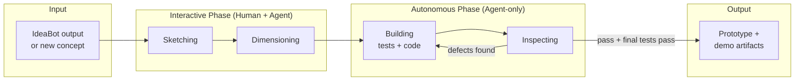
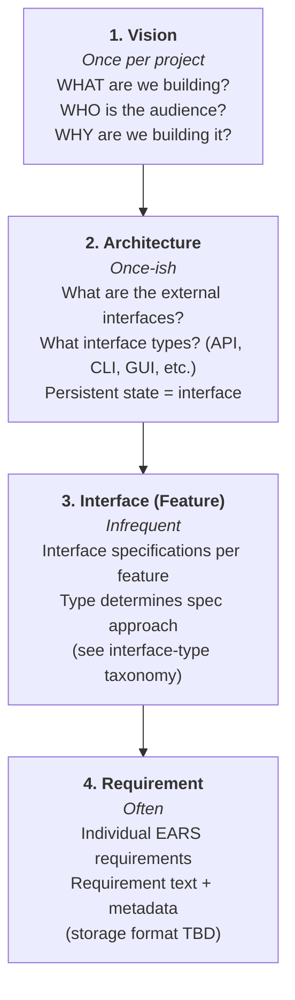
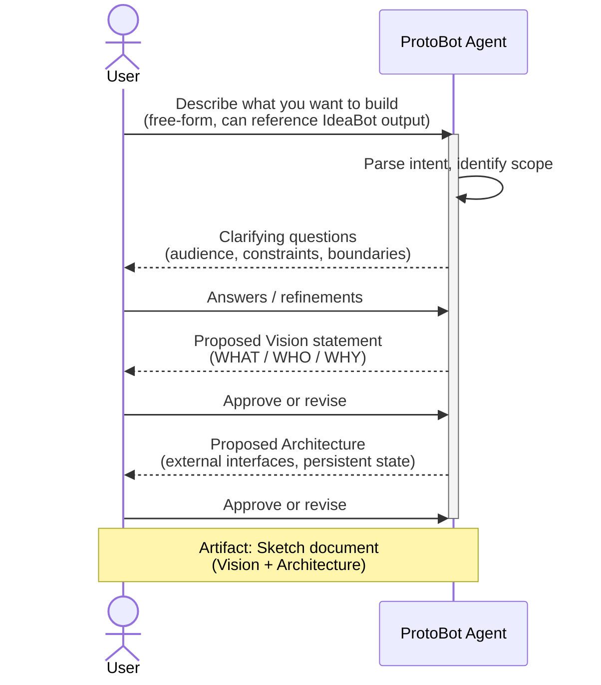
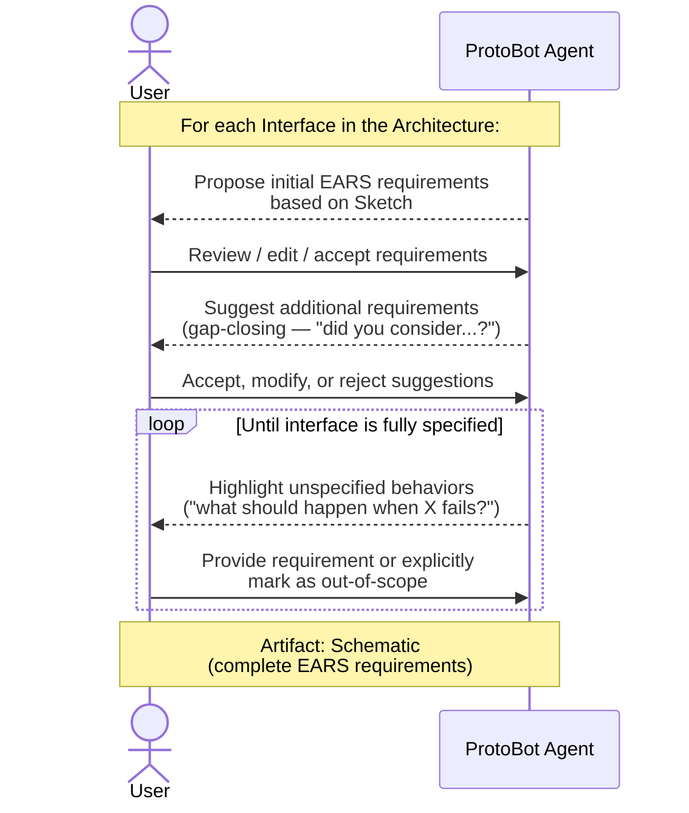
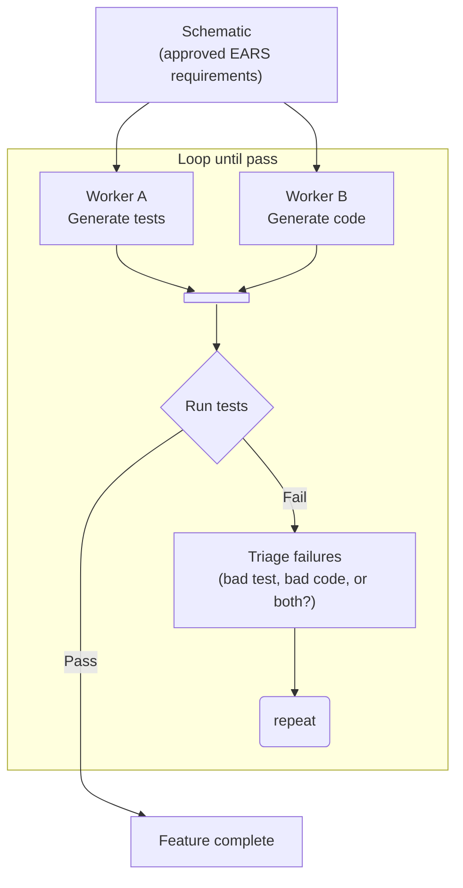
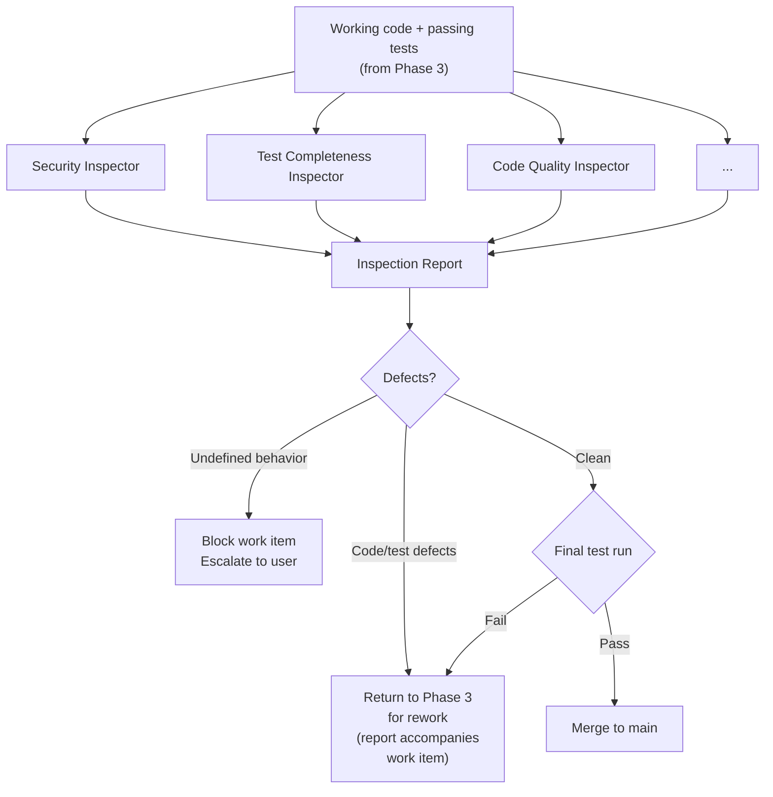
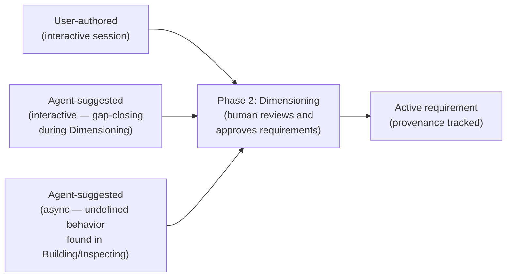
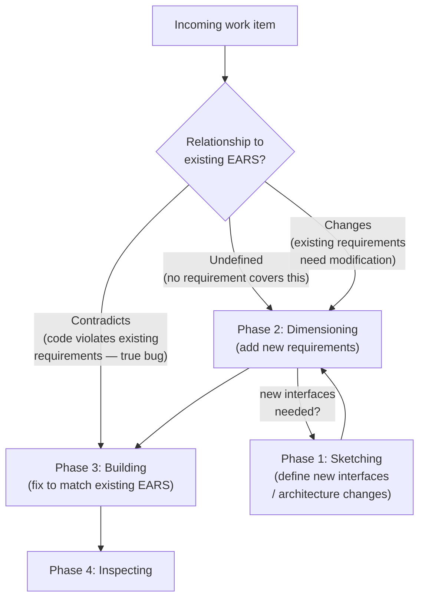
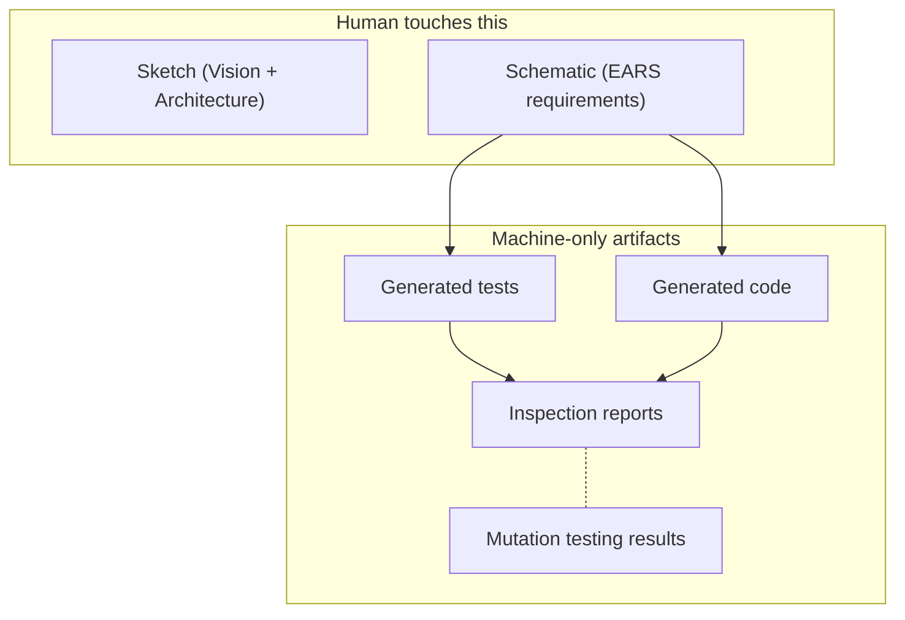

# ProtoBot: User Interaction Flow

> Design document — draft, July 2026

## Overview

ProtoBot is the second tool in the Hermes pipeline, following IdeaBot. It
takes requirement specifications as input and generates working prototypes
(for demos, not final products). The pipeline has four phases:

1. **Sketching** (interactive) — Human + AI define the Vision and
   Architecture.
2. **Dimensioning** (interactive) — Human + AI produce EARS requirement
   specifications (the Schematic).
3. **Building** (autonomous) — Agents generate tests and code
   concurrently from the approved EARS requirements.
4. **Inspecting** (autonomous) — Independent Inspector agents review
   the work; defects are sent back to Building for rework.

The human review boundary sits at the **Schematic** (approved EARS
requirements). Everything after Dimensioning is fully autonomous —
no human review of generated tests, code, or inspection results.

---

## End-to-End Flow

This is the top-level view of a user's journey through ProtoBot, from an
initial idea through to a reviewable prototype.



**Key principle:** Everything before and including Dimensioning involves the
human. Everything after (Building, Inspecting) is fully autonomous.
The only exception is if an Inspector discovers undefined behavior,
which blocks the work item and escalates to the user (see
[Incremental Development](#incremental-development-and-change-types)).

---

## Specification Hierarchy

Before diving into the phase details, it's important to understand *what*
the user is building during the interactive phase. Specifications are
produced at four levels, each answering progressively more specific
questions:



The top two levels (Vision, Architecture) are typically set once at
project start. Interface and Requirement are where the bulk of
ongoing interactive work happens.

**Interface-type taxonomy** (determines how each interface is spec'd):

| Interface Type | Spec Approach | Example |
|---|---|---|
| Network service | Smithy / OpenAPI | REST API, gRPC service |
| CLI | `usage` (jdx.dev) / docopt / `wasi:cli` *(needs evaluation)* | `protobot generate` |
| REPL | *(open gap — no real IDL exists)* | Interactive notebook |
| Linkable library | WIT (Wasm Interface Types) | Shared SDK module |
| Web GUI (html/css) | *(open gap — not yet solved)* | Dashboard UI |
| Native GUI | *(open gap — not yet solved)* | Desktop app |

---

## Phase Details

### Phase 1: Sketching

> *"High-level free-form description of what to build"* — produces a
> **Sketch**.



**User's role:** Provide the idea, answer clarifying questions, approve the
Vision and Architecture.

**Agent's role:** Structure the user's intent into the Vision/Architecture
levels of the spec hierarchy. Proactively surface gaps, ambiguities, and
unstated assumptions.

**Exit criteria:** User has approved a Vision statement and an Architecture
that enumerates all external interfaces and their types.

#### What belongs in the Architecture

The Architecture should describe the system's **external interfaces** —
its boundary with the outside world. Internal decomposition (services,
modules, components) is an implementation detail and should generally be
left to the Building phase. The user specifies *what the system looks
like from the outside*, not how it's structured internally.

**"External" means contractually stable, not just user-facing.** An
external interface is any boundary where you'd expect an independent
party to be able to write an implementation against the contract. This
includes user-facing APIs, but also internal boundaries that are
designed to be pluggable.

**Rule of thumb:** If you would support a third party creating a
plug-in implementation for a part of the system, the interface to that
component is an external interface and belongs in the Architecture.

For example, ProtoBot should support multiple work management systems
(Jira, GitHub, Trello, Beads). This means the boundary to the WMS
must be a fully specified interface so that arbitrary implementations
can be swapped in. From the standpoint of the overall ProtoBot project,
the WMS might feel "internal," but the pluggable nature makes its
interface external — it needs to be spec'd with the same rigor as any
user-facing API.

**Persistent state is an external interface.** State exists outside the
system — it outlives any single run, requires an upgrade/rollback path,
and needs some interface to read and write it. A database, a
configuration file on disk, or a set of Kubernetes CRDs are all
external interfaces even though they might feel "internal." They belong
in the Architecture.

**Environmental constraints are not interfaces, but still belong here.**
Sometimes the target environment dictates internal choices. For
example, a web frontend at Red Hat will likely be required to use
PatternFly because it's the blessed framework — even though PatternFly
isn't an external interface. These constraints should be captured in
the Architecture as **environmental requirements**, clearly
distinguished from interface definitions, so the Building phase doesn't
make incompatible choices.

In summary:

| Belongs in Architecture | Does NOT belong (leave to Building) |
|---|---|
| External APIs (REST, gRPC, CLI, etc.) | Internal service decomposition |
| Pluggable component interfaces (WMS, auth provider, model backend) | Class/module structure |
| Persistent state (DB schema, files, CRDs) | Internal data flow between components |
| User-facing interfaces (web UI, REPL) | Library choices not mandated by environment |
| Environmental constraints (PatternFly, UBI base image, language mandates) | |

---

### Phase 2: Dimensioning

> *"Turning the sketch into EARS requirements"* — produces a
> **Schematic**.

This is the most time-consuming interactive phase and the **primary human
review boundary**. The agent helps the user produce precise, EARS-formatted
requirements for each interface identified in the Architecture.



**Critical UX design point:** The agent must aggressively surface spec gaps
*during* this phase, because once the autonomous phase begins, the agent
will silently fill unspecified behaviors with its own assumptions — and
those assumptions become invisible de facto contracts (the Hyrum's Law
problem observed in IdeaBot).

**EARS requirement format** (tentatively JSONL, not in `.feature` files):

```json
{
  "id": "REQ-AUTH-001",
  "interface": "api-gateway",
  "type": "event-driven",
  "text": "When a user submits valid credentials, the system shall return a JWT token within 500ms.",
  "provenance": "user-authored",
  "created": "2026-08-01T14:30:00Z"
}
```

Lifecycle state (`pending` → `in-progress` → `implemented`) is
tracked by the WMS Adapter, not stored in the spec file — see
[Requirement Lifecycle](components.md#requirement-lifecycle).

> **Needs follow-up: JSONL as storage format.** JSONL was chosen because
> it's git-friendly — each requirement is one line, so merge conflicts
> are easy to resolve. However, this only works well if requirements are
> truly self-contained, independent records. As soon as there are
> cross-references between requirements (e.g., "REQ-AUTH-001 depends on
> REQ-SESSION-003") or a hierarchical structure (interface → feature →
> requirement), JSONL may no longer be ideal — referential integrity
> becomes the caller's problem, and reorganizing the hierarchy means
> moving lines between files or adding fragile foreign-key fields.
> Alternatives to evaluate: a directory of individual JSON/YAML files
> (one per requirement, hierarchy encoded in directory structure), a
> lightweight relational format, or a single structured document with
> tooling to handle merge conflicts.

**EARS pattern → test approach** (how each requirement type will be
verified in the autonomous phase):

| EARS Pattern | Example | Test Approach |
|---|---|---|
| Ubiquitous (*"shall X"*) | "The API shall use TLS" | PBT: global invariant over arbitrary inputs |
| Event-driven (*"When..."*) | "When user logs in, shall issue token" | Example-based: specific input → expected output |
| State-driven (*"While..."*) | "While in maintenance mode, shall reject writes" | PBT: state invariant over arbitrary sequences |
| Unwanted behavior (*"If...then"*) | "If token expired, shall return 401" | Example-based: construct trigger, assert response |
| Optional feature (*"Where..."*) | "Where SSO is configured, shall use SAML" | Example-based: set config flag, check behavior |
| Complex (combined keywords) | "While in-flight, if reverse thrust commanded, shall inhibit reverser" | Combination of above approaches, matching the combined pattern |

---

### Phase 3: Building (Autonomous)

> *"Creating the implementation and its verification"* — produces
> **Code** and a test suite concurrently.

Both test generation and code generation are driven directly from the
approved EARS requirements. A dedicated model generates tests while a
separate model generates code — neither sees the other's output.
Correctness is established when the independently-generated tests pass
against the independently-generated code.



**Why concurrent:** Both Workers read directly from the same EARS
requirements. Neither needs the other's output to begin, so there's no
reason to serialize them.

**Key constraint:** Worker A (tests) must **never** see Worker B's code,
and vice versa. If either can see the other's output, oracle gaming
becomes possible — the test-writer writes tests that pass the existing
code rather than tests that verify the requirement, or the code-writer
writes code shaped to pass specific tests rather than implementing the
spec. During the fix loop, each Worker receives triage results (which
of its artifacts need fixing and why) but still does not see the
other Worker's output directly.

**Merge + test + triage loop:** After both Workers produce their
initial outputs, the results are merged into a single runnable
artifact and the test suite is executed. If tests fail, a triage step
determines fault — bad test, bad code, or both — and routes fixes
back to the appropriate Worker(s). The loop repeats until all tests
pass. Note that "both" is a real case: a test might be wrong *and*
the code might be wrong in a different way, and fixing only one side
would still fail.

#### Ongoing obligations

Not all requirements are fully satisfied by
a single work item. Some requirements are ongoing obligations that
apply to every new instance of something — for example, *"All CLI
subcommands shall provide usage descriptions via `--help`."* This
requirement is satisfied by the work item that first implements
`--help` support, but it must be revisited by every subsequent work
item that adds a new subcommand.

This means Workers cannot limit themselves to only the requirements
explicitly claimed by the current work item. They must also consider
existing requirements (marked `implemented` in the WMS) whose scope
covers the work being done. The EARS patterns encode this
distinction naturally —
ubiquitous requirements ("The system shall X") are by definition
always active, not one-and-done — but the Building workflow must
make it explicit: Workers need access to the full set of approved
requirements (via `ears-manager`), not just the claimed ones, and
must identify which existing requirements apply to the interfaces
they're touching.

Ongoing obligations do not change status when they need follow-up
work. A ubiquitous requirement like "All CLI subcommands shall
provide `--help`" stays `implemented` — it is still satisfied for
existing subcommands. The *work item* is responsible for satisfying
it for the new additions, not the requirement itself. The work
item's test suite must include tests for applicable ongoing
obligations, so that a work item adding a CLI subcommand without
`--help` fails its own test run rather than slipping through.

See [open question #19](open-questions.md) for how Workers discover
which existing requirements apply.

> **Open concern: Bootstrapping and merge viability.** Isolation
> between Worker A and B is viable *only* if tests exercise external
> interfaces — the same boundaries defined in the Architecture phase.
> Worker A is a "client" of the interface contract; Worker B is the
> "server." They don't need to agree on internals because the tests
> never touch internals. This is exactly how contract testing (Pact,
> Smithy protocol tests) works in practice.
>
> However, the merge step is more than "put the files together."
> Worker B must produce something that *exposes* the interface in a
> runnable form (a container that starts, an API that listens, a CLI
> that accepts arguments) before Worker A's tests can execute. The
> merge step likely needs to include building and starting Worker B's
> artifact, then running Worker A's tests against it. This
> infrastructure needs to be designed.

> **Open concern: Requirements that are impractical to test at the
> interface boundary.** Some EARS requirements describe behavior that
> is only observable under conditions that are slow or expensive to
> reproduce externally. Example: *"The system shall cache
> authentication tokens for 5 minutes."* Testing this through the
> external interface means making two calls 5 minutes apart — not
> acceptable in a test suite that needs to run in seconds.
>
> The obvious fix — mock time, dependency injection — means Worker A
> and Worker B must agree on an internal DI mechanism, which is itself
> an internal contract that breaks isolation. This points toward a
> possible **third test category** beyond isolated interface tests:
>
> 1. **Isolated interface tests** (Worker A, no knowledge of
>    internals) — the default. Tests exercise external interfaces
>    only. Dual-model isolation holds.
> 2. **Implementation-aware tests** (written by or informed by
>    Worker B) — for requirements that can't be practically verified
>    at the interface boundary. These tests *can* use DI, mock time,
>    inspect internal state, etc. Isolation does not hold; oracle
>    gaming risk is accepted and mitigated by other means (mutation
>    testing, Inspector review).
> 3. **Mutation testing** (hidden, neither Worker sees results) —
>    quality audit on both categories above.
>
> The ratio between categories 1 and 2 is an open question. The goal
> is to maximize category 1 (where the dual-model guarantee holds),
> but we should not pretend category 2 doesn't exist. Designing for
> it honestly is better than having Worker A silently write tests
> that can't actually run in isolation.

#### Testing strategy: PBT + examples + mutation testing

The test suite is a **combination** of approaches, not pure
property-based testing. Each has a role; none is sufficient alone.

**Property-based tests (PBT)** work well for EARS requirements that
express invariants, structural constraints, or safety properties —
things that are cheaper to *check* than to *compute*:

| EARS Pattern | PBT Approach | Example |
|---|---|---|
| Ubiquitous (*"shall X"*) | Global invariant — holds for all generated inputs | "The API shall use TLS" → for any request, the connection is encrypted |
| State-driven (*"While..."*) | State invariant — holds across arbitrary state sequences | "While in maintenance mode, shall reject writes" → for any write payload, response is 503 |

PBT adds value when random/arbitrary input generation covers a
meaningfully large input space and the property is cheaper to *check*
than to *compute*. Both patterns above have a clear "for all X, Y
holds" shape where X is a broad input space.

**Example-based tests** are necessary for EARS requirements that specify
*correct output for specific inputs* — the case where PBT breaks down.
Specifying what the correct output should be for arbitrary input is as
difficult as writing the original program (you'd need an oracle), so
concrete input→output pairs are the practical tool here:

| EARS Pattern | Example-based Approach | Example |
|---|---|---|
| Event-driven (*"When..."*) | Concrete scenario: given this input, expect this output | "When user submits valid credentials, shall return a JWT" |
| Unwanted behavior (*"If...then"*) | Specific trigger → specific response | "If token expired, shall return 401" → construct expired token, assert 401 |
| Optional feature (*"Where..."*) | Parameterized scenario: set config, check behavior | "Where SSO is configured, shall use SAML" → enable SSO, assert SAML redirect |
| Complex transformations | Golden-file tests: known input → known expected output | Data pipeline: fixed input file → expected output file |
| Edge cases | Boundary values that PBT's random generation may not reliably hit | Empty input, max-length strings, zero-element collections |

**Mutation testing** operates as a **hidden quality audit** on top of
both. It checks whether the test suite (PBT + examples) actually
detects regressions. The generating agents do NOT see mutation test
results — surviving mutants are routed to Phase 4 (Inspecting) for
triage, not fed back to the code-generating Worker.

A surviving mutant means: we changed the code, and all tests still
passed. There are three possible explanations:

1. **No change in observable behavior** — the mutation was semantically
   neutral (dead code, redundant branch, equivalent mutant). The
   program still conforms to the spec. Nothing is actually wrong.
2. **Test suite deficiency** — the mutation *did* change observable
   behavior, but the tests don't cover that behavior path. The spec
   covers it; the tests are just weak.
3. **Unspecified behavior** — the mutation changed behavior in a region
   no requirement covers. There's nothing to test against because the
   spec is silent.

> **Open problem: mutation triage lacks an oracle.** To distinguish
> these three cases, you'd need to determine whether the mutated
> program's behavior still conforms to the spec. But that oracle *is
> the thing we're trying to build* — if we had a reliable way to check
> arbitrary code against the spec, we wouldn't need the tests in the
> first place. The only thing we can say for certain about a surviving
> mutant is "a test didn't catch this change." We cannot mechanically
> determine *why*.
>
> This means mutation testing is useful as a **coverage signal** (a
> high survival rate indicates weak testing or underspecification in
> general), but individual surviving mutants cannot be automatically
> routed to the right fix without some form of judgment — likely an
> Inspector agent or human review. How to make that triage practical
> at scale is an open design question.

> **Open concern:** The boundary between "property I can check" and
> "output I need an oracle for" is not always obvious up front. The
> system will need heuristics or human guidance to decide which EARS
> requirements get PBT vs. example-based tests vs. both. This is an
> active design question.

**Safeguard mechanisms:**

- Sandbox-level constraints (not just prompts) prevent shortcuts
  (e.g., mocking backends instead of real implementations)
- Mutation testing as a hidden gate (see above)

---

### Phase 4: Inspecting (Autonomous)

> *"Review of code"* — multi-agent automated review before the work
> is finalized. Analogous to building inspectors in the construction
> metaphor: independent specialists each examine the work from their
> area of expertise.

Phase 4 receives working, tested code from Phase 3 (deterministic
checks like lint, type-checking, and test execution have already
passed in Phase 3). Multiple independent Inspector agents review the
code and tests in parallel, each looking for a different class of
deficiency.



#### Inspector agents

Each Inspector is an independent agent with a narrow, well-defined
audit scope. They run in parallel and do not coordinate with each
other.

**Defined Inspectors:**

- **Security Inspector** — scans for security weaknesses, OWASP
  violations, hardcoded secrets, insecure dependencies, injection
  vulnerabilities, improper error handling that leaks internals. This
  is especially important given ProtoBot's prototype outputs may be
  deployed as Dev Preview builds that customers could put into
  production despite disclaimers.

- **Test Completeness Inspector** — evaluates whether the test suite
  adequately covers the requirements. Looks for requirements with no
  corresponding test, scenarios with insufficient boundary coverage,
  and assertions that are too loose to catch real regressions.
  *(Open question: should this run in Phase 3 instead, as part of
   the Building loop, so gaps are caught earlier?)*

- **Code Quality Inspector** — examines code cleanliness and
  maintainability: DRY violations, overly complex functions (CRAP
  score), dead code, poor naming, missing error handling, functions
  that do too much. Not about style nitpicks — about structural
  problems that would make the code fragile or hard to understand.

> **Open question: Inspector roster.** The list above is a starting
> point. Other candidates worth considering:
>
> - **Spec Conformance Inspector** — does the code actually implement
>   what the requirements say? (This is close to the oracle problem
>   discussed in Phase 3, but a focused AI review may catch obvious
>   mismatches that tests miss.)
> - **Performance Inspector** — flagging obviously inefficient patterns
>   (N+1 queries, unbounded memory allocation, blocking I/O in async
>   paths).
> - **Accessibility Inspector** — for web UI prototypes, checking
>   a11y compliance.
> - **Documentation Inspector** — are public interfaces documented?
>   Do error messages make sense?
>
> The right set depends on the type of prototype being built. Not
> every Inspector needs to run for every project.

#### Inspection report

Each pass through Phase 4 produces an **inspection report** — a
free-form document consolidating findings from all Inspectors. Since
inspections are non-deterministic (AI-driven review, not lint rules),
the report is the mechanism for communicating what was found and why
it's a problem.

The inspection report **accumulates across passes**. When a work item
is sent back to Phase 3 for rework and returns for re-inspection,
the previous report(s) travel with it. On subsequent passes, each
Inspector:

1. **Re-checks prior defects** — verifies that previously flagged
   issues were actually fixed, not just papered over.
2. **Scans for new defects** — the rework itself may have introduced
   new problems.

This means the inspection report grows into a history of the work
item's quality evolution, not just a snapshot of the latest pass.

#### Defect routing

Defects fall into two categories with different routing:

- **Code/test defects** (security holes, quality problems, coverage
  gaps) — sent back to Phase 3 for rework. The inspection report
  accompanies the work item so Workers have context on what to fix.
  The work item returns to Phase 4 after tests pass again.

- **Undefined behavior** — an Inspector identifies behavior that
  isn't covered by any requirement and can't be resolved by fixing
  code or tests alone. This **blocks the work item** and is
  escalated to the user as an agent-suggested requirement (async
  provenance). The work item cannot proceed until the user either
  adds a requirement to cover the behavior or explicitly marks it
  as out-of-scope. This is the Phase 4 equivalent of the
  "unspecified" bin in the undesired-behavior taxonomy — the
  difference is that here it was caught by an Inspector's judgment
  rather than by a mechanical test failure.

#### Final test run and merge

After all Inspectors pass (no defects in the report), automated
tests are run one final time against the complete, reviewed codebase.
This catches any regressions introduced by rework during the
Inspect→Build→Inspect loop. If the final test run passes, the work
is merged into the main codebase as complete.

#### Demonstration artifacts

On completion, the Job Site generates demonstration artifacts that
show the prototype working. These are attached to the final PR or
committed to the repo (TBD). Candidate tooling:

- **[showboat](https://github.com/simonw/showboat)** — Builds
  self-verifying Markdown evidence documents. `showboat verify`
  re-executes every code block and diffs the output, so the demo
  document is itself a regression check.
- **[shot-scraper](https://github.com/simonw/shot-scraper)** —
  Playwright-based screenshots and video recording for web UIs.
- **[Asciinema](https://asciinema.org)** — Records terminal
  sessions as lightweight text-based "cast" files, convertible to
  animated GIFs via `agg`. Best fit for CLI and REPL surfaces.
- **[rodney](https://github.com/simonw/rodney)** — Chrome CLI
  automation with accessibility-tree assertions (`ax-find`,
  `visible`, `assert`), providing a structured, assertable
  interface to web GUIs.
- **Animated GIFs** — The lowest-common-denominator demo artifact:
  GitHub renders them inline in PRs and READMEs with zero setup
  for the reviewer.

The right combination depends on the interface types in the
prototype. A CLI tool gets Asciinema + showboat; a web UI gets
shot-scraper + rodney + GIFs.

---

## Requirement Provenance Flow

Requirements can originate from three sources. Regardless of origin,
**all requirements flow through Dimensioning (Phase 2) for human
review before taking effect.** Once approved, a requirement is a full
requirement — no permanent second-class status. Provenance is tracked
for traceability but does not affect a requirement's weight.



**Async escalation path:** When Building or Inspecting discovers
undefined behavior, it is surfaced to the user as an agent-suggested
requirement. This **blocks the work item** until the user either adds
a requirement (which enters Dimensioning as a new work item) or
explicitly marks the behavior as out-of-scope. The blocked work item
resumes once the requirement is approved and the Schematic is
updated.

---

## Incremental Development and Change Types

The phases above describe a single pass through the pipeline, but
real software is not fully defined upfront. The first iteration may
be an MVP with a handful of requirements; features are added over
time, desired behavior is refined ("make the button blue instead of
red," "add a confirmation before deleting"), and true bugs are
discovered. ProtoBot must support this incremental, iterative
development model as the normal mode of operation, not as an
exception.

Each change enters the pipeline as a **work item**. Its relationship
to the existing EARS requirements determines where it enters:



### Change types

Every incoming work item falls into one of three categories based on
its relationship to the existing EARS requirements:

**Undefined** — no requirement covers this behavior. New requirements
must be written. The work item enters at Phase 2 (Dimensioning) to
produce EARS requirements, then flows through Building and Inspecting.
If the new behavior requires new interfaces or architecture changes,
it routes through Phase 1 (Sketching) first. Examples:

- Adding a "forgot password" flow to an existing auth API
  (new requirements on existing interface → Phase 2)
- Adding a REST API to a system that previously only had a CLI
  (new interface → Phase 1 → Phase 2)
- An Inspector discovers behavior in a region no requirement
  covers (escalated to user → user adds requirement → Phase 2)

**Changes** — existing requirements need to be modified because
the desired behavior has changed. The current implementation may be
correct per the current EARS, but the user wants different behavior.
The work item enters at Phase 2 to update the requirements, then
flows through Building and Inspecting. Examples:

- "The confirmation dialog should require typing the resource name,
  not just clicking OK"
- "Cache TTL should be 10 minutes, not 5"
- "The default sort order should be newest-first"

**Contradicts** — the implementation violates existing, approved EARS
requirements. This is a true bug — the requirements are correct and
don't need to change; the code is wrong. The work item skips Phases
1 and 2 entirely and enters directly at Phase 3 (Building), since the
requirements already define the correct behavior. The work item
references the violated requirement(s), and the fix loop runs until
tests pass. Examples:

- The EARS requirement says "shall return 401 for expired tokens"
  but the system returns 200
- The requirement says "shall reject writes in maintenance mode" but
  writes succeed

### Work item lifecycle

A work item carries context through the pipeline:

- **Requirements** it implements or references
- **Inspection reports** from Phase 4 (accumulated across passes)
- **Change type** (determines pipeline entry point)
- **Provenance** (who/what originated it — user, agent-suggested
  interactive, agent-suggested async, bug report)

Multiple work items can be in flight simultaneously at different
phases — one feature being dimensioned while another is being built
while a bug fix is being inspected. The pipeline is not a single
global assembly line; it's per-work-item.

---

## Human Review Boundary Summary



**Design principle:** The human's involvement ends at the Schematic —
approved EARS requirements that define what the system should do.
Everything after that (test generation, code generation, inspection,
merge) is fully autonomous. The specification is sufficient to define
the system; everything else is regenerable. See
[open question #13](open-questions.md) (HU-02 compliance) for
whether this is achievable given Red Hat's AIA requirements.

---

## Related Documents

- [Overview](overview.md) — What ProtoBot is, guiding principles,
  and workflow summary
- [System Components](components.md) — Component architecture,
  interfaces, and cross-cutting concerns
- [Open Design Questions](open-questions.md) — Unresolved design
  questions across all areas
- [Related Work](related-work.md) — Red Hat internal projects,
  external factory projects, and lessons learned
